# ==一、C++学习笔记——入门基础==

<center>赠自己：每天坚持学习一点点：

# 1、C++初识 

## 1.1 第一个c++程序

编写一个C++程序总共分为4个步骤

- 创建项目
- 创建文件
- 编写代码
- 运行程序

### 1.1.1 创建项目

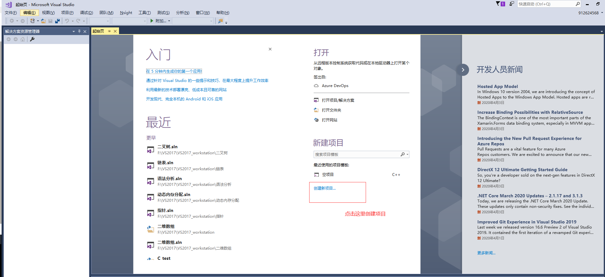

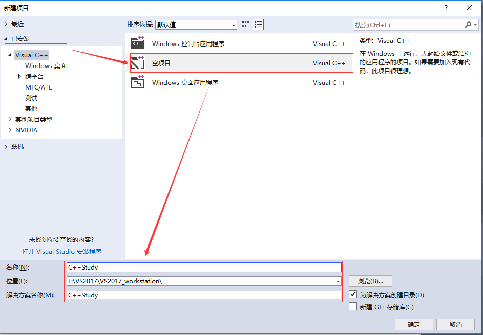

### 1.1.2 创建文件

右键源文件，选择添加->新建项

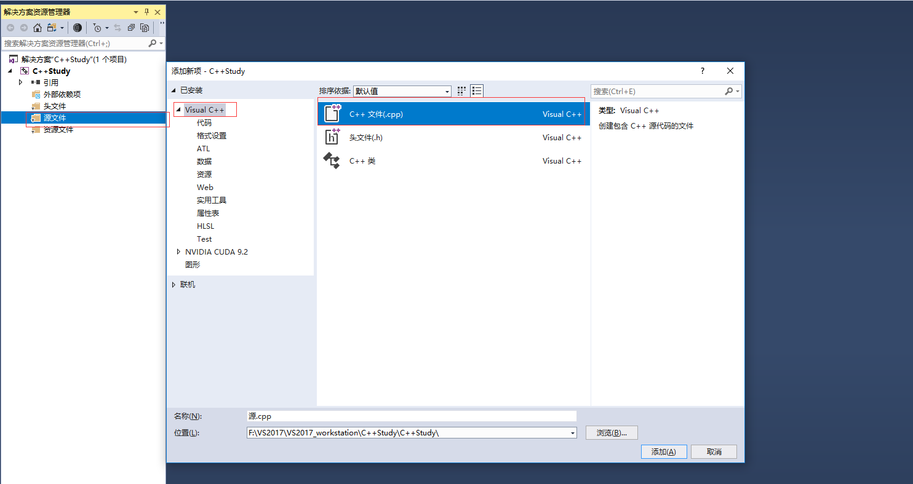

### 1.1.3 编写代码

```c++
#include<iostream>
using namespace std;

int main() 
{
	cout << "hell word" << endl;

	system("pause");
	return 0;

}
```

### 1.1.4 运行程序

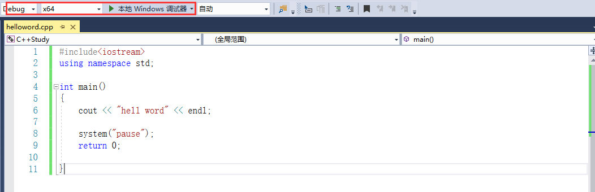

##1.2 注释

**作用**：在代码中加一些说明和解释，方便自己或其他程序员程序员阅读代码

**两种格式**

1. **单行注释**：`// 描述信息` 
    - 通常放在一行代码的上方，或者一条语句的末尾，==对该行代码说明==
2. **多行注释**： `/* 描述信息 */`
    - 通常放在一段代码的上方，==对该段代码做整体说明==

> 提示：编译器在编译代码时，会忽略注释的内容

##1.3 变量

**变量存在的意义：**方便我们管理内存空间

**作用**：给一段指定的内存空间起名，方便操作这段内存

**语法**：`数据类型 变量名 = 初始值;`

**示例：**

```c++
#include<iostream>
using namespace std;

//1、单行注释
//2、多行注释
/**
  main是一个程序的入口
  每个程序都必须有这么一个函数
  有且仅有一个
*/

int main() 
{
	
	// 变量创建的语法：数据类型 变量名 = 变量的初始值
	int a = 10; 
	cout << "a=" << a << endl;
	cout << "hell word" << endl;
	system("pause");
	return 0;

}
```

> 注意：C++在创建变量时，必须给变量一个初始值，否则会报错

##1.4  常量

**作用**：用于记录程序中不可更改的数据

C++定义常量两种方式

1. **\#define** 宏常量： `#define 常量名 常量值`
    - ==通常在文件上方定义==，表示一个常量

2. **const**修饰的变量 `const 数据类型 常量名 = 常量值`
    - ==通常在变量定义前加关键字const==，修饰该变量为常量，不可修改


**示例：**

```c++
#include<iostream>
using namespace std;

// 常量的定义方式
// 1、#define 宏常量
// 2、 const修饰的变量

// 1、#define 宏常量
#define Day 7 // 定义一个宏常量day

int main() 
{
	// Day = 14; // 错误，Day是常量，一旦修改就会报错
	cout << "一周总共有" << Day << "天" << endl;

	// 2、 const修饰的变量
	const int month = 12; // const修饰的变量也称为常量，一旦定义，无法修改
	cout << "一年总有：" << month << "个月份" << endl;

	system("pause");
	return 0;
}
```

##1.5 关键字

**作用：**关键字是C++中预先保留的单词（标识符）

- **在定义变量或者常量时候，不要用关键字**


C++关键字如下：

| asm        | do           | if               | return      | typedef  |
| ---------- | ------------ | ---------------- | ----------- | -------- |
| auto       | double       | inline           | short       | typeid   |
| bool       | dynamic_cast | int              | signed      | typename |
| break      | else         | long             | sizeof      | union    |
| case       | enum         | mutable          | static      | unsigned |
| catch      | explicit     | namespace        | static_cast | using    |
| char       | export       | new              | struct      | virtual  |
| class      | extern       | operator         | switch      | void     |
| const      | false        | private          | template    | volatile |
| const_cast | float        | protected        | this        | wchar_t  |
| continue   | for          | public           | throw       | while    |
| default    | friend       | register         | true        |          |
| delete     | goto         | reinterpret_cast | try         |          |

`提示：在给变量或者常量起名称时候，不要用C++得关键字，否则会产生歧义。`

```c++
#include<iostream>
using namespace std;

int main() 
{
	// 创建变量： 数据类型，变量名称 = 变量初始值
	// 不要用关键字给变量或者常量起名称
	// int int = 10; 错误，第二个int是关键字，不可以作为变量的名称
	system("pause");
	return 0;

}
```

##1.6 标识符命名规则

**作用**：C++规定给标识符（变量、常量）命名时，有一套自己的规则

- 标识符不能是关键字
- 标识符只能由字母、数字、下划线组成
- 第一个字符必须为字母或下划线
- 标识符中字母区分大小写

> ==建议：==给标识符命名时，争取做到见名知意的效果，方便自己和他人的阅读

```c++
#include<iostream>
using namespace std;

// 标识符命名规则
// 1、标识符不可以是关键字
// 2、标识符是由字母、数字、下划线构成
// 3、第一个字符只能是字母或者下划线
// 4、标识符是区分大小写的

int main() 
{
	// 1、标识符不可以是关键字
	// int int = 10;

	// 2、标识符是由字母、数字、下划线构成
	int abc = 10;
	int _abc = 20;

	// 3、第一个字符只能是字母或者下划线
	// int 45abc = 50; //这是一个错误的

	// 4、标识符是区分大小写的
	int aaa = 10;
	int AAA = 100;
	cout << "aaa" << aaa << endl;

	// 建议：给变量起名的时候，最后能够做到见名知意
	int num1 = 10;
	int num2 = 20;
	int sum = num1 + num2;

	system("pause");
	return 0;
}
```

# 2、数据类型

C++规定在创建一个变量或者常量时，必须要指定出相应的数据类型，否则无法给变量分配内存

##2.1 整型

**语法：**数据类型   变量名 = 变量初始值

int a= 10;

**数据类型存在的意义：**给变量分配合适的内存空间


**作用**：整型变量表示的是==整数类型==的数据

C++中能够表示整型的类型有以下几种方式，**区别在于所占内存空间不同**：

| **数据类型**        | **占用空间**                                    | 取值范围         |
| ------------------- | ----------------------------------------------- | ---------------- |
| short(短整型)       | 2字节                                           | (-2^15 ~ 2^15-1) |
| int(整型)           | 4字节                                           | (-2^31 ~ 2^31-1) |
| long(长整形)        | Windows为4字节，Linux为4字节(32位)，8字节(64位) | (-2^31 ~ 2^31-1) |
| long long(长长整形) | 8字节                                           | (-2^63 ~ 2^63-1) |

```c++
#include<iostream>
using namespace std;
int main() 
{
	// 整型
	// 1、短整型(-32768~32767),如果超出最大值，则返回到最小值-32768
	short num1 = 10;

	// 2、整型
	int num2 = 10;

	// 3、长整型
	long num3 = 10;

	// 4、长长整型
	long long num4 = 10;

	cout << "num1 = " << num1 << endl;
	cout << "num2 = " << num2 << endl;
	cout << "num3 = " << num3 << endl;
	cout << "num4 = " << num4 << endl;
	 
	system("pause");
	return 0;
}
```

如果没有特殊要求，int型通常够用了。

##2.2 sizeof关键字

**作用：**利用sizeof关键字可以==统计数据类型所占内存大小==

**语法：** `sizeof( 数据类型 / 变量)`

**示例：**

```c++
#include<iostream>
using namespace std;
 
int main() 
{
	// 整型：short(2)   int(4)     long(4)     long long(8)
	// 可以利用sizeof求出数据类型占用内存大小
	// 语法： sizeof（数据类型/变量）
	short num1 = 10;
	cout << "short 类型所占内存空间：" << sizeof(short) << endl;

	int num2 = 10;
	cout << "int 类型所占内存空间：" << sizeof(int) << endl;
	
	long num3 = 10;
	cout << "long 类型所占内存空间：" << sizeof(long) << endl;

	long long num4 = 10;
	cout << "long long 类型所占内存空间：" << sizeof(long long) << endl;

	system("pause");
	return 0;
}
```

> **整型结论**：==short < int <= long <= long long==


##2.3 实型（浮点型）

**作用**：用于==表示小数==

浮点型变量分为两种：

1. 单精度float 
2. 双精度double

两者的**区别**在于表示的有效数字范围不同。

| **数据类型** | **占用空间** | **有效数字范围** |
| ------------ | ------------ | ---------------- |
| float        | 4字节        | 7位有效数字      |
| double       | 8字节        | 15～16位有效数字 |

**示例：**

```c++
#include<iostream>
using namespace std;
 
int main() 
{
	// 1、单精度 float
	// 2、双精度 double
    // 默认情况下，输出一个小数，会显示出6位有效数字

	float f1 = 3.1415926f; // 多写一个f，代表float，如果不写，编辑器会认为是double
	cout << "f1=" << f1 << endl;

	double d1 = 3.1415926; 
	cout << "d1=" << d1 << endl;

	// 统计float和double占用内存空间
	
	cout << "float占用的内存空间为：" << sizeof(float) << endl; // 4字节
	cout << "double占用的内存空间为：" << sizeof(double) << endl; // 8字节

	// 科学计数法
	float f2 = 3e2;// 3*10^2
	cout << "f2=" << f2 << endl;

	float f3 = 3e-2; // 3*0.1^2
	cout << "f3=" << f3 << endl;

	system("pause");
	return 0;
}
```


##2.4 字符型

**作用：**字符型变量用于显示单个字符

**语法：**`char ch = 'a';`


> 注意1：在显示字符型变量时，用单引号将字符括起来，不要用双引号

> 注意2：单引号内只能有一个字符，不可以是字符串


- C和C++中字符型变量只占用==1个字节==。
- 字符型变量并不是把字符本身放到内存中存储，而是将对应的ASCII编码放入到存储单元


**示例：**

```c++
#include<iostream>
using namespace std;
 
int main() 
{
	// 1、字符型变量创建方式
	char ch = 'a';
	cout << ch << endl;
	// 2、字符型变量所占内存大小
	cout << "char字符型变量所占内存大小：" <<sizeof(char) << endl; //字符所占内存大小
	// 3、字符型变量常见错误
	char ch2 = 'b';
	//char ch3 = "b"; 创建字符型变量时候，要用单引号
	//char ch4 = 'abc'; //创建字符型变量时候，单引号只能有一个字符

	// 4、字符型变量对应ASCII编码
	// a ——97
	// A ——65
	cout << "(int)ch对应的ASCII编码：" << (int)ch << endl;

	system("pause");
	return 0;
}
```

**ASCII码表格：**

| **ASCII**值 | **控制字符** | **ASCII**值 | **字符** | **ASCII**值 | **字符** | **ASCII**值 | **字符** |
| ----------- | ------------ | ----------- | -------- | ----------- | -------- | ----------- | -------- |
| 0           | NUT          | 32          | (space)  | 64          | @        | 96          | 、       |
| 1           | SOH          | 33          | !        | 65          | A        | 97          | a        |
| 2           | STX          | 34          | "        | 66          | B        | 98          | b        |
| 3           | ETX          | 35          | #        | 67          | C        | 99          | c        |
| 4           | EOT          | 36          | $        | 68          | D        | 100         | d        |
| 5           | ENQ          | 37          | %        | 69          | E        | 101         | e        |
| 6           | ACK          | 38          | &        | 70          | F        | 102         | f        |
| 7           | BEL          | 39          | ,        | 71          | G        | 103         | g        |
| 8           | BS           | 40          | (        | 72          | H        | 104         | h        |
| 9           | HT           | 41          | )        | 73          | I        | 105         | i        |
| 10          | LF           | 42          | *        | 74          | J        | 106         | j        |
| 11          | VT           | 43          | +        | 75          | K        | 107         | k        |
| 12          | FF           | 44          | ,        | 76          | L        | 108         | l        |
| 13          | CR           | 45          | -        | 77          | M        | 109         | m        |
| 14          | SO           | 46          | .        | 78          | N        | 110         | n        |
| 15          | SI           | 47          | /        | 79          | O        | 111         | o        |
| 16          | DLE          | 48          | 0        | 80          | P        | 112         | p        |
| 17          | DCI          | 49          | 1        | 81          | Q        | 113         | q        |
| 18          | DC2          | 50          | 2        | 82          | R        | 114         | r        |
| 19          | DC3          | 51          | 3        | 83          | S        | 115         | s        |
| 20          | DC4          | 52          | 4        | 84          | T        | 116         | t        |
| 21          | NAK          | 53          | 5        | 85          | U        | 117         | u        |
| 22          | SYN          | 54          | 6        | 86          | V        | 118         | v        |
| 23          | TB           | 55          | 7        | 87          | W        | 119         | w        |
| 24          | CAN          | 56          | 8        | 88          | X        | 120         | x        |
| 25          | EM           | 57          | 9        | 89          | Y        | 121         | y        |
| 26          | SUB          | 58          | :        | 90          | Z        | 122         | z        |
| 27          | ESC          | 59          | ;        | 91          | [        | 123         | {        |
| 28          | FS           | 60          | <        | 92          | /        | 124         | \|       |
| 29          | GS           | 61          | =        | 93          | ]        | 125         | }        |
| 30          | RS           | 62          | >        | 94          | ^        | 126         | `        |
| 31          | US           | 63          | ?        | 95          | _        | 127         | DEL      |

ASCII 码大致由以下**两部分组**成：

- ASCII 非打印控制字符： ASCII 表上的数字 **0-31** 分配给了控制字符，用于控制像打印机等一些外围设备。
- ASCII 打印字符：数字 **32-126** 分配给了能在键盘上找到的字符，当查看或打印文档时就会出现。

##2.5 转义字符

**作用：**用于表示一些==不能显示出来的ASCII字符==

现阶段我们常用的转义字符有：` \n  \\  \t`

| **转义字符** | **含义**                                | **ASCII**码值（十进制） |
| ------------ | --------------------------------------- | ----------------------- |
| \a           | 警报                                    | 007                     |
| \b           | 退格(BS) ，将当前位置移到前一列         | 008                     |
| \f           | 换页(FF)，将当前位置移到下页开头        | 012                     |
| **\n**       | **换行(LF) ，将当前位置移到下一行开头** | **010**                 |
| \r           | 回车(CR) ，将当前位置移到本行开头       | 013                     |
| **\t**       | **水平制表(HT)  （跳到下一个TAB位置）** | **009**                 |
| \v           | 垂直制表(VT)                            | 011                     |
| **\\\\**     | **代表一个反斜线字符"\"**               | **092**                 |
| \'           | 代表一个单引号（撇号）字符              | 039                     |
| \"           | 代表一个双引号字符                      | 034                     |
| \?           | 代表一个问号                            | 063                     |
| \0           | 数字0                                   | 000                     |
| \ddd         | 8进制转义字符，d范围0~7                 | 3位8进制                |
| \xhh         | 16进制转义字符，h范围0~9，a~f，A~F      | 3位16进制               |

**示例：**

```c++
#include<iostream>
using namespace std;
 
int main() 
{
	 
	// 转义字符
	// 换行符 \n
	cout << "hello world" << endl;
	cout << "hello world\n";

	// 反斜杠 \\

	cout << "\\"<<endl;

	// 水平制表符 \t  作用可以整齐的输出数据
	cout << "aaa\thelloword" << endl;

	system("pause");
	return 0;
}
```


##2.6 字符串型

**作用**：用于表示一串字符

**两种风格**

1. **C风格字符串**： `char 变量名[] = "字符串值"`

    **示例：**

    ```c++
    #include<iostream>
    #include<string> // 用C++风格字符串时候，要包含这个头文件
    using namespace std;
     
    int main() 
    {
        //1、C风格字符串
    	// 注意事项1：char 字符串名 [] 
    	// 注意实现2：等号后面 要用双引号，包含起来字符串
    	char str1[] = "hello world";
    	cout << str1 << endl;
    	system("pause");
    	return 0;
    }
    ```

    

> 注意：C风格的字符串要用双引号括起来

1. **C++风格字符串**：  `string  变量名 = "字符串值"`

    **示例：**

```c++
#include<iostream>
#include<string> // 用C++风格字符串时候，要包含这个头文件
using namespace std;
 
int main() 
{
   
	//2、C++风格字符串
	//注意事项：包含一个头文件： #include<string>
	string str2 = "hello world";
	cout << "str2=" <<str2 << endl;

	system("pause");
	return 0;
}
```

> 注意：C++风格字符串，需要加入头文件==#include\<string>==


##2.7 布尔类型 bool

**作用：**布尔数据类型代表真或假的值 

bool类型只有两个值：

- true  --- 真（本质是1）
- false --- 假（本质是0）

**bool类型占==1个字节==大小**

**示例：**

```c++
#include<iostream>
using namespace std;

int main() 
{
    
	// 1、创建bool数据类型
	bool flag = true; // true代表真
	cout << flag << endl; //1

	flag = false; // false代表真
	cout << flag << endl; //0

	// 本质上：1代表真，0代表假
	// 2、查看bool类型所占内存空间
	cout << "bool类型所占内存空间：" << sizeof(bool) << endl;
	system("pause");
	return 0;
}
```


##2.8 数据的输入

**作用：用于从键盘获取数据**

**关键字：**cin

**语法：** `cin >> 变量 `

**示例：**

```c++
#include<iostream>
#include<string>
using namespace std;

int main() 
{
    
	// 1、整型输入
	int a = 0;
	cout << "请给整型变量a赋值：" << endl;
	cin >> a; //等待数据输入
	cout << "整型变量a=" << a << endl;

	// 2、浮点型输入
	float f = 3.14f;
	cout << "请给浮点型变量f赋值：" << endl;
	cin >> f;
	cout << "浮点型变量f=" << f << endl;

	// 3、字符型输入
	char ch = 'a';
	cout << "请给字符型变量ch赋值：" << endl;
	cin >> ch;
	cout << "字符型变量ch=" << ch << endl;

	// 4、字符串型输入

	string str = "jiajikang";
	cout << "请给字符串 str赋值" << endl;
	cin >> str;
	cout << "字符串变量str=" << str << endl;

	// 5、布尔型输入

	bool flag = false;
	cout << "请给布尔类型flag赋值" << endl;
	cin >> flag; //bool类型，只要是非0的值都代表真
	cout << "布尔类型flag=" << flag << endl;

	system("pause");
	return 0;
}
```

#3、运算符

**作用：**用于执行代码的运算

本章我们主要讲解以下几类运算符：

| **运算符类型** | **作用**                               |
| -------------- | -------------------------------------- |
| 算术运算符     | 用于处理四则运算                       |
| 赋值运算符     | 用于将表达式的值赋给变量               |
| 比较运算符     | 用于表达式的比较，并返回一个真值或假值 |
| 逻辑运算符     | 用于根据表达式的值返回真值或假值       |

##3.1 算术运算符

**作用**：用于处理四则运算 

算术运算符包括以下符号：

| **运算符** | **术语**   | **示例**    | **结果**  |
| ---------- | ---------- | ----------- | --------- |
| +          | 正号       | +3          | 3         |
| -          | 负号       | -3          | -3        |
| +          | 加         | 10 + 5      | 15        |
| -          | 减         | 10 - 5      | 5         |
| *          | 乘         | 10 * 5      | 50        |
| /          | 除         | 10 / 5      | 2         |
| %          | 取模(取余) | 10 % 3      | 1         |
| ++         | 前置递增   | a=2; b=++a; | a=3; b=3; |
| ++         | 后置递增   | a=2; b=a++; | a=3; b=2; |
| --         | 前置递减   | a=2; b=--a; | a=1; b=1; |
| --         | 后置递减   | a=2; b=a--; | a=1; b=2; |

**示例1：**

```c++
#include<iostream>
#include<string>
using namespace std;

// 加减乘除
int main() 
{
	int a1 = 10;
	int b1 = 3;
	cout << a1 + b1 << endl;
	cout << a1 - b1 << endl;
	cout << a1 * b1 << endl;
	cout << a1 / b1 << endl; //两个整数相除结果依然是整数

	int a2 = 10;
	int b2 = 20;
	cout << a2 / b2 << endl;

	int a3 = 10;
	int b3 = 0;
	//cout <<a3/b3 <<endl; //报错，除数不可以是0

	//两个小数可以相除
	double d1 = 0.5;
	double d2 = 0.25;
	cout << d1 / d2 << endl;

	system("pause");
	return 0;
}
```

> 总结：在除法运算中，除数不能为0

**示例2：**

```c++
#include<iostream>
#include<string>
using namespace std;

// 取模
int main() 
{
	int a1 = 10;
	int b1 = 3;
	cout << 10 % 3 << endl;
	 

	int a2 = 10;
	int b2 = 20;
	cout << a2 % b2 << endl;

	int a3 = 10;
	int b3 = 0;
	//cout <<a3%b3 <<endl; //报错，除数不可以是0

	//两个小数可以相除
	double d1 = 0.5;
	double d2 = 0.25;
	//cout << d1 % d2 << endl;

	system("pause");
	return 0;
}
```

> 总结：只有整型变量可以进行取模运算

**示例3：**

```c++
#include<iostream>
#include<string>
using namespace std;

// 递增
int main() 
{
	//后置递增
	int a = 10;
	a++; // 等价于a = a+1
	cout << a << endl; //11

	//前置递增
	int b = 10;
	++b;
	cout << b << endl;//11

	//区别
	//前置递增先对变量进行++，再计算表达式
	int a2 = 10;
	int b2 = ++a2 * 10;
	cout << b2 << endl;

	// 后置递增先计算表达式，后对变量进行++
	int a3 = 10;
	int b3 = a3++ * 10;
	cout << b3 << endl;
	system("pause");
	return 0;
}
```

> 总结：前置递增先对变量进行++，再计算表达式，后置递增相反

##3.2 赋值运算符

**作用：**用于将表达式的值赋给变量

赋值运算符包括以下几个符号：

| **运算符** | **术语** | **示例**   | **结果**  |
| ---------- | -------- | ---------- | --------- |
| =          | 赋值     | a=2; b=3;  | a=2; b=3; |
| +=         | 加等于   | a=0; a+=2; | a=2;      |
| -=         | 减等于   | a=5; a-=3; | a=2;      |
| *=         | 乘等于   | a=2; a*=2; | a=4;      |
| /=         | 除等于   | a=4; a/=2; | a=2;      |
| %=         | 模等于   | a=3; a%2;  | a=1;      |

**示例：**

```c++
#include<iostream>
#include<string>
using namespace std;

int main() 
{
	// 赋值运算符
	// 1、=
	int a = 10;
	a = 100;
	cout <<"a="<< a << endl;
	
	// 2、+=
	a = 10;
	a += 2;
	cout << "a=" << a << endl;
	
	// 3、-=
	a = 10;
	a -= 2; // a = a-2
	cout << "a=" << a << endl;

	// 4、*=
	a = 10;
	a *= 2; // a=a*2
	cout << "a=" << a << endl;

	// /=
	a = 10;
	a /= 2; // a = a/2
	cout << "a=" << a << endl;

	// %=
	a = 10;
	a %= 2; //a = a%2
	cout << "a=" << a << endl;

	system("pause");
	return 0;
}
```

##3.3 比较运算符

**作用：**用于表达式的比较，并返回一个真值或假值

比较运算符有以下符号：

| **运算符** | **术语** | **示例** | **结果** |
| ---------- | -------- | -------- | -------- |
| ==         | 相等于   | 4 == 3   | 0        |
| !=         | 不等于   | 4 != 3   | 1        |
| <          | 小于     | 4 < 3    | 0        |
| \>         | 大于     | 4 > 3    | 1        |
| <=         | 小于等于 | 4 <= 3   | 0        |
| \>=        | 大于等于 | 4 >= 1   | 1        |

**示例：**

```c++
#include<iostream>
#include<string>
using namespace std;

int main() 
{
	 
	// 比较运算符
	// ==
	int a = 10;
	int b = 20;
	cout << (a == b) << endl; // 0

	//!=
	cout << (a != b) << endl; // 1

	//>
	cout << (a > b) << endl; // 0

	// <
	cout << (a < b) << endl; // 1

	//>=
	cout << (a >= b) << endl; // 0

	//<=
	cout << (a <= b) << endl; // 1

	system("pause");
	return 0;
}
```

> 注意：C和C++ 语言的比较运算中， ==“真”用数字“1”来表示， “假”用数字“0”来表示。== 

##3.4 逻辑运算符

**作用：**用于根据表达式的值返回真值或假值

逻辑运算符有以下符号：

| **运算符** | **术语** | **示例** | **结果**                                                 |
| ---------- | -------- | -------- | -------------------------------------------------------- |
| !          | 非       | !a       | 如果a为假，则!a为真；  如果a为真，则!a为假。             |
| &&         | 与       | a && b   | 如果a和b都为真，则结果为真，否则为假。                   |
| \|\|       | 或       | a \|\| b | 如果a和b有一个为真，则结果为真，二者都为假时，结果为假。 |

**示例1：**逻辑非

```c++
#include<iostream>
#include<string>
using namespace std;
//逻辑运算符---非
int main() 
{	
	int a = 10;
	cout << !a << endl; // 0
	cout << !!a << endl; // 1


	system("pause");
	return 0;
}
```

> 总结： 真变假，假变真

**示例2：**逻辑与

```c++
#include<iostream>
#include<string>
using namespace std;
//逻辑运算符---与
int main() 
{	
	int a = 10;
	int b = 10;
	cout << (a&&b) << endl; // 1

	a = 0;
	b = 10;
	cout << (a&&b) << endl; // 0

	a = 0;
	b = 0;
	cout << (a&&b) << endl; // 0
	//同真为真，其余为假
	system("pause");
	return 0;
}
```

> 总结：逻辑==与==运算符总结： ==同真为真，其余为假==

**示例3：**逻辑或

```c++
#include<iostream>
#include<string>
using namespace std;
//逻辑运算符---或
int main() 
{	
	int a = 10;
	int b = 10;
	cout << (a || b) << endl; // 1

	a = 0;
	b = 10;
	cout << (a || b) << endl; // 1

	a = 0;
	b = 0;
	cout << (a || b) << endl; // 0

	// 逻辑或：同假为假，其余为真
	system("pause");
	return 0;
}
```

逻辑==或==运算符总结： ==同假为假，其余为真==

#4、程序流程结构

C/C++支持最基本的三种程序运行结构：==顺序结构、选择结构、循环结构==

- 顺序结构：程序按顺序执行，不发生跳转
- 选择结构：依据条件是否满足，有选择的执行相应功能
- 循环结构：依据条件是否满足，循环多次执行某段代码

##4.1 选择结构

###4.1.1 if语句

**作用：**执行满足条件的语句

if语句的三种形式

- 单行格式if语句

- 多行格式if语句

- 多条件的if语句

    

1. 单行格式if语句：`if(条件){ 条件满足执行的语句 }`


**示例：**

```c++
#include<iostream>
#include<string>
using namespace std;

int main() 
{	
	// 选择结构-单行if语句
	// 输入一个分数，如果分数大于600分，视为考上一本大学，否则你懂滴，哈哈
	// 1、用户输入分数
	int score = 0;
	cout << "请输入一个分数：" << endl;
	cin >> score;

	// 2、打印用户输入的分数
	cout << "您输入的分数是：" << score << endl;

	// 3、判断分数是否大于600，如果大于，那么输出
	if (score>600)
	{
		cout << "Jjk恭喜你，考上了一本大学哇"<<endl;

	}

	system("pause");
	return 0;
}
```

> 注意：if条件表达式后不要加分号

2. 多行格式if语句：if(条件){ 条件满足执行的语句 }else{ 条件不满足执行的语句 };

    

**示例：**

```c++
#include<iostream>
#include<string>
using namespace std;

int main() 
{	
	// 选择结构-多行if语句
	// 输入一个分数，如果分数大于600分，视为考上一本大学，否则，打印没考上。

	// 1、用户输入分数
	int score = 0;
	cout << "请输入一个分数：" << endl;
	cin >> score;

	// 2、打印用户输入的分数
	cout << "您输入的分数是：" << score << endl;

	// 3、判断分数是否大于600，如果大于，那么输出
	if (score>600)
	{
		cout << "Jjk恭喜你，考上了一本大学哇"<<endl;

	}
	else
	{
		cout << "很遗憾，您和作者一样的菜，哈哈哈" << endl;
	
	}

	system("pause");
	return 0;
}
```

3. 多条件的if语句：if(条件1){ 条件1满足执行的语句 }else if(条件2){条件2满足执行的语句}... else{ 都不满足执行的语句}

    

**示例：**

```c++
#include<iostream>
#include<string>
using namespace std;

int main() 
{	
	// 选择结构-多条件if语句
	// 输入一个分数，如果分数大于600分，视为考上一本大学，在屏幕输出
	// 大于500分，视为考上二本大学，屏幕输出
	// 大于400分，视为考上三本大学，屏幕输出
	// 小于等于400分，未考上本科，屏幕输出

	// 1、用户输入分数
	int score = 0;
	cout << "请输入一个分数：" << endl;
	cin >> score;

	// 2、打印用户输入的分数
	cout << "您输入的分数是：" << score << endl;

	// 3、判断
	// 如果大于600，考上一本
	// 如果大于500，考上二本
	// 如果大于400，考上三本
	// 前三个都不满足，凉凉啦！！！
	if (score>600)
	{
		cout << "Jjk恭喜你，考上了一本大学哇"<<endl;

	}
	else if (score > 500)
	{
		cout << "Jjk恭喜你，考上了二本大学哇" << endl;
	}
	else if (score>400) 
	{
		cout << "Jjk恭喜你，考上了三本大学哇" << endl;
	}
	else 
	{
		cout << "你和作者一样low逼，哈哈哈" << endl;
	}

	system("pause");
	return 0;
}
```

**嵌套if语句**：在if语句中，可以嵌套使用if语句，达到更精确的条件判断

案例需求：

- 提示用户输入一个高考考试分数，根据分数做如下判断
- 分数如果大于600分视为考上一本，大于500分考上二本，大于400考上三本，其余视为未考上本科；
- 在一本分数中，如果大于700分，考入北大，大于650分，考入清华，大于600考入人大。

**示例：**

```c++
#include<iostream>
#include<string>
using namespace std;
// 嵌套if语句
int main() 
{	
	/*

	- 提示用户输入一个高考考试分数，根据分数做如下判断
    - 分数如果大于600分视为考上一本，大于500分考上二本，大于400考上三本，其余视为未考上本科；
    - 在一本分数中，如果大于700分，考入北大，大于650分，考入清华，大于600考入人大。
	*/

	// 1、用户输入分数
	int score = 0;
	cout << "请输入一个分数：" << endl;
	cin >> score;

	// 2、打印用户输入的分数
	cout << "您输入的分数是：" << score << endl;

	// 3、判断
	// 如果大于600，考上一本
	   // 大于700 北大
	   // 大于650 清华
	   // 其余    人大
	// 如果大于500，考上二本
	// 如果大于400，考上三本
	// 前三个都不满足，凉凉啦！！！
	if (score>600)
	{
		cout << "Jjk恭喜你，考上了一本大学哇"<<endl;
		if (score>700) 
		{
			cout << "北大" << endl;
		}
		else if (score>650)
		{
			cout << "清华" << endl;
		}
		else
		{
			cout << "人大" << endl;
		}

	}
	else if (score > 500)
	{
		cout << "Jjk恭喜你，考上了二本大学哇" << endl;
	}
	else if (score>400) 
	{
		cout << "Jjk恭喜你，考上了三本大学哇" << endl;
	}
	else 
	{
		cout << "你和作者一样low逼，哈哈哈" << endl;
	}

	system("pause");
	return 0;
}
```

**练习案例：** 三只小猪称体重

有三只小猪ABC，请分别输入三只小猪的体重，并且判断哪只小猪最重？


	1、先判断A和B谁重
	   A重     让A和C比较
	            A重：结果是A最重
				C重：结果是C最重
	   C重     让B和C比较
	            B重：结果是B最重
				C重：结果是C最重
```c++
#include<iostream>
#include<string>
using namespace std;
// 嵌套if语句
int main() 
{	
	
	/*
	1、先判断A和B谁重
	   A重     让A和C比较
	            A重：结果是A最重
				C重：结果是C最重
	   C重     让B和C比较
	            B重：结果是B最重
				C重：结果是C最重
 
	*/

	// 需求：三只小猪称体重，判断哪只最重
	// 创建三只小猪的体重变量
	int num1 = 0;
	int num2 = 0;
	int num3 = 0;

	// 让用户输入三只小猪的重量
	cout << "请输入小猪A的体重：" << endl;
	cin >> num1;

	cout << "请输入小猪B的体重：" << endl;
	cin >> num2;

	cout << "请输入小猪C的体重：" << endl;
	cin >> num3;

	cout << "小猪A的体重为：" << num1 << endl;
	cout << "小猪B的体重为：" << num2 << endl;
	cout << "小猪C的体重为：" << num3 << endl;

	// 判断哪只最重
	if (num1>num2) // A>B
	{
		if (num1>num3)
		{
			cout << "小猪A最重" << endl;
		}
		else
		{
			cout << "小猪C最重" << endl;
		}
	}
	else //B>A
	{
		if (num2>num3)
		{
			cout << "小猪B最重" << endl;
		}
		else
		{
			cout << "小猪C最重" << endl;
		}

	}
	system("pause");
	return 0;
}
```


###4.1.2 三目运算符

**作用：** 通过三目运算符实现简单的判断

**语法：**`表达式1 ? 表达式2 ：表达式3`

**解释：**

如果表达式1的值为真，执行表达式2，并返回表达式2的结果；

如果表达式1的值为假，执行表达式3，并返回表达式3的结果。

**示例：**

```c++
#include<iostream>
#include<string>
using namespace std;
int main() 
{	
	// 三目运算符

	// 创建三个变量a,b,c
	// 将a和b做比较，将变量大的值赋值给变量c
	int a = 10;
	int b = 20;
	int c = 0;
	
	c = (a > b ? a : b); //返回值赋值给c
	cout << "变量c=" << c << endl;

	//在c++中三目运算符返回的是变量，可以继续赋值
	(a > b ? a : b) = 100; 
	cout << "变量a=" << a << endl; // 10
	cout << "变量b=" << b << endl; // 100

	system("pause");
	return 0;
}
```

> 总结：和if语句比较，三目运算符优点是短小整洁，缺点是如果用嵌套，结构不清晰

###4.1.3 switch语句

**作用：**执行多条件分支语句

**语法：**

```c++
switch(表达式)

{

	case 结果1：执行语句;break;

	case 结果2：执行语句;break;

	...

	default:执行语句;break;

}
```

**示例：**

```c++
#include<iostream>
#include<string>
using namespace std;
// switch语句
int main() 
{	 
	//给电影打分
	// 10~9 经典
	// 8~7 非常好
	// 6~5 一般
	// 5以下 烂片

	// 1、提示用户给电影评分
	cout << "请给电影进行打分：" << endl;

	// 2、用户开始进行打分
	int score = 0;
	cin >> score;
	cout << "您打的分数是:" << score << endl;
	// 3、根据用户输入的分数来提示用户最后的结果
	switch (score) 
	{
	case 10:
		cout << "您认为是经典电影" << endl;  
		break;
	case 9:
		cout << "您认为是经典电影" << endl;  
		break;// 退出当前分支
	case 8:
		cout << "您认为这个电影非常好" << endl;
		break;
	case 7:
		cout << "您认为这个电影非常好" << endl;
		break;
	case 6:
		cout << "您认为这个电影一般" << endl;
		break;
	case 5:
		cout << "您认为这个电影一般" << endl;
	default:
		cout << "您认为这是一个烂片" << endl;

	}

 
	system("pause");
	return 0;
}
```

> 注意1：switch语句中表达式类型只能是整型或者字符型

> 注意2：case里如果没有break，那么程序会一直向下执行

> 总结：与if语句比，对于多条件判断时，switch的结构清晰，执行效率高，缺点是switch不可以判断区间

##4.2 循环结构

###4.2.1 while循环语句

**作用：**满足循环条件，执行循环语句

**语法：**` while(循环条件){ 循环语句 }`

**解释：**==只要循环条件的结果为真，就执行循环语句==


**示例：**

```c++
#include<iostream>
#include<string>
using namespace std;
// switch语句
int main() 
{	 
	// while循环
	// 屏幕上打印0~10这10个数字
	int num = 0;
	
	// while()中循环的条件
	// 注意事项：在写循环一定要避免出现死循环现象
	while (num<10)
	{
		cout << num << endl;
		num++;
	}
	system("pause");
	return 0;
}
```

> 注意：在执行循环语句时候，程序必须提供跳出循环的出口，否则出现死循环

**while循环练习案例：**==猜数字==

**案例描述：**系统随机生成一个1到100之间的数字，玩家进行猜测，如果猜错，提示玩家数字过大或过小，如果猜对恭喜玩家胜利，并且退出游戏。


---

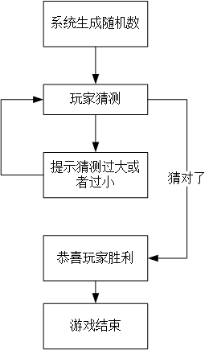

```c++
#include<iostream>
#include<ctime> //time系统时间头文件
using namespace std;

int main() 
{	

	// 添加随机数种子，作用利用当前系统时间随机随机数，防止每次随机数都一样
	srand((unsigned int)time(NULL));
	//1、系统生成随机数
	int num = rand() % 100 + 1; //rand()%100+1生成0+1~99+1的随机数
	//cout << num << endl;

	//2、玩家进行猜测
	int val = 0; // 玩家输入的数据
	while (1)
	{
		cin >> val;

		//3、判断玩家的猜测
		//   猜错：提示猜的结果，过大或者过小，重新返回第二步
		if (val > num)
		{
			cout << "猜测过大" << endl;

		}
		else if (val < num)
		{
			cout << "猜测过小" << endl;
		}
		else
		{
			cout << "恭喜您，猜对了" << endl;
			break; //   猜对：退出游戏
		}
	}
	system("pause");
	return 0;
}
```

###4.2.2 do...while循环语句

**作用：** 满足循环条件，执行循环语句

**语法：** `do{ 循环语句 } while(循环条件);`

**注意：**与while的区别在于==do...while会先执行一次循环语句==，再判断循环条件


**示例：**

```c++
#include<iostream>
#include<ctime> //time系统时间头文件
using namespace std;

int main() 
{	
	//do...while语句
	//在屏幕中输出0-9这10个数字
	int num = 0;
	do
	{
		cout << num << endl;
		num++;
	} while (num<10);
	// do...while和while循环区别在于do...while会先执行一次循环语句

	system("pause");
	return 0;
}
```

> 总结：与while循环区别在于，do...while先执行一次循环语句，再判断循环条件


---

**练习案例：水仙花数**

**案例描述：**水仙花数是指一个 3 位数，它的每个位上的数字的 3次幂之和等于它本身

例如：1^3 + 5^3+ 3^3 = 153

请利用do...while语句，求出所有3位数中的水仙花数

```c++
#include<iostream>
#include<ctime> //time系统时间头文件
using namespace std;

int main() 
{	
	
	//1、将所有的三位数进行输出(100-999)
	//2、在所有的三位数中找到水仙花数
	/*
	    水仙花数
		 获取个位：对数字取模于10可以获取个位
		 获取十位：对数字先整除于10，然后再取模于10，得到十位数字
		 获取百位：对数字整除于100，获取百位

		判断：个位^3+十位^3+百位^4 = 本身

	*/

	//1、将所有的三位数进行输出(100-999)
	int num = 100;
	do
	{
		//cout << num << endl;
		//2、在所有的三位数中找到水仙花数
		int a = 0;// 个位
		int b = 0;// 十位
		int c = 0;// 百位
		a = num % 10; // 获取数字的个位
		b = num / 10 % 10;//获取数字的十位
		c = num / 100; // 获取数字的百位

		if (a*a*a+b*b*b+c*c*c==num)//如果是水仙花数，才打印
		{
			cout << num << endl;
		}
		num++;

	} while (num<1000);
	system("pause");
	return 0;
}
```


###4.2.3 for循环语句

**作用：** 满足循环条件，执行循环语句

**语法：**` for(起始表达式;条件表达式;末尾循环体) { 循环语句; }`

**示例：**

```c++
#include<iostream>
#include<ctime> //time系统时间头文件
using namespace std;

//for循环
int main() 
{	
	//从数字0 打印到 数字9
	for (int i = 0; i < 10; i++)
	{
		cout << i << endl;
	}
	system("pause");
	return 0;
}
```

**详解：**


> 注意：for循环中的表达式，要用分号进行分隔

> 总结：while , do...while, for都是开发中常用的循环语句，for循环结构比较清晰，比较常用

---


**练习案例：敲桌子**

案例描述：从1开始数到数字100， 如果数字个位含有7，或者数字十位含有7，或者该数字是7的倍数，我们打印敲桌子，其余数字直接打印输出。


```c++
1、先来输出1-100这些数字
2、从这100个数字中找到特殊的数字，改为敲桌子
  特殊数字：
     7的倍数：取模为0
     个位有7：取模于10=7
     十位有7：取整数于10=7
```

```c++
#include<iostream>
#include<ctime> //time系统时间头文件
using namespace std;

//for循环
int main() 
{	
	//从数字0 打印到 数字100
	// 1、输出1-100数字
	for (int i = 0; i < 100; i++)
	{
		//2、如果是特殊数字
		if (i%7==0||i%10==7||i/10==7)
		{
			cout << "敲桌子" << endl;
		}
		else
		{
			cout << i << endl;
		}

	}
	system("pause");
	return 0;
}
```


###4.2.4 嵌套循环

**作用：** 在循环体中再嵌套一层循环，解决一些实际问题

例如我们想在屏幕中打印如下图片，就需要利用嵌套循环


**示例：**

```c++
#include<iostream>
#include<ctime> //time系统时间头文件
using namespace std;

int main() 
{	
	//利用嵌套循环实现星图
	//外层执行一次，内层执行一周
	for (int i = 0; i < 10; i++)
	{
		for (int j = 0; j < 10; j++)
		{
			cout << "* ";
		}
		cout << endl;
	}
	system("pause");
	return 0;
}
```

**练习案例：**乘法口诀表

案例描述：利用嵌套循环，实现九九乘法表


**1、列数 *** **行数 = 计算结果**

**2、列数<=当前行数**

```c++
#include<iostream>
#include<ctime> //time系统时间头文件
using namespace std;

int main() 
{	
	//乘法口诀表
	// 打印行数
	for (int i = 1; i <=9; i++)
	{
		//cout << i << endl; //
		for (int j = 1; j <=i; j++)
		{
			cout << j<<"*"<<i<<"="<<j*i<<"\t"; //列数
		}
		cout << endl;
	}
	system("pause");
	return 0;
}
```


##4.3 跳转语句 

###4.3.1 break语句

**作用:** 用于跳出==选择结构==或者==循环结构==

break使用的时机：

- 出现在switch条件语句中，作用是终止case并跳出switch
- 出现在循环语句中，作用是跳出当前的循环语句
- 出现在嵌套循环中，跳出最近的内层循环语句


**示例1：**

```c++
#include<iostream>
#include<ctime> //time系统时间头文件
using namespace std;

int main() 
{	
	//break使用时机
	//1、出现在switch
	cout << "请选择副本的难度" << endl;
	cout << "1、普通" << endl;
	cout << "2、中等" << endl;
	cout << "3、困难" << endl;

	int select = 0; // 创建选择结果的变量
	cin >> select; // 等待用户输入
	switch (select)
	{
	case 1:
		cout << "你选择的是普通难度" << endl;
		break;
	case 2:
		cout << "你选择的是中等难度" << endl;
		break;
	case 3:
		cout << "你选择的是困难难度" << endl;
		break;

	default:
		break;
	}


	//2、出现在循环语句中
	//3、出现在嵌套循环语句中
	system("pause");
	return 0;
}
```

**示例2：**

```c++
#include<iostream>
#include<ctime> //time系统时间头文件
using namespace std;

int main() 
{	
	//break使用时机
	//2、出现在循环语句中
	for (int i = 0; i < 10; i++)
	{
		if (i==5)
		{
			break; // 跳出循环语句
		}
		cout << i << endl;
	}

	//3、出现在嵌套循环语句中
	system("pause");
	return 0;
}
```

**示例3：**

```c++
#include<iostream>
#include<ctime> //time系统时间头文件
using namespace std;
int main() 
{	
	//break使用时机
	//3、出现在嵌套循环语句中
	// 在嵌套循环语句中使用break，退出内层循环
	for (int i = 0; i < 10; i++)
	{
		for (int j = 0; j < 10; j++)
		{
			if (j == 5) 
			{
				break;
			}
			cout << "*" << " ";
		}
		cout << endl;

	}
	system("pause");
	return 0;
}
```


###4.3.2 continue语句

**作用：**在==循环语句==中，跳过本次循环中余下尚未执行的语句，继续执行下一次循环

**示例：**

```c++
#include<iostream>
#include<ctime> //time系统时间头文件
using namespace std;

int main() 
{	
	
	//continue语句

	for (int i = 0; i <=100; i++)
	{
		//如果是奇数，输出
		if (i%2==0)
		{
			continue; //可以筛选条件，执行到此就不在向下执行， 执行下一次循环
			// break会退出循环，而continue不会
		}
		cout << i << endl;
	}

	system("pause");
	return 0;
}
```

> 注意：continue并没有使整个循环终止，而break会跳出循环

###4.3.3 goto语句

**作用：**可以无条件跳转语句

**语法：** `goto 标记;`

**解释：**如果标记的名称存在，执行到goto语句时，会跳转到标记的位置

**示例：**

```c++
#include<iostream>
#include<ctime> //time系统时间头文件
using namespace std;

int main() 
{	
	//goto语句——推荐不适用:影响代码的逻辑结构

	cout << "1、xxxx" << endl;
	cout << "2、xxxx" << endl;

	goto FLAG;
	cout << "3、xxxx" << endl;
	cout << "4、xxxx" << endl;
	FLAG:
	cout << "5、xxxx" << endl;
	system("pause");
	return 0;
}
```

> 注意：在程序中不建议使用goto语句，以免造成程序流程混乱

#5、 数组

##5.1 概述

所谓数组，就是一个集合，里面存放了相同类型的数据元素

**特点1：**数组中的每个==数据元素都是相同的数据类型==

**特点2：**数组是由==连续的内存==位置组成的


##5.2 一维数组

###5.2.1 一维数组定义方式

**一维数组定义的三种方式：**

1. ` 数据类型  数组名[ 数组长度 ]; `
2. `数据类型  数组名[ 数组长度 ] = { 值1，值2 ...};`
3. `数据类型  数组名[ ] = { 值1，值2 ...};`

**示例**

```c++
#include<iostream>
#include<ctime> //time系统时间头文件
using namespace std;

int main() 
{	
	
	//数组
	/*
	
	1. 数据类型  数组名[ 数组长度 ];
    2. 数据类型  数组名[ 数组长度 ] = { 值1，值2 ...};
    3. 数据类型  数组名[ ] = { 值1，值2 ...};	
	*/
	//1. 数据类型  数组名[数组长度];
	int arr[5];
	//给数组中的元素进行赋值
	//数组元素的下标是从0开始索引的
	arr[0] = 10;
	arr[1] = 20;
	arr[2] = 30;
	arr[3] = 40;
	arr[4] = 50;
	//访问数组元素
	cout << arr[0] << endl;
	cout << arr[1] << endl;
	cout << arr[2] << endl;
	cout << arr[3] << endl;
	cout << arr[4] << endl;

	// 2. 数据类型  数组名[ 数组长度 ] = { 值1，值2 ...};
	//如果在初始化数据的时候，没有全部填写完，会用0进行填充剩余的数据
	int arr2[5] = { 10,20,30,40,50 };
	//cout << arr2[0] << endl;
	//cout << arr2[1] << endl;
	//cout << arr2[2] << endl;
	//cout << arr2[3] << endl;
	//cout << arr2[4] << endl;
	for (int i = 0; i < 5; i++)
	{
		cout << arr2[i] << endl;
	}
	//3. 数据类型  数组名[] = { 值1，值2 ... };
	//定义数组的时候，必须有初始长度
	int arr3[] = { 10,20,30,40,50 };
	for (int j = 0; j < 5; j++)
	{
		cout << arr2[j] << endl;
	}

	system("pause");
	return 0;
}
```

> 总结1：数组名的命名规范与变量名命名规范一致，不要和变量重名

> 总结2：数组中下标是从0开始索引

###5.2.2 一维数组数组名

**一维数组名称的用途：**

1. **可以统计整个数组在内存中的长度**
2. **可以获取数组在内存中的首地址**

**示例：**

```c++
#include<iostream>
#include<ctime> //time系统时间头文件
using namespace std;
int main() 
{	
	//数组名用途
	//1、可以统计整个数组在内存的长度
	int arr[10] = { 1,2,3,4,5,6,7,8,9,10 };
	cout << "整个数组占用内存空间为：" << sizeof(arr) << endl;
	cout << "每个元素占用内存空间：" << sizeof(arr[0]) << endl;
	cout << "数组中元素的个数：" << sizeof(arr) / sizeof(arr[0]) << endl;

	//2、可以获取数组在内存中的首地址
	cout << "数组首地址：" << arr << endl;
	cout << "数组中第一个元素地址为：" <<&arr[0]<< endl;

	//数组名是常量，不可以进行赋值操作
	system("pause");
	return 0;
}
```

> 注意：数组名是常量，不可以赋值

> 总结1：直接打印数组名，可以查看数组所占内存的首地址

> 总结2：对数组名进行sizeof，可以获取整个数组占内存空间的大小


**练习案例1**：五只小猪称体重

**案例描述：**

在一个数组中记录了五只小猪的体重，如：int arr[5] = {300,350,200,400,250};

找出并打印最重的小猪体重。

**思想：**访问数组中每个元素，如果这个元素比我认定的最大值要打，更新最大值。

```c++
#include<iostream>
#include<ctime> //time系统时间头文件
using namespace std;
int main() 
{	
	// 1、创建5只小猪体重的数组
	int arr[5] = {300,350,200,400,250};

	// 2、从数组中找出最大值
	//先假定一个最大值，arr[0]
	int max = 0; 
	for (int i = 0; i < 5; i++)
	{
		//cout << arr[i] << endl;
		//如果访问的数组中元素比我认定的最大值还要大，更新最大值
		if (arr[i]>max)
		{
			max = arr[i];
		}

	}
	// 3、打印最大值 
	cout << "最重的小猪体重为：" << max << endl;
	system("pause");
	return 0;
}
```

**练习案例2：**数组元素逆置

**案例描述：**请声明一个5个元素的数组，并且将元素逆置.

(如原数组元素为：1,3,2,5,4;逆置后输出结果为:4,5,2,3,1);

int start = 0；

int end = sizeof(arr)/sizeof(arr[0]) -1; //末尾元素下标

start和end下标元素进行互换，还需要一个零时的变量

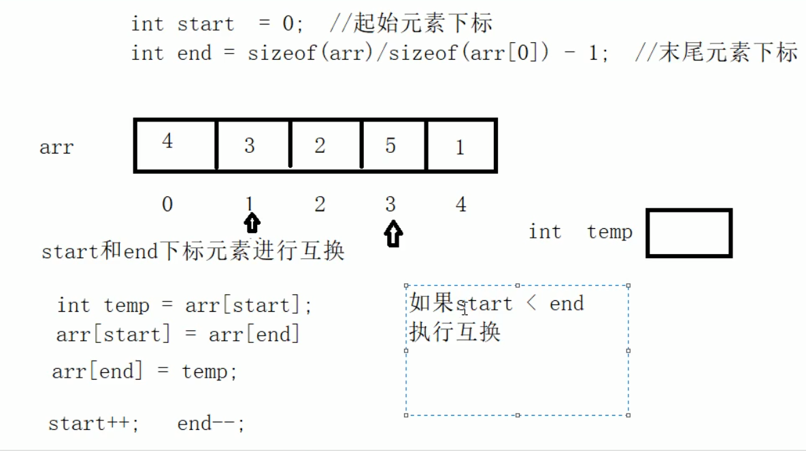

```c++
#include<iostream>
#include<ctime> //time系统时间头文件
using namespace std;
int main() 
{	
	//实现数组元素逆置
	// 1、创建数组
	int arr[5] = { 1,2,3,4,5 };
	cout << "元素数组逆置前结果：" << endl;
	for (int i = 0; i < 5; i++)
	{
		cout << arr[i] << endl;
	}

	// 2、实现逆置
	// 2.1 记录起始下标位置
	// 2.2 记录结束下标位置
	// 2.3 记录起始下标与结束下标的元素互换
	// 2.4 起始位置++，结束位置——
	// 2.5 循环执行2.1操作，知道起始位置>=结束位置
	int start = 0; //起始下标
	int end = sizeof(arr) / sizeof(arr[0]) - 1; //结束下标

	while (start<end)
	{
		//实现元素互换
		int temp = arr[start];
		arr[start] = arr[end];
		arr[end] = temp;

		//下标更新
		start++;
		end--;

	}

	// 3、打印逆置后的数组
	cout << "数组元素逆置后结果：" << endl;
	for (int i = 0; i < 5; i++)
	{
		cout << arr[i] << endl;
	}

	system("pause");
	return 0;
}
```


###5.2.3 冒泡排序

**作用：** 最常用的排序算法，对数组内元素进行排序

1. 比较相邻的元素。如果第一个比第二个大，就交换他们两个。
2. 对每一对相邻元素做同样的工作，执行完毕后，找到第一个最大值。
3. 重复以上的步骤，每次比较次数-1，直到不需要比较


**示例： 将数组 { 4,2,8,0,5,7,1,3,9 } 进行升序排序**


```c++
#include<iostream>
#include<ctime> //time系统时间头文件
using namespace std;
int main() 
{	
	//利用冒泡排序实现升序序列
	int arr[9] = { 4,2,8,0,5,7,1,3,9 };
	cout << "排序前：" << endl;
	for (int i = 0; i < 9; i++)
	{
		cout << arr[i] << "\t";
	}
	//开始排序
	// 总共排序轮数为：元素个数-1
	for (int i = 0; i < 9-1; i++)
	{
		//内层循环对比次数 = 元素个数-当前轮数-1
		for (int j = 0; j < 9-i-1; j++) //sizeof(arr)/size(arr[0])
		{
			//如果第一个数字，比第二个数字大，交换两个数字
			if (arr[j] > arr[j + 1])
			{
				int temp = arr[j];
				arr[j] = arr[j + 1];
				arr[j + 1] = temp;
			}
		}
	}
	//排序后结果
	cout << "排序后结果：" << endl;
	for (int i = 0; i < 9; i++)
	{
		cout << arr[i] << "\t";
	}

	cout << endl;
	system("pause");
	return 0;
}
```


##5.3 二维数组

二维数组就是在一维数组上，多加一个维度。


###5.3.1 二维数组定义方式

二维数组定义的四种方式：

1. ` 数据类型  数组名[ 行数 ][ 列数 ]; `
2. `数据类型  数组名[ 行数 ][ 列数 ] = { {数据1，数据2 } ，{数据3，数据4 } };`
3. `数据类型  数组名[ 行数 ][ 列数 ] = { 数据1，数据2，数据3，数据4};`
4. ` 数据类型  数组名[  ][ 列数 ] = { 数据1，数据2，数据3，数据4};`

> 建议：以上4种定义方式，利用==第二种更加直观，提高代码的可读性==

**示例：**

```c++
#include<iostream>
#include<ctime> //time系统时间头文件
using namespace std;
int main() 
{	
	//二维数组定义方式

	/*
	1. 数据类型  数组名[ 行数 ][ 列数 ];
	2. 数据类型  数组名[ 行数 ][ 列数 ] = { {数据1，数据2 } ，{数据3，数据4 } };
	3. 数据类型  数组名[ 行数 ][ 列数 ] = { 数据1，数据2，数据3，数据4};
	4. 数据类型  数组名[  ][ 列数 ] = { 数据1，数据2，数据3，数据4};
	*/
	//1. 数据类型  数组名[ 行数 ][ 列数 ];
	int arr[2][3]; // 2行3列数组
	arr[0][0] = 1;
	arr[0][1] = 2;
	arr[0][2] = 3;
	arr[1][0] = 4;
	arr[1][1] = 5;
	arr[1][2] = 6;
	cout << "输出每一个元素：" << endl;
	//外层循环打印行数，内层循环打印列数
	for (int i = 0; i < 2; i++)
	{
		for (int j = 0; j < 3; j++)
		{
			cout << arr[i][j]<<endl;

		}
	}
	
	//2. 数据类型  数组名[行数][列数] = { {数据1，数据2 } ，{数据3，数据4 } };
	int arr2[2][3] =
	{
		{1,2,3},
	    {4,5,6},
	};
	for (int i = 0; i < 2; i++)
	{
		for (int j = 0; j < 3; j++)
		{
			cout << arr2[i][j]<<" ";

		}
		cout << endl;
	}

	//3. 数据类型  数组名[行数][列数] = { 数据1，数据2，数据3，数据4 };
	int arr3[2][3] = { 1,2,3,4,5,6 };
	for (int i = 0; i < 2; i++)
	{
		for (int j = 0; j < 3; j++)
		{
			cout << arr3[i][j] << " ";

		}
		cout << endl;
	}

	//4. 数据类型  数组名[][列数] = { 数据1，数据2，数据3，数据4 };
	int arr4[][3] = {1,2,3,4,5,6};
	for (int i = 0; i < 2; i++)
	{
		for (int j = 0; j < 3; j++)
		{
			cout << arr4[i][j] << " ";

		}
		cout << endl;
	}
	system("pause");
	return 0;
}
```

> 总结：在定义二维数组时，如果初始化了数据，可以省略行数

###5.3.2 二维数组数组名

- 查看二维数组所占内存空间
- 获取二维数组首地址

**示例：**

```c++
#include<iostream>
#include<ctime> //time系统时间头文件
using namespace std;
int main() 
{	
	//二维数组名称用途
	//1、可以查看占用的内存空间大小
	int arr[2][3] = 
	{
		{1,2,3},
	    {4,5,6}
	};
	cout << "二维数组占用的内存空间大小：" << sizeof(arr) << endl;
	cout << "二维数组第一行占用内存为：" << sizeof(arr[0]) << endl; //0表示行号
	cout << "二维数组第一个元素占用内存为：" << sizeof(arr[0][0]) << endl;
	 
	cout << "二维数组的行数为：" << sizeof(arr) / sizeof(arr[0]) << endl; // 行数
	cout << "二维数组的列数为：" << sizeof(arr[0]) / sizeof(arr[0][0]) << endl; //列数

	//2、可以查看二维数组的首地址
	cout <<"二维数组的首地址为："<< arr << endl;
	cout << "二维数组第一行首地址为：" << arr[0] << endl;
	cout << "二维数组第二行首地址为：" << arr[1] << endl;
	cout << "二维数组第一个元素首地址：" << &arr[0][0] << endl;// 具体元素的地址，需要加一个取地符
	system("pause");
	return 0;
}
```

> 总结1：二维数组名就是这个数组的首地址

> 总结2：对二维数组名进行sizeof时，可以获取整个二维数组占用的内存空间大小

###5.3.3 二维数组应用案例

**考试成绩统计：**

案例描述：有三名同学（张三，李四，王五），在一次考试中的成绩分别如下表，**请分别输出三名同学的总成绩**

|      | 语文 | 数学 | 英语 |
| ---- | ---- | ---- | ---- |
| 张三 | 100  | 100  | 100  |
| 李四 | 90   | 50   | 100  |
| 王五 | 60   | 70   | 80   |

1、创建一个二维3行3列数组

2、统计考试成绩，让每行的3列数据相加，统计出来一个综合

```c++
#include<iostream>
#include<ctime> //time系统时间头文件
#include<string>
using namespace std;
int main() 
{	
	//二维数组的案例——考试成绩统计
	int score[3][3] = 
	{
		{100,100,100},
	    {90,50,100},
	    {60,70,80}
	
	};

	string names[3] = { "张三","李四","王五" };
	//2、统计每个人的总和分数
	for (int i = 0; i < 3; i++)
	{
		int sum = 0; // 统计分数总和的变量
		for (int j = 0; j < 3; j++)
		{
			sum += score[i][j];
			//cout << score[i][j] << "\t";
		}
		cout << names[i] << "个人的总分为：" << sum << endl;
		cout << endl;

	}
	system("pause");
	return 0;
}
```


# 6、函数

##6.1 概述

**作用：**将一段经常使用的代码封装起来，减少重复代码

一个较大的程序，一般分为若干个程序块，每个模块实现特定的功能。

##6.2 函数的定义

**函数的定义一般主要有5个步骤：**

1、返回值类型 

2、函数名

3、参数表列

4、函数体语句 

5、return 表达式

**语法：** 

```
返回值类型 函数名 （参数列表）
{

       函数体语句

       return表达式

}
```

- 返回值类型 ：一个函数可以返回一个值。在函数定义中
- 函数名：给函数起个名称
- 参数列表：使用该函数时，传入的数据
- 函数体语句：花括号内的代码，函数内需要执行的语句
- return表达式： 和返回值类型挂钩，函数执行完后，返回相应的数据

**示例：**定义一个加法函数，实现两个数相加

1、返回值类型    int

2、函数的名称    add

3、参数列表        int num1,intnum2

4、函数体语句    int sum = num1+num2

5、return 表达式  return sum

```c++
//函数定义
int add(int num1, int num2)
{
	int sum = num1 + num2;
	return sum;
}
```


##6.3 函数的调用

**功能：**使用定义好的函数

**语法：**` 函数名（参数）`

**示例：**

```c++
#include<iostream>
#include<ctime> //time系统时间头文件
#include<string>
using namespace std;
//函数的定义
// 语法
// 返回值类型，函数名 参数列表 具体的函数体语句 return表达式
// 加法函数，实现两个整数相加，并且将相加的结果进行返回

// 函数定义的时候，num1和num2并没有真的数据，他只是一个形式上的参数，简称形参
int add(int num1,int num2) 
{
	int sum = num1 + num2;
	return sum;
}

int main() 
{	
	int num1 = 1;
	int num2 = 2;
	// 调用函数
	// 函数调用语法： 函数名称(参数)
	// num1和num2成为实际参数，简称实参；在函数中并称之为形参
	// 当调用函数的时候，实参的值会传递给形参
	int sum = add(num1, num2);
	cout << "sum=" << sum << endl;

	system("pause");
	return 0;
}
```

总结：函数定义里小括号内称为形参，函数调用时传入的参数称为实参

##6.4 值传递

- 所谓值传递，就是函数调用时实参将数值传入给形参
- 值传递时，==如果形参发生，并不会影响实参==

**示例：**

```c++
#include<iostream>
#include<ctime> //time系统时间头文件
#include<string>
using namespace std;

//值传递
// 定义函数，两个数字进行交换函数
void swap(int num1, int num2)
{

	cout << "交换前：" << endl;
	cout << "num1=" << num1 << endl;
	cout << "num2=" << num2 << endl;

	int temp = num1;
	num1 = num2;
	num2 = temp;

	cout << "交换前：" << endl;
	cout << "num1=" << num1 << endl;
	cout << "num2=" << num2 << endl;

	return;//或者都不需要写，或者返回值不需要的时候，可以不写return
}

int main() 
{	
	 
	int a = 10;
	int b = 20;
	cout << "a=" << a << endl;
	cout << "b=" << b << endl;
	// 当我们做值传递的时候，函数的形参发生改变，并不会影响实参
	swap(a, b);
	
	cout << "a=" << a << endl;
	cout << "b=" << b << endl;
	system("pause");
	return 0;
}
```

总结： 值传递时，形参是修饰不了实参的

##6.5 函数的常见样式

**常见的函数样式有4种**

1. 无参无返
2. 有参无返
3. 无参有返
4. 有参有返

**示例：**

```c++
#include<iostream>
#include<ctime> //time系统时间头文件
#include<string>
using namespace std;

//函数常见样式

//1、无参无返
void test01() 
{
	cout << "this is test01" << endl;

}
//2、有参无饭
void test02(int a) 
{
	cout << "this is test02 a=" << a << endl;
	return;
}
//3、无参有返
int test03() 
{
	cout << "this is test03" << endl;
	return 100;

}

//4、有参有返
int test04(int a) 
{
	cout << "this is test04 a=" << a << endl;
	return a;
}

int main() 
{	
	 // 无参无返函数调用
	test01();
	// 有参无返函数调用
	test02(100);
	// 无参有返函数调用
	int num1 = test03();
	cout << "num1=" << num1 << endl;
	// 有参有返函数调用
	int num2 = test04(1000);
	cout << "num2=" << num2 << endl;
	system("pause");
	return 0;
}
```


##6.6 函数的声明

**作用：** 告诉编译器函数名称及如何调用函数。函数的实际主体可以单独定义。

- 函数的**声明可以多次**，但是函数的**定义只能有一次**

**示例：**

```c++
#include<iostream>
#include<ctime> //time系统时间头文件
#include<string>
using namespace std;

// 提前告诉编译器函数的存在，可以利用函数的声明
int max(int a, int b); // 函数声明


// 声明可以多次，定义只能一次
// 函数声明
// 比较函数，实现两个整型数字进行比较，返回较大的值
int max(int a, int b)
{
	return a > b ? a : b; // 三目运算符

}

int main() 
{	
	int a = 10;
	int b = 20;
	cout << max(a, b) << endl;
	system("pause");
	return 0;
}
```


##6.7 函数的分文件编写

**作用：**让代码结构更加清晰

函数分文件编写一般有4个步骤

1. 创建后缀名为.h的头文件  
2. 创建后缀名为.cpp的源文件
3. 在头文件中写函数的声明
4. 在源文件中写函数的定义

**示例：**

```c++
//swap.h文件
#include<iostream>
using namespace std;

// 函数的声明
void swap(int a, int b); 

```

```c++
//swap.cpp文件
#include "swap.h" //自定义文件

//函数的定义
void swap(int a, int b)
{
	int temp = a;
	a = b;
	b = temp;
	cout << "a=" << a << endl;
	cout << "b=" << b << endl;

}
```

```c++
//main函数文件
#include<iostream>
using namespace std;

#include "swap.h" 

// 1、创建.h后缀名的头文件 swap.h
// 2、创建.cpp后缀名的源文件 swap.cpp
// 3、在头文件中写函数的声明
// 4、在源文件中先函数的定义

int main() 
{	
	int a = 10;
	int b = 20;
	swap(a, b);

	system("pause");
	return 0;
}
```

# 7、指针

<<<<<<< HEAD
##7.1 指针的基本概念

**指针的作用：** 可以通过指针**间接**访问内存

- 内存编号是从0开始记录的，一般用十六进制数字表示
- 可以利用指针变量保存地址

**说白了，指针就是一个地址**

##7.2 指针变量的定义和使用

指针变量定义语法： `数据类型 * 变量名；`

**示例：**

```c++
#include<iostream>
using namespace std;

int main() 
{	
	// 1、定义指针
	int a = 10;
	// 指针定义的语法： 数据类型 * 指针变量名
	int *p; 
	// 让指针记录变量a的地址
	p = &a; // &取址变量符
	cout << "a的地址为：" << &a << endl; // 打印的是a的地址
	cout << "指针p等于：" << p << endl; // 打印的是a的地址

	// 2、使用指针
	// 可以通过解引用的方式来找到指针指向的内存
	// 指针前面加 * ，找到指针指向的内存中的数据
	*p = 100;
	cout << "a=" << a << endl;
	cout << "*p=" << *p << endl;

	system("pause");
	return 0;
} 
```

指针变量和普通变量的区别

- 普通变量存放的是数据,指针变量存放的是地址
- 指针变量可以通过" * "操作符，操作指针变量指向的内存空间，这个过程称为解引用

> 总结1： 我们可以通过 & 符号 获取变量的地址

> 总结2：利用指针可以记录地址

> 总结3：对指针变量解引用，可以操作指针指向的内存

##7.3 指针所占内存空间

**提问：**指针也是种数据类型，那么这种数据类型占用多少内存空间？

**示例：**

```c++
#include<iostream>
using namespace std;

int main() 
{	
	//指针所占内存空间
	int a = 10;
	//int *p;
	//p = &a; // 指针p指向a的首地址
	int *p = &a;
	//在32位操作系统下，指针是占4个字节空间大小，不管是什么数据类型
	//在64位操作系统下，指针是占8个字节空间大小，不管是什么数据类型
	cout << "sizeof (int *) = " << sizeof(int *) << endl; // sizeof(p)
	cout << "sizeof (float *) = " << sizeof(float *) << endl; // sizeof(p)
	cout << "sizeof (double *) = " << sizeof(double *) << endl; // sizeof(p)
	cout << "sizeof (char *) = " << sizeof(char *) << endl; // sizeof(p)

	system("pause");
	return 0;
}
```

> 总结：所有指针类型在32位操作系统下是4个字节，64位下占8个字节

##7.4 空指针和野指针

**空指针**：指针变量指向内存中编号为0的空间

**用途：**初始化指针变量

**注意：**空指针指向的内存是不可以访问的

**示例1：空指针**

```c++
#include<iostream>
using namespace std;

int main() 
{	
	 //空指针
	//1、空指针用于给指针变量进行初始化
	int *p = NULL;

	//2、空指针是不可以进行访问的
	//0~255之间的内存编号是系统占用的，因此不可以访问
	//*p = 100;
	system("pause");
	return 0;
}
```

**野指针**：指针变量指向非法的内存空间

**示例2：野指针**

```c++
#include<iostream>
using namespace std;

int main() 
{	
	//野指针
	// 在程序中，尽量避免出现野指针
	//指针变量p指向内存地址编号为0x1100的空间
	int *p = NULL; //空指针
	int *p1 = (int *)0x1100;

	system("pause");
	return 0;
}
```

> ==总结：空指针和野指针都不是我们申请的空间，因此不要访问。==

##7.5 const修饰指针

**const修饰指针有三种情况**

1. **const修饰指针   --- 常量指针**

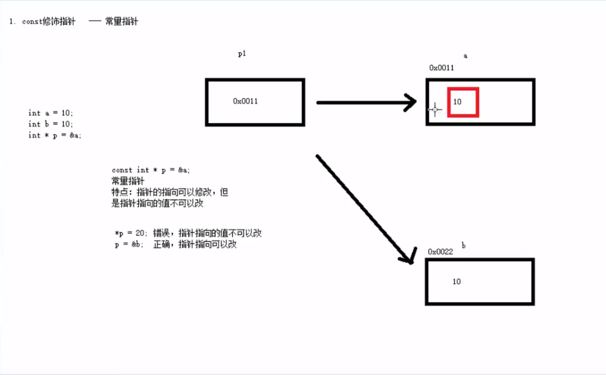

2. **const修饰常量   --- 指针常量**

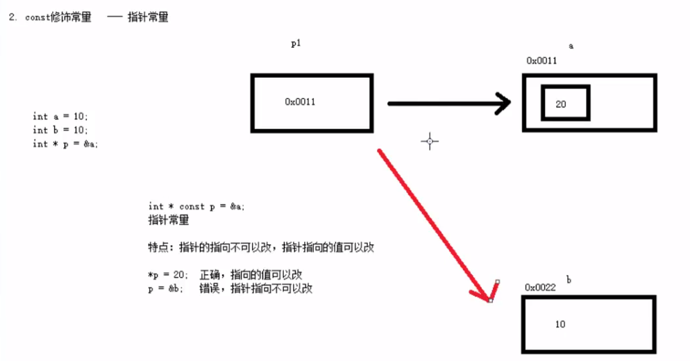

3. **const即修饰指针，又修饰常量**

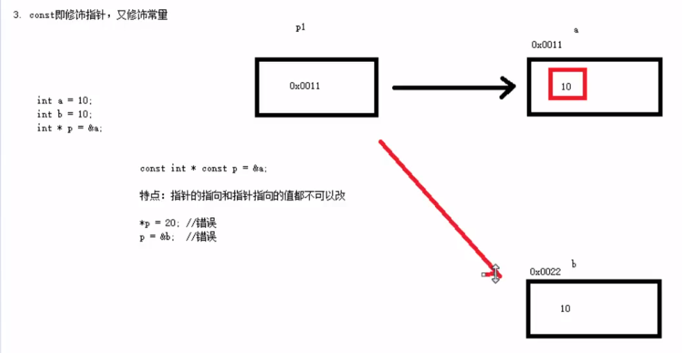

**示例：**

```c++
#include<iostream>
using namespace std;

int main() 
{	 

	//1、const修饰指针
	int a = 10;
	int b = 10;
	
	const int * p = &a; //常量指针，指针指向的值不可以改，指针指向可以改
	//*p = 20; 错误
	p = &b;//正确

	//2、const修饰常量    指针常量
	// 指针的指向不可以改，指针指向的值可以改
	int * const p2 = &a; // 
	*p2 = 100; //正确
	//p2 = &b;//错误，指针的指向不可以改

	//3、const修饰常量和指针
	const int * const p3 = &a;
	//*p3 = 100; 错误
	//p3 = &b; 错误

	system("pause");
	return 0;
}
```

> ==技巧：看const右侧紧跟着的是指针还是常量, 是指针就是常量指针，是常量就是指针常量==

##7.6 指针和数组

**作用：**利用指针访问数组中元素

**示例：**

```c++
#include<iostream>
using namespace std;

int main() 
{	 

	// 指针和数组
	// 利用指针访问数组中的元素

	int arr[] = { 1,2,3,4,5,6,7,8,9,10 };
	cout << "第一个元素为" << arr[0] << endl;

	int * p = arr; // arr就是数组的首地址
	cout << "利用指针来访问第一个元素：" << *p << endl;
	//p++;//让指针向后便宜4个字节
	//cout << "利用指针来访问第二个元素：" << *p << endl;

	cout << "利用指针遍历数组" << endl;
	for (int i = 0; i < 10; i++)
	{
		//cout << arr[i] << endl;
		cout << *p << endl;
		p++;

	}

	system("pause");
	return 0;
}
```


##7.7 指针和函数

**作用：**利用指针作函数参数，可以修改实参的值

**示例：**

```c++
#include<iostream>
using namespace std;

//实现两个数字进行交换
void swap01(int a, int b) 
{
	int temp = a;
	a = b;
	b = temp;
	cout << "swap01 a=" << a << endl;
	cout << "swap01 b=" << b << endl;

}

void swap02(int *p1, int *p2)
{
	int temp = *p1;
	*p1 = *p2;
	*p2 = temp;
	
}

int main() 
{	 
	//指针和函数
	//1、值传递
	int a = 10;
	int b = 20;
	//swap01(a, b);
	
	//2、地址传递
	//如果是地址传递，可以修饰实参
	swap02(&a, &b);

	cout << "a=" << a << endl;
	cout << "b=" << b << endl;

	system("pause");
	return 0;
}
```

> 总结：如果不想修改实参，就用值传递，如果想修改实参，就用地址传递

##7.8 指针、数组、函数

**案例描述：**封装一个函数，利用冒泡排序，实现对整型数组的升序排序

例如数组：int arr[10] = { 4,3,6,9,1,2,10,8,7,5 };

**示例：**

```c++
#include<iostream>
using namespace std;

//冒泡排序函数 参数1：数组的首地址，参数2：数组长度
void bubbleSort(int *arr, int len)
{
	for (int i = 0; i < len; i++)
	{
		for (int j = 0; j < len-i-1; j++)
		{
			//如果j>j+1的值，交换数字
			if (arr[j]>arr[j+1])
			{
				int temp = arr[j];
				arr[j] = arr[j + 1];
				arr[j + 1] = temp;

			}
		}
	}

}

//打印数组
void printArray(int *arr, int len)
{
	for (int i = 0; i < len; i++)
	{
		cout << arr[i] << endl;

	}

}

int main() 
{	 
	//1、先创建一个数组
	int arr[] = { 4,3,6,9,1,2,10,8,7,5 };
	int len = sizeof(arr) / sizeof(arr[0]); // 数组的长度

	//2、创建一个函数，实现冒泡排序
	bubbleSort(arr,len);

	//3、打印排序后的数组
	printArray(arr, len);

	system("pause");
	return 0;
}
```

> 总结：当数组名传入到函数作为参数时，被退化为指向首元素的指针

#8 结构体

##8.1 结构体基本概念

结构体属于用户==自定义的数据类型==，允许用户存储不同的数据类型

##8.2 结构体定义和使用

**语法：**`struct 结构体名 { 结构体成员列表 }；`

通过结构体创建变量的方式有三种：

- struct 结构体名 变量名
- struct 结构体名 变量名 = { 成员1值 ， 成员2值...}
- 定义结构体时顺便创建变量

**示例：**

```c++
#include<iostream>
#include<string>
using namespace std;

//1、 创建学生数据类型：学生包括（姓名，年龄，分数）
// 自定义数据类型，一些类型集合组成的一个类型
// 语法 struct 类型名称 {成员列表};
struct Student
{
	//成员列表
	//姓名
	string name;
	//年龄
	int age;
	//分数
	int score;

}s3;// 顺便创建结构体变量——不建议使用第三种

 
//2、 通过学生类型创建具体学生
int main() 
{	 
	
	//2.1 struct Student s1 
	    //struct关键字可以不写

	struct Student s1;
    //给s1属性赋值，通过. 访问结构体变量中的属性
	s1.name = "jjk";
	s1.age = 18;
	s1.score = 100;
	cout << "姓名：" << s1.name << "年龄：" << s1.age << "分数：" << s1.score << endl;

	//2.2 struct Student s2 = {...}
	struct Student s2 = { "贾继康",10,349 };
	cout << "姓名：" << s2.name << "年龄：" << s2.age << "分数：" << s2.score << endl;

	//2.3 定义结构体时顺便创建结构体变量
	s3.name = "王五";
	s3.age = 20;
	s3.score = 23;
	cout << "姓名：" << s3.name << "年龄：" << s3.age << "分数：" << s3.score << endl;

	system("pause");
	return 0;
}
```

> 总结1：定义结构体时的关键字是struct，不可省略

> 总结2：创建结构体变量时，关键字struct可以省略

> 总结3：结构体变量利用操作符 ''.''  访问成员

##8.3 结构体数组

**作用：**将自定义的结构体放入到数组中方便维护

**语法：**` struct  结构体名 数组名[元素个数] = {  {} , {} , ... {} }`

**示例：**

```c++
#include<iostream>
#include<string>
using namespace std;

//结构体数组
//1、结构体定义
struct Student
{
	string name; // 姓名
	int age; //年龄
	int  score;//分数
};

int main() 
{	 
	//2、创建结构体数组
	struct Student stuArray[3] =
	{
		{"张三",13,23},
		{"李四",23,435},
		{"王五",34,56}

	};


	//3、给结构体数组中的元素赋值
	stuArray[2].name = "赵柳";
	stuArray[2].age = 343;
	stuArray[2].score = 34;

	//4、遍历结构体数组
	for (int i = 0; i < 3; i++)
	{
		cout << "姓名：" << stuArray[i].name
			 << "年龄：" << stuArray[i].age 
			 << "分数：" << stuArray[i].score << endl;

	}
	system("pause");
	return 0;
}
```


##8.4 结构体指针

**作用：**通过指针访问结构体中的成员

- 利用操作符 `-> `可以通过结构体指针访问结构体属性

**示例：**

```c++
#include<iostream>
#include<string>
using namespace std;

//结构体指针
//定义学生的结构体
struct student
{
	string name; //姓名
	int age; //年龄
	int score; //分数
};

int main() 
{	 
	//1、创建学生结构体变量
	struct student s = { "张三",23,45 };

	//2、创建指针指向结构体变量
	struct student *p = &s;

	//3、通过指针访问结构体变量中的数据
	//通过结构体指针，访问结构体中的属性，需要利用'->'
	cout << "姓名：" << p->name << "年龄" << p->age << "分数：" << p->score << endl;
	
	system("pause");
	return 0;
}
```


> 总结：结构体指针可以通过 -> 操作符 来访问结构体中的成员

##8.5 结构体嵌套结构体

**作用：** 结构体中的成员可以是另一个结构体

**例如：**每个老师辅导一个学员，一个老师的结构体中，记录一个学生的结构体

**示例：**

```c++
#include<iostream>
#include<string>
using namespace std;

//学生结构体定义
struct student
{
	//学生姓名，年龄，考试分数
	string name;
	int age;
	int score;
};


//老师结构体定义
struct teacher
{
	int id; //教师编号
	string name; // 教师姓名
	int age; //教师年龄
	struct student stu; //老师有自己的学生

};

int main() 
{	 
	//结构体嵌套结构体
	//创建老师
	struct teacher t;
	t.id = 10000;
	t.name = "老王";
	t.age = 50;
	t.stu.name = "小三";
	t.stu.age = 20;
	t.stu.score = 34;
	cout << "老师姓名："<< t.name
		<< "老师编号：" << t.id
		<< "老师年龄：" << t.age
		<< "老师辅导的学生姓名：" << t.stu.name
		<< "学生年龄：" << t.stu.age
		<< "学生成绩：" << t.stu.score << endl;

	system("pause");
	return 0;
}
```

**总结：**在结构体中可以定义另一个结构体作为成员，用来解决实际问题

##8.6 结构体做函数参数 

**作用：**将结构体作为参数向函数中传递

传递方式有两种：

- 值传递
- 地址传递

**示例：**

```c++
#include<iostream>
#include<string>
using namespace std;


struct student 
{
	//学生姓名，年龄，分数
	string name;
	int age;
	int score;
};

//打印学生信息函数
//1、值传递
void printStudent1(struct student s) 
{
	cout << "子函数1中打印姓名: " << s.name << "年龄: " << s.age << "分数: " << s.score << endl;

}
//2、地址传递
void printStudent2(struct student * p) 
{
	cout << "子函数2中打印姓名:" << p->name << "年龄:" << p->age << "分数:" << p->score << endl;
}

int main() 
{	 

	 //结构体做函数参数
	//将学生传入到一个参数中，打印学生身上的所有信息
	
	//创建结构体变量
	struct student s;
	s.name = "张三";
	s.age = 23;
	s.score = 34;

	printStudent1(s);
	printStudent2(&s);

	//cout << "main函数中打印姓名:" << s.name << "年龄:" << s.age << "分数:" << s.score << endl;

	system("pause");
	return 0;
}
```

==总结：如果不想修改主函数中的数据，用值传递，反之用地址传递==

##8.7 结构体中 const使用场景

**作用：**用const来防止误操作

**示例：**

```c++
#include<iostream>
#include<string>
using namespace std;

//const 使用场景

struct student
{
	//姓名，年龄，分数
	string name;
	int age;
	int score;

};
//打印函数
//将函数中的形参改为指针，可以减少内存空间，而且不会复制新的副本出来
//需要注意到：main函数的文件会因为打印函数的修改而随之修改，所以在形参中加上const，以致不能修改
void printStudents(const struct student *s) 
{
	//s->age = 100; //假如const之后，一旦有修改的操作就会报错，可以防止我们的误操作
	//cout << "姓名：" << s.name << "年龄：" << s.age << "分数：" << s.score << endl;
	cout << "姓名：" << s->name << "年龄：" << s->age << "分数：" << s->score << endl;
}

int main() 
{	 
	//创建结构体变量及其初始化赋值
	struct student s = { "张三", 20, 34 };

	//通过函数打印结构体变量信息
	//printStudents(s);//值传递
	printStudents(&s); //地址传递
	 
	system("pause");
	return 0;
}
```


##8.8 结构体案例

###8.8.1 案例1

**案例描述：**

学校正在做毕设项目，每名老师带领5个学生，总共有3名老师，需求如下

设计学生和老师的结构体，其中在老师的结构体中，有老师姓名和一个存放5名学生的数组作为成员

学生的成员有姓名、考试分数，创建数组存放3名老师，通过函数给每个老师及所带的学生赋值

最终打印出老师数据以及老师所带的学生数据。

**示例：**

```c++
#include<iostream>
#include<string>
#include<ctime>
using namespace std;

//学生的结构体定义
struct student
{
	string name;
	int score;
};

//老师的结构体定义
struct teacher
{
	string name;
	struct student sArray[5];
};

//给老师和学生赋值的函数
void allocateSpace(struct teacher tArray[],int len) 
{
	string nameSeed = "ABCDE";
	//给老师开始赋值
	for (int i = 0; i < len; i++)
	{

		tArray[i].name = "Teacher_";
		tArray[i].name += nameSeed[i];

		//通过循环给每名老师所带的学生赋值
		for (int j = 0; j < 5; j++)
		{
			tArray[i].sArray[j].name = "Student_";
			tArray[i].sArray[j].name += nameSeed[j];

			int random = rand() % 61+40;//  40-99
			tArray[i].sArray[j].score = random;

		}
	}
}

//打印所有信息
void printInfo(struct teacher tArray[], int len)
{
	for (int i = 0; i < len; i++)
	{
		cout << "老师的姓名：" << tArray[i].name << endl;
		for (int j = 0; j < 5; j++)
		{
			cout << "\t学生姓名：" << tArray[i].sArray[j].name 
				 << "考试分数：" << tArray[i].sArray[j].score << endl;
		}
	}
}

int main() 
{ 
	 //随机数种子
	srand((unsigned int)time(NULL));
	 //创建3名老师的数组
	struct teacher tArray[3];
	int len = sizeof(tArray) / sizeof(tArray[0]);

	//通过函数给3名老师的信息赋值，并且老师带的学生赋值
	allocateSpace(tArray,len);

	//打印所有老师及所带的学生信息
	printInfo(tArray,len);

	system("pause");
	return 0;
}
```


###8.8.2 案例2

**案例描述：**

设计一个英雄的结构体，包括成员姓名，年龄，性别;创建结构体数组，数组中存放5名英雄。

通过冒泡排序的算法，将数组中的英雄按照年龄进行升序排序，最终打印排序后的结果。

五名英雄信息如下：

```c++
		{"刘备",23,"男"},
		{"关羽",22,"男"},
		{"张飞",20,"男"},
		{"赵云",21,"男"},
		{"貂蝉",19,"女"},
```

**示例**

```c++
#include<iostream>
#include<string>
#include<ctime>
using namespace std;

//英雄的结构体
struct Hero
{
	string name;
	int age;
	string sex;

};

//冒泡排序 实现年龄升序排列
void bubbleSort(struct Hero heroArray[], int len) 
{
	for (int i = 0; i < len-1; i++)
	{
		for (int j = 0; j < len-i-1; j++)
		{
			//如果j下标的元素 大于 j+1下标的元素的年龄，交换两个元素
			if (heroArray[j].age>heroArray[j+1].age)
			{
				struct Hero temp = heroArray[j];
				heroArray[j] = heroArray[j + 1];
				heroArray[j + 1] = temp;
			}
		}
	}
}

//打印函数
void printHero(struct Hero heroArray[], int len)
{
	for (int i = 0; i < len; i++)
	{
		cout << "英雄的姓名：" << heroArray[i].name
		    << " 英雄的年龄：" << heroArray[i].age
			<< "英雄的性别：" << heroArray[i].sex << endl;
	}
}

int main() 
{ 
	//1、设计一个英雄的结构体
	//2、创建数组存放5名英雄
	struct Hero heroArray[5] = 
	{
		{"刘备",23,"男"},
		{"关羽",22,"男"},
		{"张飞",20,"男"},
		{"赵云",21,"男"},
		{"貂蝉",19,"女"},
	};

	int len = sizeof(heroArray) / sizeof(heroArray[0]); // 获取数组的长度
	for (int i = 0; i < len; i++)
	{
		cout <<"英雄的姓名：" <<heroArray[i].name 
			 <<" 英雄的年龄：" <<heroArray[i].age 
			 <<"英雄的性别：" <<heroArray[i].sex << endl;

	}

	//3、对数组进行排序，按照年龄升序排序
	bubbleSort(heroArray,len);

	//4、将排序后的结果打印输出
	cout << "排序后的结果：" << endl;
	printHero(heroArray, len);

	system("pause");
	return 0;
}
```


# ==二、C++学习笔记——通讯录管理系统==

##2.1、系统需求

通讯录是一个可以记录亲人、好友信息的工具。

本教程主要利用C++来实现一个通讯录管理系统

系统中需要实现的功能如下：

- 添加联系人：向通讯录中添加新人，信息包括（姓名、性别、年龄、联系电话、家庭住址）最多记录1000人
- 显示联系人：显示通讯录中所有联系人信息
- 删除联系人：按照姓名进行删除指定联系人
- 查找联系人：按照姓名查看指定联系人信息
- 修改联系人：按照姓名重新修改指定联系人
- 清空联系人：清空通讯录中所有信息
- 退出通讯录：退出当前使用的通讯录

##2.2、创建项目

创建项目步骤如下：

- 创建新项目
- 添加文件

###2.2.1 创建项目

打开vs2017后，点击创建新项目，创建新的C++项目

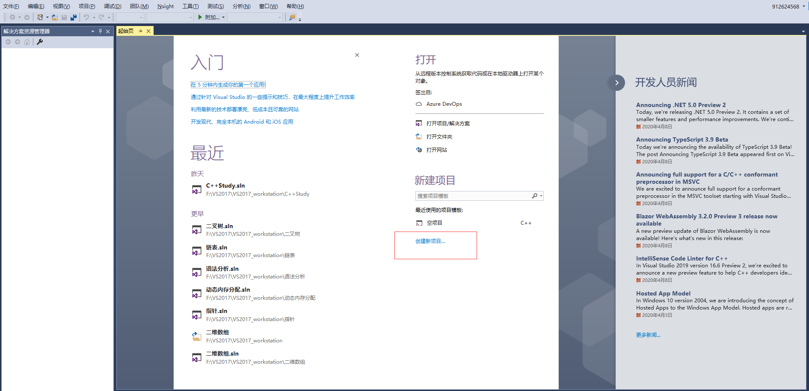

填写项目名称，选择项目路径

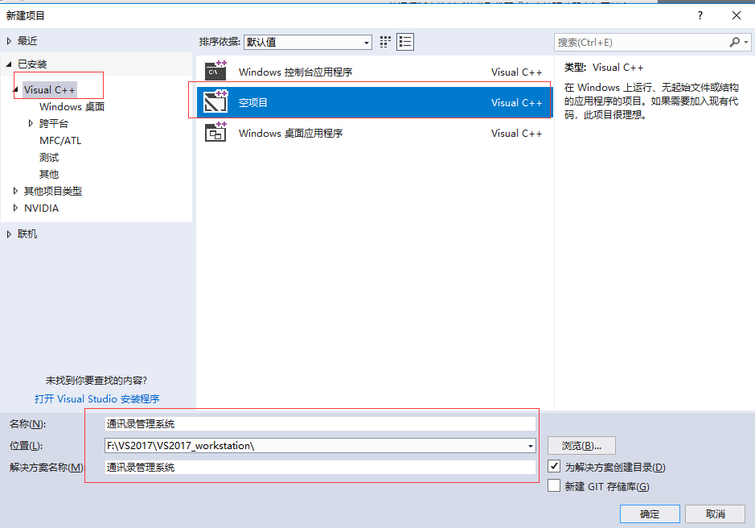

###2.2.2 添加文件

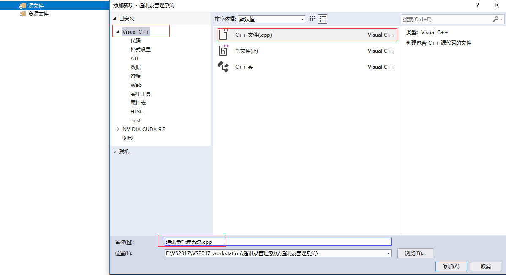

至此，项目已创建完毕

##2.3、菜单功能

**功能描述：** 用户选择功能的界面

菜单界面效果如下图：


**步骤：**

- 封装函数显示该界面  如 `void showMenu()`
- 在main函数中调用封装好的函数

**代码：**

```c++
#include<iostream>
#include<string>
using namespace std;

//菜单界面
void showMenu() 
{
	cout << "******************************" << endl;
	cout << "*****  1、添加联系人  *****" << endl;
	cout << "*****  2、显示联系人  *****" << endl;
	cout << "*****  3、删除联系人  *****" << endl;
	cout << "*****  4、查找联系人  *****" << endl;
	cout << "*****  5、修改联系人  *****" << endl;
	cout << "*****  6、清空联系人  *****" << endl;
	cout << "*****  0、退出通讯录  *****" << endl;
	cout << "******************************" << endl;
}

int main() 
{
	showMenu(); // 菜单调用

	system("pause");
	return 0;

}
```


##2.4、退出功能

**功能描述：**退出通讯录系统

**思路：**根据用户不同的选择，进入不同的功能，可以选择switch分支结构，将整个架构进行搭建

当用户选择0时候，执行退出，选择其他先不做操作，也不会退出程序

**代码：**

```c++
#include<iostream>
#include<string>
using namespace std;

//菜单界面
void showMenu() 
{
	cout << "******************************" << endl;
	cout << "*****  1、添加联系人  *****" << endl;
	cout << "*****  2、显示联系人  *****" << endl;
	cout << "*****  3、删除联系人  *****" << endl;
	cout << "*****  4、查找联系人  *****" << endl;
	cout << "*****  5、修改联系人  *****" << endl;
	cout << "*****  6、清空联系人  *****" << endl;
	cout << "*****  0、退出通讯录  *****" << endl;
	cout << "******************************" << endl;
}


int main() 
{
	int select = 0; //创建一个用户选择输入的变量
	while (true) // 并不是真正意义上的死循环
	{
		showMenu(); // 菜单调用
		cin >> select;
		switch (select)
		{
		case 1: //1、添加联系人
			break;
		case 2: //2、显示联系人
			break;
		case 3: //3、删除联系人
			break;
		case 4: //4、查找联系人
			break;
		case 5: //5、修改联系人
			break;
		case 6: //6、清空联系人
			break;
		case 0: //0、退出通讯录
			cout << "欢迎下次使用" << endl;
			system("pause");
			return 0;
			break;
		default:
			break;
		}

	}
	system("pause");
	return 0;
}
```


## 2.5、添加联系人

**功能描述：**

实现添加联系人功能，联系人上限为1000人，联系人信息包括（姓名、性别、年龄、联系电话、家庭住址）

**添加联系人实现步骤：**

- 设计联系人结构体
- 设计通讯录结构体
- main函数中创建通讯录
- 封装添加联系人函数
- 测试添加联系人功能

###2.5.1 设计联系人结构体

联系人信息包括：姓名、性别、年龄、联系电话、家庭住址

设计如下：

```c++
#include<string>
//设计联系人结构体
struct Person
{
	// 姓名、性别、年龄、电话、住址
	string m_Name;
	int m_Sex;
	int m_Age;
	string m_Phone;
	string m_Addr;
};
```


### 2.5.2 设计通讯录结构体

设计时候可以在通讯录结构体中，维护一个容量为1000的存放联系人的数组，并记录当前通讯录中联系人数量

设计如下

```c++
#define MAX 1000
//设计通讯录结构体
struct Addressbooks
{
	//通讯录中保存的联系人数组
	struct Person personArray[MAX];
	//通讯录中当前记录联系人个数
	int m_Size;
};
```


###2.5.3 main函数中创建通讯录

添加联系人函数封装好后，在main函数中创建一个通讯录变量，这个就是我们需要一直维护的通讯录

```c++
main函数起始位置添加:
         //创建通讯录
         struct Addressbooks abs;
        //初始化通讯录中人数
        abs.m_Size = 0;
```


### 2.5.4 封装添加联系人函数

**思路：**添加联系人前先判断通讯录是否已满，如果满了就不再添加，未满情况将新联系人信息逐个加入到通讯录

**添加联系人代码：**

```c++
//1、添加联系人
void addPerson(struct Addressbooks * abs)
{
	//判断通讯录是否已满，如果满了就不在添加
	if (abs->m_Size==MAX)
	{
		cout << "通讯录已满，无法添加！" << endl;
		return;
	}
	else
	{
		//添加具体联系人
		//姓名
		string name;
		cout << "请输入姓名：" << endl;
		cin >> name;
		abs->personArray[abs->m_Size].m_Name = name;

		//性别
		cout << "请输入性别：" << endl;
		cout << "1---男" << endl;
		cout << "2---女" << endl;
		int sex = 0;
		while (true)
		{
			//如果输入的是 1 或者 2 可以退出循环
			//如果输入的有误，重新输入
			cin >> sex;//输入性别
			if (sex == 1 || sex == 2)
			{
				abs->personArray[abs->m_Size].m_Sex = sex;
				break;

			}
			cout << "输入有误，请重新输入" << endl;
		}

		//年龄
		cout << "请输入年龄：" << endl;
		int age = 0;
		cin >> age;
		abs->personArray[abs->m_Size].m_Age = age;
		
		//电话
		cout << "请输入联系电话：" << endl;
		string phone = "";
		cin >> phone;
		abs->personArray[abs->m_Size].m_Phone = phone;

		//住址
		cout << "请输入家庭住址：" << endl;
		string address;
		cin >> address;
		abs->personArray[abs->m_Size].m_Addr = address;

		abs->m_Size++;
		cout << "添加成功" << endl;
		system("pause");
		system("cls");//清屏操作
	}
}
```

### 2.5.5 测试添加联系人功能

选择界面中，如果玩家选择了1，代表添加联系人，我们可以测试下该功能

在switch case 语句中，case1里添加：

```c++
case 1: //添加联系人
    addPerson(&abs);
    break;
```

测试效果图：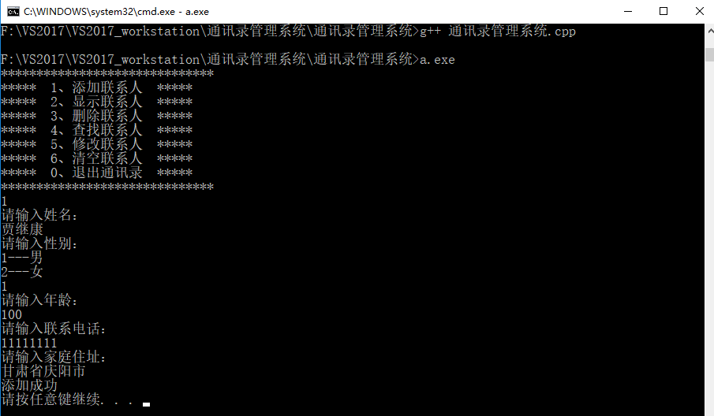

##2.6、显示联系人

**功能描述**：显示通讯录中已有的联系人信息

**显示联系人实现步骤：**

- 封装显示联系人函数
- 测试显示联系人功能

###2.6.1 封装显示联系人函数

**思路：**判断如果当前通讯录中没有人员，就提示记录为空，人数大于0，显示通讯录中信息

**显示联系人代码：**

```c++
//2、显示所有联系人
void showPerson(struct Addressbooks * abs) 
{
	//判断通讯录人数是否为0，如果为0，提示记录为空；如果不为0，显示记录的联系人信息
	if (abs->m_Size==0)
	{
		cout << "当前的记录为空" << endl;
	}
	else
	{
		for (int i = 0; i < abs->m_Size; i++)
		{
			cout << "姓名：" << abs->personArray[i].m_Name <<"\t";
			cout << "性别：" << (abs->personArray[i].m_Sex == 1 ? "男" : "女")<< "\t";
			cout << "年龄：" << abs->personArray[i].m_Age << "\t";
			cout << "电话：" << abs->personArray[i].m_Phone <<"\t";
			cout << "住址：" << abs->personArray[i].m_Addr << endl;

		}
	}
	system("pause");
	system("cls"); //清屏操作 
}

```


### 2.6.2 测试显示联系人功能

在switch case语句中，case 2 里添加

```c++
case 2: //显示联系人
        showPerson(&abs);
        break;
```

测试效果如图：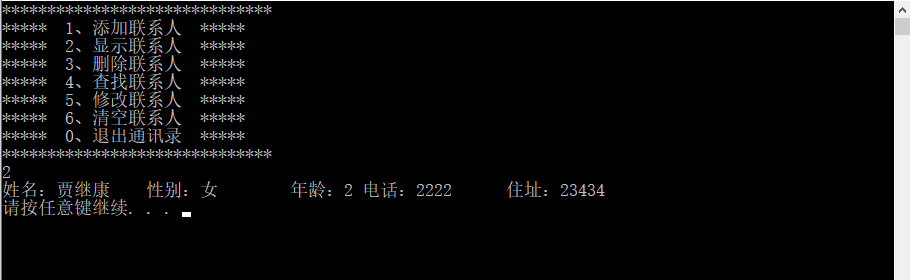

##2.7、删除联系人

**功能描述：**按照姓名进行删除指定联系人

**删除联系人实现步骤：**

- 封装检测联系人是否存在
- 封装删除联系人函数
- 测试删除联系人功能

### 2.7.1  封装检测联系人是否存在

**设计思路：**

删除联系人前，我们需要先判断用户输入的联系人是否存在，如果存在删除，不存在提示用户没有要删除的联系人

因此我们可以把检测联系人是否存在封装成一个函数中，如果存在，返回联系人在通讯录中的位置，不存在返回-1

**检测联系人是否存在代码：**

```c++
//参数1：通讯录  参数2：对比的姓名
int isExist(struct Addressbooks * abs, string name) 
{
	for (int i = 0; i < abs->m_Size; i++)
	{
		//找到用户输入的姓名
		if (abs->personArray[i].m_Name == name)
		{
			return i; // 找到了，返回这个人在数组中下标
		}

	}
	return -1; //如果遍历结束都没有找到，返回-1

}
```


### 2.7.2 封装删除联系人函数

根据用户输入的联系人判断该通讯录中是否有此人

查找到进行删除，并提示删除成功

查不到提示查无此人。

```c++
//3、删除指定联系人
void deletePerson(struct Addressbooks * abs) 
{
	cout << "请输入您要删除的联系人" << endl;
	string name;
	cin >> name;

	//ret == -1  表示无人,
	//ret != -1  查到了
	int ret = isExist(abs,name);
	if (ret != -1)
	{
		//查找到人，要进行删除操作
		for (int i = ret; i < abs->m_Size; i++)
		{
			//数据迁移
			abs->personArray[i] = abs->personArray[i + 1];
		}
		abs->m_Size--;//更新一下通讯录中的人员数
		cout << "删除成功" << endl;

	}
	else 
	{
		cout << "查无此人" << endl;
	
	}

	system("pause");
	system("cls");

}
```


### 2.7.3 测试删除联系人功能

在switch case 语句中，case3里添加：

```c++
case 3:  //删除联系人
	deletePerson(&abs);
	break;
```

 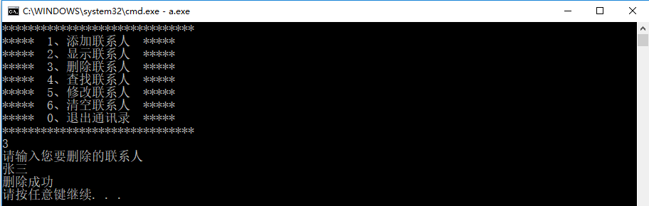

不存在的情况：

 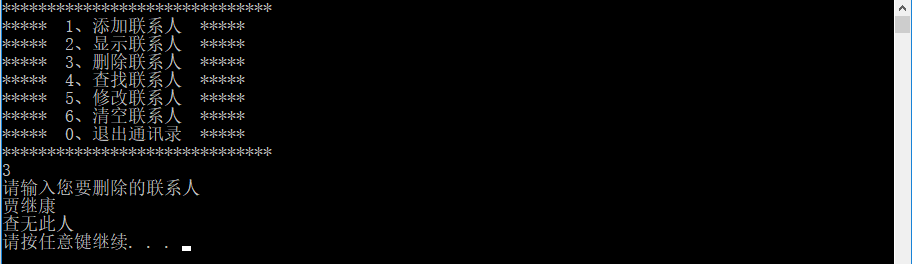

##2. 8、查找联系人

功能描述：按照姓名查看指定联系人信息

查找联系人实现步骤

- 封装查找联系人函数
- 测试查找指定联系人

### 2.8.1 封装查找联系人函数

实现思路：判断用户指定的联系人是否存在，如果存在显示信息，不存在则提示查无此人。

查找联系人代码：

```c++
//4、查找指定联系人信息
void findPerson(struct Addressbooks * abs) 
{
	cout << "请输入您要查找的联系人：" << endl;
	string name;
	cin >> name;

	//判断指定的联系人是否存在通讯录中
	int ret = isExist(abs, name);
	if (ret != -1) //找到联系人
	{
		cout << "姓名：" << abs->personArray[ret].m_Name << "\t";
		cout << "性别：" << abs->personArray[ret].m_Sex << "\t";
		cout << "年龄：" << abs->personArray[ret].m_Age << "\t";
		cout << "电话：" << abs->personArray[ret].m_Phone << "\t";
		cout << "家庭住址：" << abs->personArray[ret].m_Addr << endl;
	}
	else 
	{
		cout << "查无此人！" << endl;
	}
	system("pause");
	system("cls");
}
```


### 2.8.2 测试查找指定联系人

在switch case 语句中，case4里添加：

```c++
case 4: //4、查找联系人
			findPerson(&abs);
			break;
```

**测试效果如图**

比存在情况 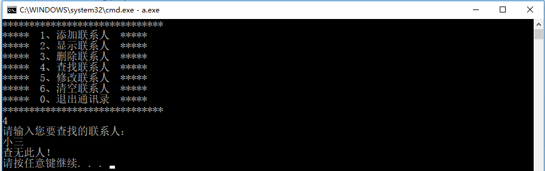

 存在情况：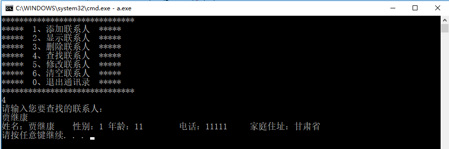 

## 2.9、修改联系人

**功能描述：**按照姓名重新修改指定联系人

修改联系人实现步骤

- 封装修改联系人函数
- 测试修改联系人功能

### 2.9.1 封装修改联系人函数

**实现思路：**查找用户输入的联系人，如果查找成功进行修改操作，查找失败提示查无此人

**修改联系人代码：**

```c++

//5、修改指定人信息
void moidfyPerson(struct Addressbooks * abs) 
{
	cout << "请输入您要修改的联系人" << endl;
	string name;
	cin >> name;

	int ret = isExist(abs, name);
	if (ret != -1)// 找到联系人
	{
		//姓名
		string name;
		cout << "请输入姓名：" << endl;
		cin >> name;
		abs->personArray[ret].m_Name = name;
		
		//性别
		cout << "请输入性别：" << endl;
		cout << "1--男" << endl;
		cout << "2--女" << endl;
		int sex = 0;
		while (true)
		{
			cin >> sex;
			if (sex == 1 || sex == 2)
			{
				//输入正确，退出循环输入
				abs->personArray[ret].m_Sex = sex;
				break;
			}
			cout << "输入错误，请重新输入" << endl;

		}
		
		//年龄
		cout << "请输入年龄：" << endl;
		int age = 0;
		cin >> age;
		abs->personArray[ret].m_Age = age;

		//电话
		cout << "请输入联系电话：" << endl;
		string phone;
		cin >> phone;
		abs->personArray[ret].m_Phone = phone;

		//住址
		cout << "请输入家庭住址：" << endl;
		string address;
		cin >> address;
		abs->personArray[ret].m_Addr = address;
		cout << "修改成功" << endl;
	}
	else 
	{
		cout << "查无此人" << endl;
	}
	//按任意键后清屏
	system("pause");
	system("cls");
}
```


### 2.9.2 测试修改联系人功能

在switch case 语句中，case 5里添加：

```c++
case 5:  //修改联系人
	modifyPerson(&abs);
	break;
```

测试效果如图：

 查不到指定联系人情况：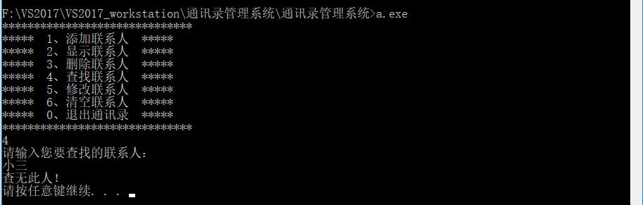

 查找到联系人，并修改成功：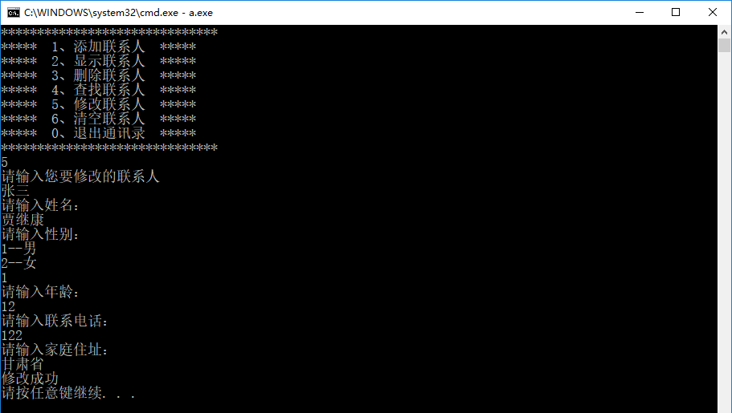

 再次查看通讯录，确认修改完毕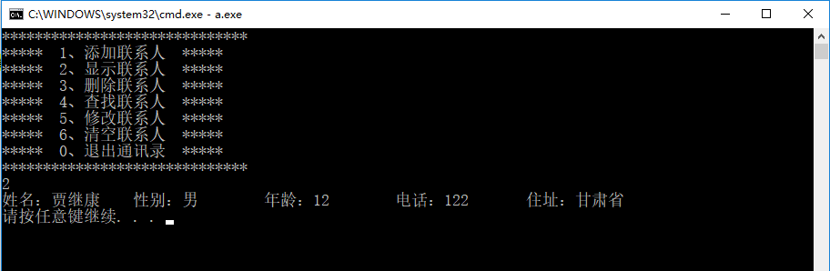


## 2.10、清空联系人

**功能描述：**清空通讯录中所有信息

**清空联系人实现步骤**

- 封装清空联系人函数
- 测试清空联系人

### 2.10.1 封装清空联系人函数

**实现思路：** 将通讯录所有联系人信息清除掉，只要将通讯录记录的联系人数量置为0，做逻辑清空即可。

**清空联系人代码：**

```c++
//6、清空所有联系人
void cleanPerson(struct Addressbooks * abs) 
{
	cout << "请确认是否要清空所有联系人,1：确认清空；2：放弃清空" << endl;
	int ret = 0;
	while (true)
	{
		cout << "请输入是否清空按钮：";
		cin >> ret;

		if (ret == 1)
		{
			abs->m_Size = 0; //将当前记录联系人数量置为0，做逻辑清空操作
			cout << "通讯录已经清空" << endl;
			break;
		}
		else if (ret == 2)
		{
			cout << "放弃清空完成" << endl;
			break;
		}
		else
		{
			cout << "输入有误，请重新输入" << endl;
		}
	}
	system("pause");
	system("cls");
}
```


### 2.10.2  测试清空联系人

在switch case 语句中，case 6 里添加：

```c++
case 6: //6、清空联系人
			cleanPerson(&abs);
			break;
```

测试效果如图：

 清空通讯录：其实一开始还需要判断一下，是否有人，要是没有就没有清空的必要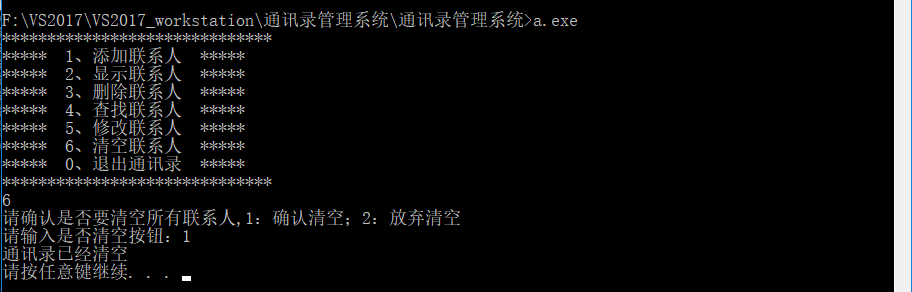

 再次查看信息，显示记录为空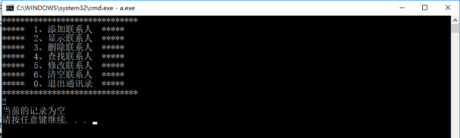


<center>至此，通讯录管理系统完成</center>


# ==三、C++学习笔记—核心编程==

本阶段，将对C++面向对象编程技术做详细学习，深入C++中的核心和精髓

## 3.1 内存分区模型

C++程序在执行时，将内存大方向划分为**4个区域**

- 代码区：存放函数体的二进制代码，由操作系统进行管理的
- 全局区：存放全局变量和静态变量以及常量
- 栈区：由编译器自动分配释放, 存放函数的参数值,局部变量等
- 堆区：由程序员分配和释放,若程序员不释放,程序结束时由操作系统回收

**内存四区意义：**

不同区域存放的数据，赋予不同的生命周期, 给我们更大的灵活编程

### 3.1.1 程序运行前

​	在程序编译后，生成了**exe可执行程序，****未执行该程序前**分为两个区域

​	**代码区：**

​		存放 CPU 执行的机器指令

​		代码区是**共享**的，共享的目的是对于频繁被执行的程序，只需要在内存中有一份代码即可

​		代码区是**只读**的，使其只读的原因是防止程序意外地修改了它的指令

​	**全局区：**

​		**全局变量和静态变量存放在此**.

​		全局区还包含了**常量区, 字符串常量和其他常量**也存放在此.

​		==该区域的数据在程序结束后由操作系统释放==.


     **示例：**

```c++
#include<iostream>
using namespace std;
//全局变量
int g_a = 10;
int g_b = 10;

//const修饰的全局变量，全局常量
const int c_g_a = 10;
const int c_g_b = 10;
int main() 
{

	//全局区
	
	//全局变量、静态变量、常量
	
	//创建普通局部变量
	int a = 10;
	int b = 10;
	cout << "局部变量a的地址为：\t" << &a << endl;
	cout << "局部变量b的地址为：\t" << &b << endl;

	cout << "全局变量g_a的地址为：\t" << &g_a << endl;
	cout << "全局变量g_b的地址为：\t" << &g_b << endl;
	
	//静态变量  在普通变量的前面加上static，属于静态变量，也会放在全局区域中
	static int s_a = 10;
	cout << "静态变量s_a的地址为：\t" << &s_a << endl;

	//常量
	//字符串常量
	cout << "字符串常量的地址为：\t" << &"hell world" << endl;
	
	//const修饰的变量
	//const修饰的全局变量，const修饰的局部变量
	cout << "全局常量c_g_a的地址为：\t" << &c_g_a << endl;
	cout << "全局常量c_g_b的地址为：\t" << &c_g_b << endl;

	const int c_l_a = 10; //c-const g-global l=local
	const int c_l_b = 10; //c-const g-global l=local
	cout << "局部常量c_l_a的地址为：\t" << &c_l_a << endl;
	cout << "局部常量c_l_b的地址为：\t" << &c_l_b << endl;
	system("pause");
	return 0;

}
```

     **总结：**

- C++中在程序运行前分为全局区和代码区
- 代码区特点是共享和只读
- 全局区中存放全局变量、静态变量、常量
- 常量区中存放 const修饰的全局常量  和 字符串常量


### 3.1.2 程序运行后

​	**栈区：**

​		由编译器自动分配释放, **存放函数的参数值,局部变量等**

​		**注意事项：**不要返回局部变量的地址，栈区开辟的数据由编译器自动释放

**示例：**

```c++
#include<iostream>
using namespace std;

//栈区注意事项 --- 不要返回局部变量的地址
//栈区的数据由编译器管理开辟和释放

int* func(int b)  //形参数据也会放在栈区
{ 
	int b = 100;
	int a = 10; //局部变量 存放在栈区，栈区的数据在函数执行完后自动释放
	return &a; //返回局部变量的地址
}

int main() 
{
 
	//接收func函数的返回值 
	int * p = func(1);
	cout << *p << endl; //10,第一次可以打印正确的数字，是因为编译器做了保留
	cout << *p << endl; // 第二次这个数据就不在保留了

	system("pause");
	return 0;

}
```

​	**堆区：**

​		由程序员分配释放,若程序员不释放,程序结束时由操作系统回收

​		在C++中主要利用new在堆区开辟内存


**示例：**

```c++
#include<iostream>
using namespace std;

int * func() 
{
	//int a = 10;
	//return &a; //不要返回局部变量的地址，栈区开辟的数据由编译器自动释放

	//利用new关键字，  可以将数据开辟到堆区
	//指针，本质也是局部变量，放在栈上，指针保存的数据是放在堆区
	int * p = new int(10);
	return p;   
}

int main() 
{
 
	//在堆区开辟数据
	int *p  = func();
	cout << *p << endl;

	system("pause");
	return 0;

}
```

**总结：**

堆区数据由程序员管理开辟和释放

堆区数据利用new关键字进行开辟内存

### 3.1.3 new操作符

​	C++中利用==new==操作符在堆区开辟数据

​	堆区开辟的数据，由程序员手动开辟，手动释放，释放利用操作符 ==delete==

​	语法：` new 数据类型`

​	利用new创建的数据，会返回该数据对应的类型的指针

**示例1： 基本语法**

```c++
#include<iostream>
using namespace std;

//1、new的基本语法
int * func() 
{
	//在堆区创建整型数据
	int *p = new int(10); // new返回的是，该数据类型的指针

	return p;
}

int main() 
{
	
	int * p = func();
	cout << *p << endl; //堆区的数据，由程序员管理开辟，程序员管理释放
	delete p;
	//cout << *p << endl;//内存已经被释放，再次访问就是非法操作，会报错
	system("pause");
	return 0;

}
```

**示例2：开辟数组**

```c++
#include<iostream>
using namespace std;

//2、在堆区利用new开辟内存
void test02() 
{
	//创建10个整型数据的数组，在堆区
	int * arr = new int[10]; //10代表数组有10个元素
	for (int i = 0; i < 10; i++)
	{
		arr[i] = i + 100; //给10个元素赋值：100-109
	}
	for (int i = 0; i < 10; i++)
	{
		cout << arr[i] << endl;
	}
	//释放堆区数组
	delete[] arr; //释放数组的时候，需要加[]才可以
}

int main() 
{
	test02();
	system("pause");
	return 0;

}
```


## 3.2 引用

### 3.2.1 引用的基本使用

**作用： **<font color=red>给变量起别名</font>

**语法：** `数据类型 &别名 = 原名`


**示例：**

```c++
#include<iostream>
using namespace std;

int main() 
{
	//引用基本语法
	//数据类型  &别名  =  原名

	int a = 10;
	//创建引用
	int &b = a;
	cout << "a=" << a << endl;
	cout << "b=" << b << endl;

	b = 100;
	cout << "a=" << a << endl;
	cout << "b=" << b << endl;

	system("pause");
	return 0;

}
```


### 3.2.2 引用注意事项

- 引用必须初始化
- 引用在初始化后，不可以改变


**示例：**

```c++
#include<iostream>
using namespace std;

int main() 
{
	
	int a = 10;

	//1、引用必须初始化
	//int &b; //错误，必须要初始化
	int &b = a;
	 
	//2、引用在初始化后，不可以改变
	int c = 20;
	b = c; //赋值操作，而不是更改引用
	cout << "a=" << a << endl;
	cout << "b=" << b << endl;
	cout << "c=" << c << endl;

	system("pause");
	return 0;

}
```


### 3.2.3 引用做函数参数

**作用：**函数传参时，可以利用引用的技术让形参修饰实参

**优点：**<font color=red>可以简化指针修改实参</font>

**示例：**

```c++
#include<iostream>
using namespace std;

//交互函数
//1、值传递
void mySwap01(int a, int b)
{
	int temp = a;
	a = b;
	b = temp;
	cout << "swap01a=" << a << endl;
	cout << "swap01b=" << b << endl;
}

//2、地址传递
void mySwap02(int *a, int *b) 
{
	int temp = *a;
	*a = *b;
	*b = temp;

}

//3、引用传递
void mySwap03(int &a, int &b) 
{
	int temp = a;
	a = b;
	b = temp;
}

int main() 
{

	int a = 10;
	int b = 20;

	//mySwap01(a, b); //值传递，形参并不能修饰实参，实参并未发生改变
	cout << "a=" << a << endl;
	cout << "b=" << b << endl;
	
	//mySwap02(&a, &b); //地址传递，形参会修饰实参的
	cout << "02a=" << a << endl;
	cout << "02b=" << b << endl;

	mySwap03(a,b); //引用传递，形参会修改实参
	cout << "03a=" << a << endl;
	cout << "03b=" << b << endl;

	system("pause");
	return 0;

}
```

> 总结：==通过引用参数产生的效果同按地址传递是一样的。引用的语法更清楚简单==

### 3.2.4 引用做函数返回值

**作用：**引用是可以作为函数的返回值存在的

**注意：**不要返回局部变量引用

**用法**：函数调用作为左值

**示例：**

```c++
#include<iostream>
using namespace std;

//引用做函数的返回值

//1、不要返回局部变量的引用
int& test01() 
{
	int a = 10; //局部变量存在在四区中的，栈区
	return  a; //引用的反正返回
}

//2、函数的调用可以作为左值
int& test02()
{
	static int b = 10; //静态变量，放在在全局区，全局区上的数据在程序结束后系统释放
	return b;
}

int main() 
{
	
	//int &ref = test01();
	//cout << "ref=" << ref << endl;//第一次结果正确，是因为编译器做了保留
	//cout << "ref=" << ref << endl;//第二次结果错误，是因为a的内存已经释放

	int &ref2 = test02();
	cout << "ref2=" << ref2 << endl;
	cout << "ref2=" << ref2 << endl; //10

	//a=1000的操作，原名赋值1000，再使用别名ref2调用 如果函数的返回值是引用，这个函数调用可以作为左值
	test02() = 1000; 
	cout << "ref2=" << ref2 << endl;
	cout << "ref2=" << ref2 << endl;//1000

	system("pause");
	return 0;

}
```


### 3.2.5 引用的本质

**本质：**引用的本质在c++内部实现是一个**指针常量.**

 

**示例：**

```c++
#include<iostream>
using namespace std;

//引用的本质
void func(int& ref) 
{
	ref = 100; // ref是引用，转换为*ref = 100
}

int main() 
{
	int a = 10;
	
	//自动转换为 int * const ref = &a; 指针常量是指针指向不可改，也说明为什么引用不可更改
	int& ref = a; //给a起了一个别名
	ref = 20; //内部发现ref是引用，自动帮我们转换为 *ref = 20;

	cout << "a=" << a << endl;
	cout << "ref=" << ref << endl;

	func(a);
	system("pause");
	return 0;

}
```


### 3.2.6 常量引用

**作用：**常量引用主要用来修饰形参，防止误操作

在函数形参列表中，可以加==const修饰形参==，防止形参改变实参

**示例：**

```c++
#include<iostream>
using namespace std;

//常量引用
//使用场景：用来修饰形参，防止误操作

//打印数据函数
void showValue(const int & val)  //使用引用的方式接收 
{
	//val = 1000;
	cout << "val=" << val << endl;
}

int main() 
{
	//int a = 10;

	//加上const之后，编译器将代码修改 int temp = 10; const int & ref = temp;
	//const int & ref = 10;//引用必须引一块合法的内存空间
	//ref = 20;//加入const之后变为只读，不可以修改

	int a = 100;
	showValue(a);
	cout << "a=" << a << endl;
	 
	system("pause");
	return 0;
}
```


## 3.3 函数提高

### 3.3.1 函数默认参数

在C++中，函数的形参列表中的形参是可以有默认值的。

**语法：**` 返回值类型  函数名 （参数= 默认值）{}`

**示例：**

```c++
#include<iostream>
using namespace std;

//函数默认参数
//如果我们自己传入数据吗，就是自己的数据，如果没有，那么就用默认值
//语法： 返回值类型 函数名（形参=默认值）{}

int func(int a, int b=20, int c=30) 
{
	return a + b + c;
}

//注意事项：
//1、如果某个位置已经有了默认参数，那么从这个位置往后，从左到右都必须有默认值
int fun2(int a, int b=10, int c)//c此时也必须得有 
{
	return a + b + c;
}

//2、如果函数的声明有了默认参数，函数的实现就不能有默认参数
//声明和实现智能有一个有默认参数
int func3(int a=10, int b=10); //声明
int func3(int a=10, int b=10) 
{
	return a + b;
}

int main() 
{
	 
	int sum = func(10); //
	cout << "sum=" << sum << endl;
	cout << func(10, 30)<<endl; //70

	cout<<func3(10, 10)<<endl; //会报错，重定义默认参数


	system("pause");
	return 0;
}
```


### 3.3.2 函数占位参数

C++中函数的形参列表里可以有占位参数，用来做占位，调用函数时必须填补该位置

**语法：** `返回值类型 函数名 (数据类型){}`

在现阶段函数的占位参数存在意义不大，但是后面的课程中会用到该技术

**示例：**

```c++
#include<iostream>
using namespace std;

//占位参数
//返回值类型  函数名（数据类型）{}

//目前阶段的占位参数，我们还用不到，后面学习中会用到
//占位参数 还可以有默认参数
void func(int a,int = 10) 
{
	cout << "this is func " << endl;
}

int main() 
{

	func(10);
	system("pause");
	return 0;

}
```


### 3.3.3 函数重载

#### 3.3.3.1 函数重载概述

**作用：**函数名可以相同，提高复用性

**函数重载满足条件：**

- 同一个作用域下
- 函数名称相同
- 函数参数**类型不同**  或者 **个数不同** 或者 **顺序不同**

**注意:**  <font color=red>函数的返回值不可以作为函数重载的条件</font>

**示例：**

```c++
#include<iostream>
using namespace std;

//函数重载
//可以让函数名相同，提高复用性

//函数重载的满足条件：
//1、同一个作用域下
//2、函数名称相同
//3、函数的参数类型不同，或者个数不同，或者顺序不同

//1
void func()
{
	cout << "func的调用" << endl;
}
//2
void func(int a)
{
	cout << "func(int a)的调用!" << endl;
}
//3
void func(double a)
{
	cout << "func(double a)的调用!" << endl;
}
//4
void func(int a, double b)
{
	cout << "func(int a, double b)的调用!" << endl;
}
//5
void func(double a, int b)
{
	cout << "func(double a, int b)的调用!" << endl;
}

//注意事项：
//函数的返回值不可以作为函数重载的条件
//就是不能和上面相同的重复
//void func(double a, int b)
//{
//	cout << "func(double a, int b)的调用!" << endl;
//}

int main() 
{
	//func();
	//func(10);
	//func(3.14);
	//func(10, 3.14);
	func(3.13,10);

	system("pause");
	return 0;

}
```


#### 3.3.3.2 函数重载注意事项

- 引用作为重载条件
- 函数重载碰到函数默认参数

**示例：**

```c++
#include<iostream>
using namespace std;

//函数重载的注意事项
//1、引用作为重载的条件
void func(int &a) //int &a  =10; 不合法
{
	cout << "func(int &a)调用" << endl;
}

void func(const int &a) //只读状态 const int &a =10;合法
{
	cout << "func(const int &a)调用" << endl;
}


//2、函数重载碰到默认参数

void func2(int a,int b=10)
{
	cout << "func2(int a,int b)调用" << endl;
}

void func2(int a)
{
	cout << "func2(int a)调用" << endl;
}


int main() 
{
	//int a = 10;//变量
	//func(a);//调用没有加const的。

	//func(10);

	func2(10); //此时，上面都能调，编译器傻了。当函数重载碰到默认参数，出现二义性，报错，尽量避免这种情况

	system("pause");
	return 0;

}
```


## **3.4** 类和对象

C++面向对象的三大特性为：==封装、继承、多态==

C++认为==万事万物都皆为对象==，对象上有其属性和行为

**例如：**

​	人可以作为对象，属性有姓名、年龄、身高、体重...，行为有走、跑、跳、吃饭、唱歌...

​	车也可以作为对象，属性有轮胎、方向盘、车灯...,行为有载人、放音乐、放空调...

​	具有相同性质的==对象==，我们可以抽象称为==类==，人属于人类，车属于车类

### 3.4.1 封装

#### 3.4.1.1  封装的意义

封装是C++面向对象三大特性之一

**封装的意义：**

- 将属性和行为作为一个整体，表现生活中的事物
- 将属性和行为加以权限控制

**封装意义一：**

​	在设计类的时候，属性和行为写在一起，表现事物

**语法：** `class 类名{   访问权限： 属性  / 行为  };`

**示例1：**设计一个圆类，求圆的周长

**示例代码：**

```c++
#include<iostream>
using namespace std;

//圆周率
const double PI = 3.14;
//设计一个圆类，求圆的周长
//圆求周长的公式： 2 * PI * 半径

//class 代表设计一个类，类后面紧跟着的就是类名称
class Circl
{
	//访问权限
	//公共权限
public:
	//属性————变量
	//半径
	int m_r;
	
	//行为————函数，公式等
	//获取圆的周长
	double calculateZC()
	{
		return 2 * PI * m_r;
	}

};

int main() 
{
	//通过圆类，创建具体的圆（对象）
	//实例化（通过一个类，创建一个对象的过程）
	Circl c1;
	//给圆对象 的属性进行赋值
	c1.m_r = 10;

	// 2*PI*10=62.8
	cout << "圆的周长为：" << c1.calculateZC() << endl;


	system("pause");
	return 0;

}
```

**示例2：**设计一个学生类，属性有姓名和学号，可以给姓名和学号赋值，可以显示学生的姓名和学号

**示例2代码：**

```c++
#include<iostream>
#include<string>
using namespace std;

//学生类
//设计一个学生类，属性有姓名和学号，
//可以给学生和学号赋值，可以显示学生的姓名和学号

class Student
{
public://访问权限—公共权限

	// 类中的属性和行为， 我们统一称为 成员
	// 属性   成员属性  成员变量
	// 行为   成员函数  成员方法

	//属性
	string m_Name;
	int m_Id;

	//行为
	//显示姓名和学号
	void showStudent() 
	{
		cout << "姓名：" << m_Name << endl;
		cout << "学号：" << m_Id << endl;

	}

	//给姓名赋值
	void setName(string name) 
	{
		m_Name = name;
	}
	//给学号赋值
	void set_m_Id(int Id) 
	{
		m_Id = Id;
	}
};


int main() 
{
	 
	//创建一个具体的学生（对象）实例化
	Student s1;
	
	//给s1对象，进行属性赋值操作
	//s1.m_Name = "贾继康";
	s1.setName("张三");
	//s1.m_Id = 123;
	s1.set_m_Id(1);

	//显示学生信息
	s1.showStudent();

	system("pause");
	return 0;

}
```

**封装意义二：**

**类在设计时，可以把属性和行为放在不同的权限下，加以控制**

==**访问权限有三种：**==

1. public        公共权限  
2. protected 保护权限
3. private      私有权限

**示例：**

```c++
#include<iostream>
#include<string>
using namespace std;

//访问权限
//三种
//公共权限  public               成员 类内可以访问， 类外可以访问
//保护权限  protected            成员 类内可以访问， 类外不可以访问 儿子可以访问父亲中的保护内容
//私有权限  private              成员 类内可以访问， 类外不可以访问 儿子不可以访问父亲的私有内容

class Person
{
public:
	//公共权限
	string m_Name;
protected:
	//保护权限
	string c_Car; //汽车

private:
	// 私有权限
	int m_Password; // 银行卡密码
public: //private，或者protected在类内都可以访问的
	void func() 
	{
		m_Name = "张三";
		c_Car = "拖拉机";
		m_Password = 123456;
	}

};
 
int main() 
{
	Person p1; // 实例化具体对象
	p1.m_Name = "李四";
	p1.c_Car = "拖拉机"; //保护权限内容，在类外访问不到
	p1.m_Password = 12345; // 私有权限内容，类外访问不到


	system("pause");
	return 0;

}
```


#### 3.4.1.2 struct和class区别

在C++中 struct和class唯一的**区别**就在于 **默认的访问权限不同**

**区别：**

- struct 默认权限为公共
- class   默认权限为私有

```c++
#include<iostream>
#include<string>
using namespace std;

//struct 和 class 区别
//struct 默认权限是  公共  public
//class  默认权限是  私有  pivate

class C1
{
	int m_A; // 默认权限   是私有
};
struct C2
{
	int m_A; //默认权限    是公共
};
 
int main() 
{
	 
	C1 c1; //实例化对象
	//c1.m_A=100; // 在class里默认权限，私有，此处报错

	C2 c2;
	c2.m_A = 100; //struct默认权限公共的，因此可以访问

	system("pause");
	return 0;

}
```


#### 3.4.1.3 成员属性设置为私有

**优点1：**将所有成员属性设置为私有，可以自己控制读写权限

**优点2：**对于写权限，我们可以检测数据的有效性

**示例：**

```c++
#include<iostream>
#include<string>
using namespace std;


// 成员属性设置为私有
// 1、可以自己控制读写权限
// 2、对于写可以检测数据的有效性

//设计人类
class Person 
{
public:

	//姓名——可读可写
	//设置姓名
	void setName(string name) 
	{
		m_Name = name;
	}
	//获取姓名
	string getName() 
	{
		return m_Name;
	}

	//年龄——只读  ——改成可读可写（如果想修改，年龄的范围必须是0-150范围）
	//获取年龄
	int getAge() 
	{
		//m_Age = 0; // 初始化为0
		return m_Age;
	}
	//设置年龄
	void  setAge(int age)
	{
		if (age<0||age>150)
		{
			m_Age = 0;
			cout << "您这个老妖精" << endl;
			return;
		}
		m_Age = age;
	}

	//情人——只写
	void setLover(string lover) 
	{
		m_Lover = lover;
	}

private: //设置为私有化
	//姓名  可读可写
	string m_Name; 
	//年龄  只读
	int m_Age; 
	// 情人  只读
	string m_Lover;

};

int main() 
{
	 //实例化对象
	Person p;
	p.setName("贾继康");
	cout << "姓名为：" << p.getName() << endl;

	p.setAge(1000);
	cout << "年龄为：" << p.getAge() << endl;

	p.setLover("苍井空");
	//cout << "情人为：" << p.m_Lover << endl; //只设置，所以不可以访问的

	system("pause");
	return 0;

}
```

**练习案例1：设计立方体类**

设计立方体类(Cube)

求出立方体的面积和体积

分别用全局函数和成员函数判断两个立方体是否相等。

```c++
#include<iostream>
#include<string>
using namespace std;

//设计一个立方体
//1、创建立方体类
//2、设计属性 
//3、设计行为：获取立方体面积和体积
//4、分别利用全局函数和成员函数 判断两个立方体是否相等


class Cube
{

public:

	//设置长
	void setL(int l) 
	{
		m_L = l;

	}
	//获取长
	int getL() 
	{
		return m_L;

	}

	//设置宽
	void setW(int w)
	{
		m_W = w;

	}

	//获取宽
	int getW()
	{
		return m_W;

	}
	//设置高
	void setH(int h)
	{
		m_H = h;

	}
	//获取高
	int getH()
	{
		return m_W;

	}

	//获取立方体的面积
	int calculateS() 
	{
		return 2 * m_L*m_W + 2 * m_W*m_H + 2 * m_L*m_H;
	}
	//获取立方体的体积
	int calculateV() 
	{
		return m_L * m_H*m_W;
	}

	//利用成员函数判断两个立方体是否相等
	bool isSameByClass(Cube &c) 
	{
		if (m_L == c.getL() && m_W == c.getW() && m_H == c.getH())
		{
			return true;
		}
		return false;

	}

private: //属性

	int m_L; //长
	int m_W; //宽
	int m_H; //高

};

//全局函数
//利用全局函数判断 两个立方体是否相等
bool isSame(Cube &c1, Cube &c2)// 引用方式 
{
	if (c1.getL() == c2.getL() && c1.getW()==c2.getW() && c1.getH()==c2.getH())
	{
		return true;
	}
	return false;
}

int main() 
{
	 
	//创建立方体对象
	Cube c1;
	c1.setL(10);
	c1.setW(10);
	c1.setH(10);

	cout << "c1的面积为：" << c1.calculateS() << endl;
	cout << "c1的体积为：" << c1.calculateV() << endl;

	//创建第二个立方体对象

	Cube c2;
	c2.setL(10);
	c2.setW(10);
	c2.setH(10);

	bool ret = isSame(c1, c2);
	if (ret)
	{
		cout << "c1和c2是相等的" << endl;

	}
	else
	{
		cout << "c1和c2是不相等的" << endl;
	}

	ret = c1.isSameByClass(c2);
	if (ret)
	{
		cout << "这是成员函数判断的结果：c1和c2相等" << endl;
	}
	else
	{
		cout << "这是成员函数判断的结果：c1和c2不相等" << endl;
	}

	system("pause");
	return 0;
}
```

**练习案例2：点和圆的关系**

设计一个圆形类（Circle），和一个点类（Point），计算点和圆的关系。

注意：点到圆心的距离—欧氏距离

 **程序布局第一种方式：**

```c++
#include<iostream>
#include<string>
using namespace std;

#include "circle.h"
#include "point.h"

//点和圆关系案例

////点类
//class Point 
//{
//public:
//
//	//设置X
//	void setX(int x) 
//	{
//		m_X = x;
//	}
//
//	//获取X
//	int getX() 
//	{
//		return m_X;
//	}
//
//	//设置Y
//	void setY(int y)
//	{
//		m_Y = y;
//	}
//	//获取Y
//	int getY()
//	{
//		return m_Y;
//	}
//	
//
//private: //属性
//	int m_X;
//	int m_Y;
//
//};


////圆类
//class Circle 
//{
//public:
//
//	//设置半径
//	void setR(int r)
//	{
//		m_R = r;
//	}
//	//获取半径
//	int getR() 
//	{
//		return m_R;
//	}
//	//设置圆心
//	void setCenter(Point center)
//	{
//		m_Center = center;
//	}
//	//获取圆心
//	Point getCenter()
//	{
//		return m_Center;
//	}
//
//private://属性
//	int m_R;//半径
//
//	//核心内容1：在类中，可以让另一个类 作为本类中的成员
//	Point m_Center; // 圆心
//
//};

//判断点和圆的关系
void isInCircle(Circle &c, Point &p) 
{
	//计算两点之间的距离  平方
	int distance =
		(c.getCenter().getX() - p.getX())*(c.getCenter().getX() - p.getX()) +
		(c.getCenter().getY() - p.getY())*(c.getCenter().getY() - p.getY());

	//计算半径的平方
	int rDistance = c.getR()*c.getR();

	//判断
	if (distance==rDistance)
	{
		cout << "点在圆上" << endl;
	}
	else if (distance>rDistance)
	{
		cout << "点在圆外" << endl;
	}
	else
	{
		cout << "点在圆内" << endl;
	}
}

int main() 
{
	 //实例化对象
	//创建圆
	Circle c;
	c.setR(10);
	Point center;
	center.setX(10);
	center.setY(0);
	c.setCenter(center);

	//创建点
	Point p;
	p.setX(10);
	p.setY(10);

	//判断关系
	isInCircle(c, p);

	system("pause");
	return 0;
}
```

**程序布局第二种方式：**

```c++
//1、point.h
#pragma once
#include<iostream>
using namespace std;

//函数的声明和变量的声明
//点类
class Point
{
public:

	//设置X
	void setX(int x);	 
	//获取X
	int getX();	
	//设置Y
	void setY(int y);
	//获取Y
	int getY();
private: //属性
	int m_X;
	int m_Y;

};
```

```c++
//point.cpp
#include "point.h"

//点类
//只需要留住函数所有的实现

//设置X
void Point:: setX(int x) //需要告诉Point作用域下的成员函数
{
	m_X = x;
}

//获取X
int Point::getX()
{
	return m_X;
}

//设置Y
void Point::setY(int y)
{
	m_Y = y;
}
//获取Y
int Point:: getY()
{
	return m_Y;
}
```

```c++
//3、circle.h
#pragma once
#include<iostream>
using namespace std;

#include "point.h"

//圆类
class Circle
{
public:

	//设置半径
	void setR(int r); //函数的声明
	 
	//获取半径
	int getR();
	 
	//设置圆心
	void setCenter(Point center);
	 
	//获取圆心
	Point getCenter();
	 
private://属性
	int m_R;//半径

	//核心内容1：在类中，可以让另一个类 作为本类中的成员
	Point m_Center; // 圆心

};
```

```c++
//4、circle.cpp


#include "circle.h"
//圆类实现
 	//设置半径
	void Circle::setR(int r) // 这是一个Circle的成员函数
	{
		m_R = r;
	}
	//获取半径
	int Circle::getR()
	{
		return m_R;
	}
	//设置圆心
	void Circle::setCenter(Point center)
	{
		m_Center = center;
	}
	//获取圆心
	Point Circle:: getCenter()
	{
		return m_Center;
	}
```

```c++
//5、主程序
#include<iostream>
#include<string>
using namespace std;

#include "circle.h"
#include "point.h"
//判断点和圆的关系
void isInCircle(Circle &c, Point &p) 
{
	//计算两点之间的距离  平方
	int distance =
		(c.getCenter().getX() - p.getX())*(c.getCenter().getX() - p.getX()) +
		(c.getCenter().getY() - p.getY())*(c.getCenter().getY() - p.getY());

	//计算半径的平方
	int rDistance = c.getR()*c.getR();

	//判断
	if (distance==rDistance)
	{
		cout << "点在圆上" << endl;
	}
	else if (distance>rDistance)
	{
		cout << "点在圆外" << endl;
	}
	else
	{
		cout << "点在圆内" << endl;
	}
}

int main() 
{
	 //实例化对象
	//创建圆
	Circle c;
	c.setR(10);
	Point center;
	center.setX(10);
	center.setY(0);
	c.setCenter(center);

	//创建点
	Point p;
	p.setX(10);
	p.setY(10);

	//判断关系
	isInCircle(c, p);

	system("pause");
	return 0;
}
```

### 3.4.2 对象的初始化和清理

- 生活中我们买的电子产品都基本会有出厂设置，在某一天我们不用时候也会删除一些自己信息数据保证安全
- C++中的面向对象来源于生活，每个对象也都会有初始设置以及对象销毁前的清理数据的设置。

#### 3.4.2.1 构造函数和析构函数

对象的**初始化和清理**也是两个非常重要的安全问题

​	一个对象或者变量没有初始状态，对其使用后果是未知

​	同样的使用完一个对象或变量，没有及时清理，也会造成一定的安全问题

c++利用了**构造函数**和**析构函数**解决上述问题，这两个函数将会被编译器自动调用，完成对象初始化和清理工作。

对象的初始化和清理工作是编译器强制要我们做的事情，因此如果**我们不提供构造和析构，编译器会提供**

**但是，编译器提供的构造函数和析构函数是空实现。**

- 构造函数：主要作用在于创建对象时为对象的成员属性赋值，构造函数由编译器自动调用，无须手动调用。
- 析构函数：主要作用在于对象**销毁前**系统自动调用，执行一些清理工作。

**构造函数语法：**`类名(){}`

1. 构造函数，没有返回值也不写void
2. 函数名称与类名相同
3. 构造函数可以有参数，因此可以发生重载
4. 程序在调用对象时候会自动调用构造，无须手动调用,而且只会调用一次

**析构函数语法：** `~类名(){}`

1. 析构函数，没有返回值也不写void
2. 函数名称与类名相同,在名称前加上符号  ~
3. 析构函数不可以有参数，因此不可以发生重载
4. 程序在对象销毁前会自动调用析构，无须手动调用,而且只会调用一次

```c++
#include<iostream>
#include<string>
using namespace std;

//对象的初始化和清理
class Person 
{
public:

	////1、构造函数 进行初始化操作
	//没法返回值 不用写void
	//函数名 与类名相同
	//构造函数可以有参数， 可以发生重载
	//创建对象的时候，构造函数会自动调用，而且只调用一次
	Person() 
	{
		cout << "构造函数的调用" << endl;
	}

	//2、析构函数  进行清理的操作
	//没有返回值 不写void
	//函数名和类名相同 在名称前面加~
	//析构函数不可以有参数的，不可以发生重载
	//对象在销毁前，会自动调用析构函数，而且只会调用一次
	~Person()
	{
		cout << "这是Person的析构函数调用" << endl;
	}

};

//构造和析构函数都是必须有的实现，如果我们自己不提供，编译器会提供一个空实现的构造和析构
void test01()
{
	Person p; //创建一个对象 这是在栈上的数据，test01执行完毕后，释放这个对象
}

int main() 
{
	 
	//test01();
	//Person p; //都执行完毕之后，才会执行析构函数的代码；对象执行完了，销毁了才会调用析构函数
	system("pause");
	return 0;
}
```


#### 3.4.2.2 构造函数的分类及调用

**两种分类方式：**

​	按参数分为： 有参构造和无参构造

​	按类型分为： 普通构造和拷贝构造

**三种调用方式：**

​	括号法

​	显示法

​	隐式转换法

**示例：**

```c++
#include<iostream>
#include<string>
using namespace std;

//构造函数的分类和调用
//分类
//   按照参数分类    无参构造（默认构造） 和 有参构造
//   按照类型分类    普通构造和拷贝构造
class Person 
{
public:
	//无参构造
	Person() 
	{
		cout << "Person无参构造函数的调用" << endl;
	}
	//有参构造
	Person(int a)
	{
		age = a;
		cout << "Person有参构造函数的调用" << endl;
	}

	//拷贝构造函数
	Person(const Person &p) //引用方式
	{
		//将传入的人身上的所有的属性拷贝到当前对象身上
		cout << "Person拷贝构造函数的调用" << endl;
		age = p.age;

	}


	//析构函数
	~Person()
	{
		cout << "Person的析构函数调用" << endl;
	}

	int age;
};

//调用
void test01() 
{
	//1、括号法
	Person p1; //默认构造函数调用
	Person p2(10); //有参构造函数
	Person p3(p2); //拷贝构造函数

	//注意事项1：
	//调用默认构造函数时候，不要加() Person p1()。因为，编译器会认为是一个函数的声明，不会认为在创建对象

	cout << "p2的年龄为：" << p2.age << endl;
	cout << "p3的年龄为：" << p3.age << endl;

	//2、显示法
	Person p4; //无参构造
	Person p5 = Person(10); //调用有参构造
	Person p6 = Person(p5); // 拷贝构造

	//Person(10); //匿名对象，，起个名字，放在右侧；特点：当前行执行结束后，系统会立即回收掉匿名对象
	//cout << "aaaa" << endl;
	
	//注意事项2
	//不要利用拷贝构造函数，初始化匿名对象;编译器会认为Person(p6) == Person P6;对象声明
	//Person(p6);


	//3、隐式转换法
	Person p7 = 10; //相当于 写了 Person p7 = Person(10); 
	Person p8 = p7; //拷贝构造

}

int main() 
{
	 
	test01();
 
	system("pause");
	return 0;
}
```


#### 3.4.2.3 拷贝构造函数调用时机

C++中拷贝构造函数调用时机通常有三种情况

- 使用一个已经创建完毕的对象来初始化一个新对象
- 值传递的方式给函数参数传值
- 以值方式返回局部对象

**示例：**

```c++
#include<iostream>
#include<string>
using namespace std;

//拷贝构造函数调用时机
//1、 使用一个已经创建完毕的对象来初始化一个新对象
//2、 值传递的方式给函数参数传值
//3、 值方式返回局部对象

class Person 
{
public:
	Person() 
	{
		cout << "Person默认构造函数调用" << endl;
		m_Age = 0;
	}
	Person(int age) 
	{
		cout << "Person有参构造函数调用" << endl;
		m_Age = age;

	}

	//拷贝构造函数
	Person(const Person &p)
	{
		cout << "Person拷贝构造函数调用" << endl;
		m_Age = p.m_Age;
	}

	//析构函数
	~Person()
	{
		cout << "Person析构函数调用" << endl;
	}

public:
	int m_Age;
};
 
//1、 使用一个已经创建完毕的对象来初始化一个新对象
void test01() 
{
	Person p1(20);
	Person p2(p1);
	cout << "p2的年龄为：" << p2.m_Age << endl;

}
//2、 值传递的方式给函数参数传值
void doWork(Person p)
{

}

void test02() 
{
	Person p; //默认构造
	doWork(p);//实参传递给形参
}

//3、 值方式返回局部对象
Person doWork2() 
{
	Person p1;
	cout << &p1 << endl;
	return p1;
}
void test03()
{
	Person p = doWork2();
	cout << &p << endl;

}


int main() 
{
	 
	//test01();
	//test02();
	test03();
	system("pause");
	return 0;
}
```


#### 3.4.2.4 构造函数调用规则

默认情况下，c++编译器至少给一个类添加3个函数

1．默认构造函数(无参，函数体为空)

2．默认析构函数(无参，函数体为空)

3．默认拷贝构造函数，对属性进行值拷贝

**构造函数调用规则如下：**

- 如果用户定义有参构造函数，c++不在提供默认无参构造，但是会提供默认拷贝构造
- 如果用户定义拷贝构造函数，c++不会再提供其他构造函数

 

**示例：**

```c++
#include<iostream>
#include<string>
using namespace std;
 
//构造函数的调用规则
//1、创建一个类，c++编译器好 给每个类都添加至少3个函数
// 默认构造  （空实现）
// 析构函数  （空实现）
// 拷贝构造  （值拷贝）


//2、
// 如果我们写了有参构造函数，编译器就不在提供默认构造，依然提供拷贝构造
// 如果我们写了拷贝构造函数，编译器就不在提供其他普通构造函数了

class Person 
{
public:
	//Person()
	//{
	//	cout << "Person的默认构造函数调用" << endl;
	//}

	//有参构造
	//Person(int age)
	//{
	//	cout << "Person的有参构造函数调用" << endl;
	//	m_Age = age;
	//}

	Person(const Person &p)
	{
		cout << "Person的拷贝构造函数调用" << endl;
		m_Age = p.m_Age;
	}

	~Person()
	{
		cout << "Person的析构函数调用" << endl;

	}

public:
	int m_Age;
};

//void test01() 
//{
//	Person p;// 默认构造函数
//	p.m_Age = 18; 
//
//	Person p2(p);//拷贝构造函数
//	cout << "p2的年龄：" << p2.m_Age << endl;
//}

void test02() 
{
	//Person p; // 无参构造————注释掉自己提供的无参构造，编译器也不再提供啦，因为我提供了有参构造
	//Person p(10);
	//Person p2(p);
	//cout << "p2的年龄：" << p2.m_Age << endl;

}


int main() 
{
	 
	//test01();
	test02();
	system("pause");
	return 0;
}
```


#### 3.4.2.5 深拷贝与浅拷贝

深浅拷贝是面试经典问题，也是常见的一个坑

**浅拷贝：**简单的赋值拷贝操作

**深拷贝：**在堆区重新申请空间，进行拷贝操作

 解决： 

**示例：**

```c++
#include<iostream>
#include<string>
using namespace std;

// 深拷贝和浅拷贝
class Person 
{
public:
	Person() 
	{
		cout << "Person默认构造函数" << endl;
	}

	Person(int age, int height)
	{
		
		m_Age = age;
		m_Height = new int(height); //在堆区开辟了一块内存
		cout << "Person有参构造函数" << endl;
	}

	//自己实现拷贝构造函数，解决浅拷贝带来的问题
	//拷贝构造函数  
	Person(const Person &p)
	{
		cout << "Person拷贝构造函数!" << endl;
		//如果不利用深拷贝在堆区创建新内存，会导致浅拷贝带来的重复释放堆区问题
		m_Age = p.m_Age;
		//m_Height = p.m_Height; //编译器默认实现就是这行代码
		//深拷贝操作：
		m_Height = new int(*p.m_Height);

	}

	~Person()
	{
		//析构代码，将堆区开辟的数据做一个释放作用
		if (m_Height != NULL)
		{
			delete m_Height;
			m_Height = NULL; //防止野指针出现，做一个制空操作
		}
		cout << "Person析构构造函数" << endl;
	}

public:
	int m_Age;
	int *m_Height;  // 升高，指针  要开辟到堆区
};

void test01() 
{
	Person p1(18,160);
	cout << "p1的年龄为：" << p1.m_Age <<"升高为："<<*p1.m_Height<< endl;

	Person p2(p1);
	cout << "p1的年龄为：" << p2.m_Age << "升高为：" << *p2.m_Height << endl;

}

int main() 
{
	 
	test01();
 
	system("pause");
	return 0;
}
```


> 总结：==如果属性有在堆区开辟的，一定要自己提供拷贝构造函数，防止浅拷贝带来的问题==

#### 3.4.2.6 初始化列表

**作用：**

C++提供了初始化列表语法，用来**初始化属性**

**语法：**`构造函数()：属性1(值1),属性2（值2）... {}`

**示例：**

```c++
#include<iostream>
#include<string>
using namespace std;
 
//初始化列表
class Person 
{

	//传统初始化操作
public:

	//有参构造
	//Person(int a, int b, int c)
	//{
	//	m_A = a;
	//	m_B = b;
	//	m_C = c;
	//}
	
    //初始化列表初始化属性
	Person(int a, int b, int c) :m_A(a), m_B(b), m_C(c) //Person() :m_A(10), m_B(20), m_C(30
	{

	}

public:
	int m_A;
	int m_B;
	int m_C;
};

void test01() 
{
	//Person p(10, 20, 30);

	Person p(10,20,34);
	cout << "m_A=" << p.m_A << endl;
	cout << "m_B=" << p.m_B << endl;
	cout << "m_C=" << p.m_C << endl;
}

int main() 
{
	 
	test01();
 
	system("pause");
	return 0;
}
```


