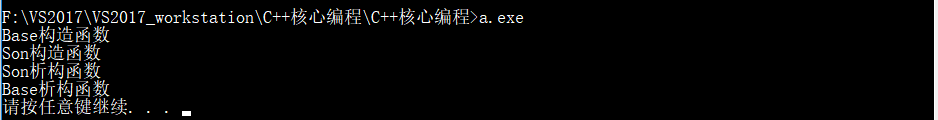
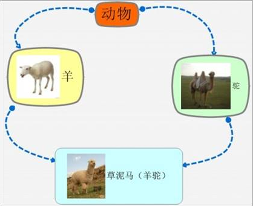
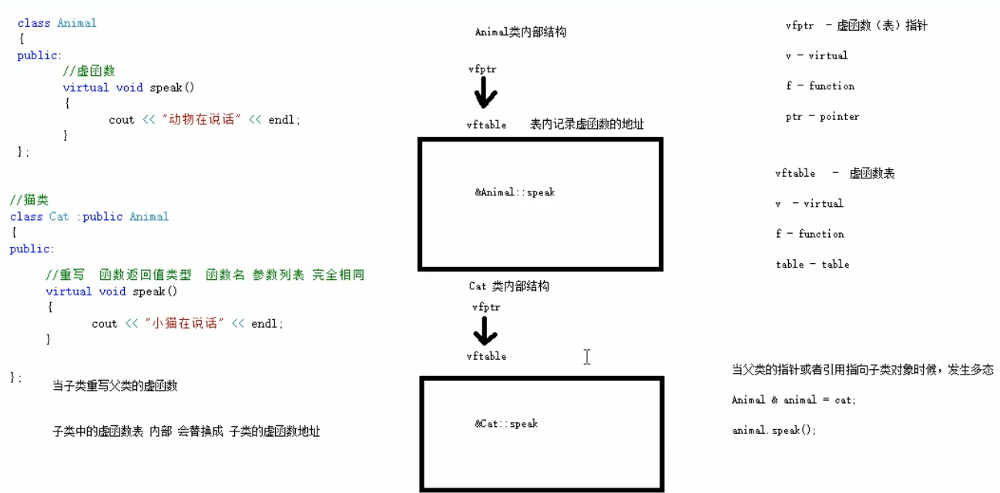

# ==三、C++学习笔记—核心编程==

本阶段，将对C++面向对象编程技术做详细学习，深入C++中的核心和精髓


#### 3.4.6.3 继承中的对象模型

**问题：**从父类继承过来的成员，哪些属于子类对象中？

**示例：**

```c++
#include<iostream>
#include<string>
using namespace std;

//继承中的对象模型
class Base 
{
public:
	int m_A;
protected:
	int m_B;
private:
	int m_C; //私有成员只是被隐藏了，但是还是会继承下去

};

//公共继承
class Son : public Base
{

public:
	int m_D;

private:

};

//利用开发人员命令提示工具查看对象模型
//在文件目录下：
//查看命令：cl /d1 reportSingleClassLayout类名 文件名


void test01() 
{
	//在父类中所有非静态成员属性都会被子类继承下去
	//父类中私有成员属性 是被编译器给隐藏了，因此访问不到，但是确实被继承下去了。
	cout << "size of Son=" << sizeof(Son) << endl; //16
}


int main() 
{
	test01();
	system("pause");
	return 0;
}
```

利用工具查看：


打开工具窗口后，定位到当前CPP文件的盘符

然后输入： cl /d1 reportSingleClassLayout查看的类名   所属文件名

效果如下图：

 

> 结论： 父类中私有成员也是被子类继承下去了，只是由编译器给隐藏后访问不到


#### 3.4.6.4 继承中构造和析构顺序

子类继承父类后，当创建子类对象，也会调用父类的构造函数

问题：父类和子类的构造和析构顺序是谁先谁后？

**示例：**

```c++
#include<iostream>
#include<string>
using namespace std;

//继承中的构造和析构顺序
class Base
{
public:
	Base() 
	{
		cout << "Base构造函数" << endl;
	}

	~Base()
	{
		cout << "Base析构函数" << endl;
	}

};

//子类（派生类）
class Son : public Base 
{
public:
	Son()
	{
		cout << "Son构造函数" << endl;
	}
	~Son()
	{
		cout << "Son析构函数" << endl;
	}
};

void test01() 
{
	//Base b;
	//继承中的构造和析构顺序如下：
	//先构造父类，再构造子类，析构的顺序与构造的顺序相反
	Son s;
}


int main() 
{
	test01();
	system("pause");
	return 0;
}
```

 

 

> 总结：==继承中 先调用父类构造函数，再调用子类构造函数，析构顺序与构造相反==


#### 3.4.6.5 继承同名成员处理方式

**问题：**当子类与父类出现同名的成员，如何通过子类对象，访问到子类或父类中同名的数据呢？

- 访问子类同名成员   直接访问即可
- 访问父类同名成员   需要加作用域

**示例：**

```c++
#include<iostream>
#include<string>
using namespace std;

//继承中同名成员处理
class Base 
{
public:
	Base() 
	{
		m_A = 100;
	}

	void func() 
	{
		cout << "Base - func（）调用" << endl;
	}

	void func(int a)
	{
		cout << "Base - func（int a）调用" << endl;
	}


	int m_A;
	
};


//派生类
class Son : public Base
{

public:
	Son() 
	{
		m_A = 200;
	}

	void func()
	{
		cout << "Son - func（）调用" << endl;
	}

	int m_A;
};
 

//同名成员属性处理方式
void test01() 
{
	Son s;
	cout << "Son  下 m_A=" << s.m_A << endl;
	//如果通过子类对象 访问到父类中同名成员，需要加作用域
	cout << "Base 下 m_A=" << s.Base::m_A << endl;

}
//同名成员函数处理
void test02()
{
	Son s; //子类对象
	s.func(); //直接调用 调用的是子类中的同名成员
	s.Base::func();//调用父类中的同名成员，需要加作用域
	        
	//如果子类中出现了和父类同名的成员函数，子类的同名成员会隐藏掉父类中所有同名成员函数
	//如果想访问到父类中被隐藏的同名成员函数，需要加作用域
	s.Base::func(300);

}

int main() 
{
	//test01();
	test02();
	system("pause");
	return 0;
}
```

**总结：**

1. 子类对象可以直接访问到子类中同名成员
2. 子类对象加作用域可以访问到父类同名成员
3. 当子类与父类拥有同名的成员函数，子类会隐藏父类中同名成员函数，加作用域可以访问到父类中同名函数

#### 3.4.6.6 继承同名静态成员处理方式

问题：继承中同名的静态成员在子类对象上如何进行访问？

静态成员和非静态成员出现同名，处理方式一致

- 访问子类同名成员   直接访问即可
- 访问父类同名成员   需要加作用域

**示例：**

```c++
#include<iostream>
#include<string>
using namespace std;

//继承中的同名静态成员处理方式
class Base 
{
public:

	static int m_A;

	static void func() 
	{
		cout << "Base - static void func()" << endl;
	}

};
 
int Base::m_A = 100; //类外初始化

class Son : public Base
{
public:
	static int m_A;

	static void func()
	{
		cout << "Son - static void func()" << endl;
	}
	 
};

int Son::m_A=200;


//同名静态成员属性
void test01()
{
	//1、通过对象访问
	cout << "通过对象访问：" << endl;
	Son s;
	cout << "SON  m_A =" << s.m_A << endl;
	cout << "Base m_A =" << s.Base::m_A << endl;

	//2、通过类名访问
	cout << "通过类名访问：" << endl;
	cout << "Son  下m_A:" << Son::m_A << endl;
	//第一个::通过类名访问方式  第二个::代表访问父类作用域下
	cout << "Base 下m_A:" << Son::Base::m_A << endl;

}


//同名静态成员函数
void test02() 
{
	//1、通过对象访问
	cout << "通过对象访问" << endl;
	Son s;
	s.func(); 
	s.Base::func();

	//2、 通过类名访问
	cout << "通过类名访问" << endl;
	Son::func();

	//子类出现和父类同名静态成员函数，也会隐藏父类中所有同名成员函数
	//如果想访问父类中被隐藏同名成员，需要加作用域
	Son::Base::func();
}

int main() 
{
	//test01();
	test02();
	system("pause");
	return 0;
}
```

总结：同名静态成员处理方式和非静态处理方式一样，**只不过有两种访问的方式（通过对象 和 通过类名）**


#### 3.4.6.7 多继承语法

C++允许**一个类继承多个类**

语法：` class 子类 ：继承方式 父类1 ， 继承方式 父类2...`

多继承可能会引发父类中有同名成员出现，需要加作用域区分

**C++实际开发中不建议用多继承**

**示例：**

```c++
#include<iostream>
#include<string>
using namespace std;

//多继承语法
class Base1 
{
public:
	Base1() 
	{
		m_A = 100;
	}
	int m_A;
};

class Base2 
{
public:
	Base2() 
	{
		m_A = 200;
	}
	int m_A;

};

//子类  需要继承Base1 和 Base2
//语法：class子类： 继承方式 父类1，继承方式 父类2...
class Son:public Base1,public Base2
{
public:
	Son() 
	{
		m_C = 300;
		m_D = 400;
	}

	int m_C;
	int m_D;
};

void test01() 
{
	Son s;
	cout << "sizeof SON=" << sizeof(s) << endl;
	
	//当父类中出现同名的成员，需要加作用域区分
	cout << "Base1=m_A=" << s.Base1::m_A << endl;
	cout << "Base2=m_A=" << s.Base2::m_A << endl;

}


int main() 
{
	test01();
	//test02();
	system("pause");
	return 0;
}
```


> 总结： 多继承中如果父类中出现了同名情况，子类使用时候要加作用域
>
> 在实际开发过程中，不建议使用多继承

#### 3.4.6.8 菱形继承

**菱形继承概念：**

​	两个派生类继承同一个基类

​	又有某个类同时继承者两个派生类

​	这种继承被称为菱形继承，或者钻石继承

**典型的菱形继承案例：**



**菱形继承问题：**

1. 羊继承了动物的数据，驼同样继承了动物的数据，当草泥马使用数据时，就会产生二义性。
2. 草泥马继承自动物的数据继承了两份，其实我们应该清楚，这份数据我们只需要一份就可以。

**示例：**

```c++
#include<iostream>
#include<string>
using namespace std;

//菱形继承
//动物类
class Animal 
{
public:
	int m_Age;
};

//利用虚继承，解决菱形继承的问题
//继承之前，加上关键字virtual 变为虚继承
//Animal类称为 虚基类


//羊类
class Sheep :virtual public Animal {};
//驼类
class Tuo : virtual public Animal {};
//羊驼类
class SheepTuo : public Sheep, public Tuo {};


void test01() 
{
	SheepTuo st;
	st.Sheep::m_Age = 18;
	st.Tuo::m_Age = 28;

	//当菱形继承，两个父类拥有相同数据，需要加以作用域区分
	cout << "st.Sheep::m_Age=" << st.Sheep::m_Age << endl;
	cout << "st.Tuo::m_Age=" << st.Tuo::m_Age << endl;
	cout << "st.m_A=" << st.m_Age << endl;

	//这份数据我们知道，只要有一份就可以，菱形继承导致数据有两份，资源浪费

}
int main() 
{
	test01();
	//test02();
	system("pause");
	return 0;
}
```

**总结：**

- 菱形继承带来的主要问题是子类继承两份相同的数据，导致资源浪费以及毫无意义
- 利用虚继承可以解决菱形继承问题

### 3.4.7  多态

#### 3.4.7.1 多态的基本概念


**多态是C++面向对象三大特性之一**

**多态分为两类：**

- 静态多态: 函数重载 和 运算符重载属于静态多态，复用函数名
- 动态多态: 派生类和虚函数实现运行时多态

**静态多态和动态多态区别：**

- 静态多态的函数地址早绑定  -  编译阶段确定函数地址
- 动态多态的函数地址晚绑定  -  运行阶段确定函数地址

下面通过案例进行讲解多态

```c++
#include<iostream>
#include<string>
using namespace std;

//多态
//动物类
class Animal 
{
public:
	//虚函数
	virtual void speak() 
	{
		cout << "动物在说话" << endl;
	}
};

//派生类——猫类
class Cat :public Animal 
{
public:
	//重写  函数返回类型  函数名 参数列表  完全相同
	void speak() 
	{
		cout << "小猫在说话" << endl;
	}
};
//派生类——狗类
class Dog : public Animal 
{
public:
	void speak() 
	{
		cout << "小狗在说话" << endl;

	}
};

//执行说话的函数
//地址早绑定  在编译阶段就确定了函数的地址
//如果想执行让猫说话，那么这个函数地址就不能提前绑定，需要在运行阶段进行绑定，地址晚绑定

//动态多态满足条件
//1、有继承关系
//2、子类重写父类的虚函数

//动态多态使用
//1、父类的指针或者引用  指向子类对象

void doSpeak(Animal &animal) //Animal & animal = cat;
{
	animal.speak();
}

//测试函数
void test01() 
{
	Cat cat;
	doSpeak(cat);

	Dog dog;
	doSpeak(dog);

}


int main() 
{
	test01();
	//test02();
	system("pause");
	return 0;
}
```

**总结：**

**多态满足条件**

- 有继承关系
- 子类重写父类中的虚函数

**多态使用条件**

- 父类指针或引用指向子类对象

**重写：**函数返回值类型  函数名 参数列表 完全一致称为重写

 

#### 3.4.7.2 多态案例一-计算器类

**案例描述：**

分别利用普通写法和多态技术，设计实现两个操作数进行运算的计算器类

**多态的优点：**

- 代码组织结构清晰
- 可读性强
- 利于前期和后期的扩展以及维护

==写之前，先想想，看看能不能用多态==

**示例：**

```c++
#include<iostream>
#include<string>
using namespace std;
 
//分别利用普通写法和多态技术实现计算器

//普通写法
class Calculator {
public:
	int getResult(string oper)
	{
		if (oper == "+") {
			return m_Num1 + m_Num2;
		}
		else if (oper == "-") {
			return m_Num1 - m_Num2;
		}
		else if (oper == "*") {
			return m_Num1 * m_Num2;
		}

		//如果要提供新的运算，需要修改源码
		//在真实开发中，提倡 开闭原则
		//开闭原则：对的扩展进行开发，对修改进行关闭

	}

public:
	int m_Num1;
	int m_Num2;
};


void test01()
{
	//普通实现测试
	Calculator c;
	c.m_Num1 = 10;
	c.m_Num2 = 10;
	cout << c.m_Num1 << " + " << c.m_Num2 << " = " << c.getResult("+") << endl;

	cout << c.m_Num1 << " - " << c.m_Num2 << " = " << c.getResult("-") << endl;

	cout << c.m_Num1 << " * " << c.m_Num2 << " = " << c.getResult("*") << endl;
}

//利用多态实现计算器
//实现计算器的抽象类
//多态好处：
//1、组织结构清洗
//2、可读性强
//3、对于前期和后期扩展以为维护性高

class AbstractCalculator 
{
public:
	//虚函数
	virtual int getResult()
	{
		return 0;
	}

	int m_Num1;
	int m_Num2;
};

//加法计算器类
class AddCalculator : public AbstractCalculator 
{
	int getResult()
	{
		return m_Num1 + m_Num2;
	}
};
//减法运算器类
class SubCalculator : public AbstractCalculator
{
	int getResult()
	{
		return m_Num1 - m_Num2;
	}
};
//乘法计算器类
class MulCalculator : public AbstractCalculator
{
	int getResult()
	{
		return m_Num1 * m_Num2;
	}
};

//测试函数
void test02() 
{
	//多态使用条件
	//父类指针或者引用执行子类对象

	//加法
	AbstractCalculator * abc = new AddCalculator;
	abc->m_Num1 = 10;
	abc->m_Num2 = 10;
	cout << abc->m_Num1<<"+" << abc->m_Num2 << "=" << abc->getResult() << endl;
	//用完后记得销毁
	delete abc;

	//减法
	abc = new SubCalculator;
	abc->m_Num1 = 100;
	abc->m_Num2 = 100;
	cout << abc->m_Num1 << "-" << abc->m_Num2 << "=" << abc->getResult() << endl;
	//用完后记得销毁
	delete abc;

	//乘法
	abc = new MulCalculator;
	abc->m_Num1 = 100;
	abc->m_Num2 = 100;
	cout << abc->m_Num1 << "*" << abc->m_Num2 << "=" << abc->getResult() << endl;
	//用完后记得销毁
	delete abc;

}


int main() 
{
	//test01();
	test02();
	system("pause");
	return 0;
}
```


> 总结：C++开发提倡利用多态设计程序架构，因为多态优点很多

#### 3.4.7.3 纯虚函数和抽象类

在多态中，通常父类中虚函数的实现是毫无意义的，主要都是调用子类重写的内容

因此可以将虚函数改为**纯虚函数**

纯虚函数语法：`virtual 返回值类型 函数名 （参数列表）= 0 ;`

当类中有了纯虚函数，这个类也称为==抽象类==

**抽象类特点**：

- 无法实例化对象
- 子类必须重写抽象类中的纯虚函数，否则也属于抽象类


**示例：**


#### 3.4.7.4 多态案例二-制作饮品

**案例描述：**

制作饮品的大致流程为：煮水 -  冲泡 - 倒入杯中 - 加入辅料


利用多态技术实现本案例，提供抽象制作饮品基类，提供子类制作咖啡和茶叶

 


**示例：**

#### 3.4.7.5 虚析构和纯虚析构


多态使用时，如果子类中有属性开辟到堆区，那么父类指针在释放时无法调用到子类的析构代码


解决方式：将父类中的析构函数改为**虚析构**或者**纯虚析构**


虚析构和纯虚析构共性：

- 可以解决父类指针释放子类对象
- 都需要有具体的函数实现

虚析构和纯虚析构区别：

- 如果是纯虚析构，该类属于抽象类，无法实例化对象


虚析构语法：

`virtual ~类名(){}`

纯虚析构语法：

` virtual ~类名() = 0;`

`类名::~类名(){}`


**示例：**

总结：

​	1. 虚析构或纯虚析构就是用来解决通过父类指针释放子类对象

​	2. 如果子类中没有堆区数据，可以不写为虚析构或纯虚析构

​	3. 拥有纯虚析构函数的类也属于抽象类

#### 3.4.7.6 多态案例三-电脑组装


**案例描述：**


电脑主要组成部件为 CPU（用于计算），显卡（用于显示），内存条（用于存储）

将每个零件封装出抽象基类，并且提供不同的厂商生产不同的零件，例如Intel厂商和Lenovo厂商

创建电脑类提供让电脑工作的函数，并且调用每个零件工作的接口

测试时组装三台不同的电脑进行工作


**示例：**

