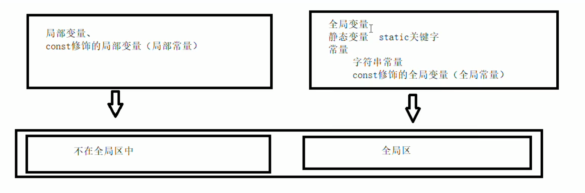
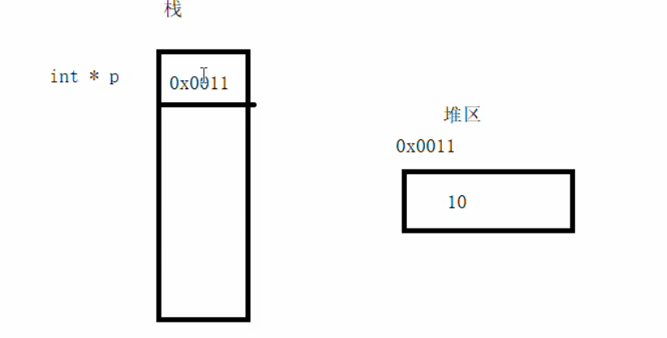
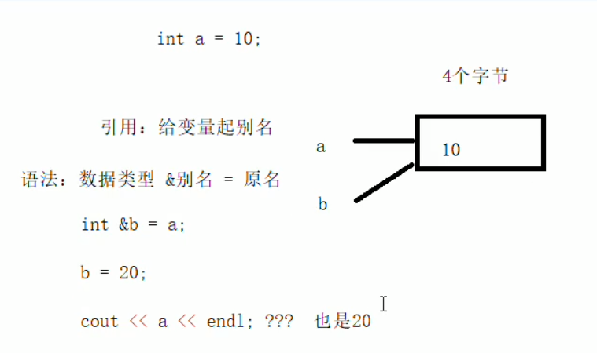
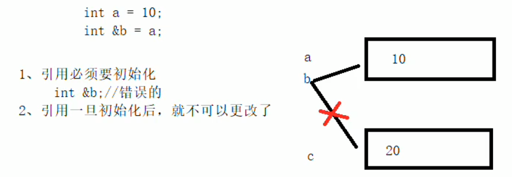
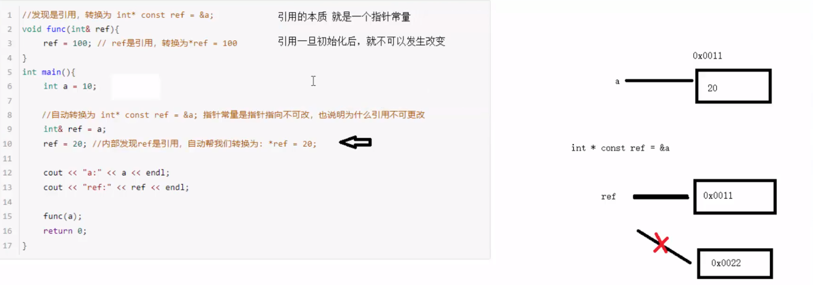
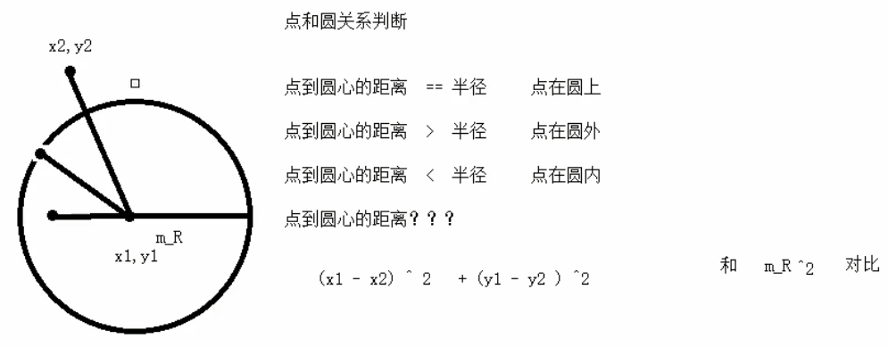

# ==三、C++学习笔记—核心编程==

本阶段，将对C++面向对象编程技术做详细学习，深入C++中的核心和精髓

##3.1 内存分区模型

C++程序在执行时，将内存大方向划分为**4个区域**

- 代码区：存放函数体的二进制代码，由操作系统进行管理的
- 全局区：存放全局变量和静态变量以及常量
- 栈区：由编译器自动分配释放, 存放函数的参数值,局部变量等
- 堆区：由程序员分配和释放,若程序员不释放,程序结束时由操作系统回收

**内存四区意义：**

不同区域存放的数据，赋予不同的生命周期, 给我们更大的灵活编程

###3.1.1 程序运行前

​	在程序编译后，生成了**exe可执行程序，****未执行该程序前**分为两个区域

​	**代码区：**

​		存放 CPU 执行的机器指令

​		代码区是**共享**的，共享的目的是对于频繁被执行的程序，只需要在内存中有一份代码即可

​		代码区是**只读**的，使其只读的原因是防止程序意外地修改了它的指令

​	**全局区：**

​		**全局变量和静态变量存放在此**.

​		全局区还包含了**常量区, 字符串常量和其他常量**也存放在此.

​		==该区域的数据在程序结束后由操作系统释放==.



     **示例：**

```c++
#include<iostream>
using namespace std;
//全局变量
int g_a = 10;
int g_b = 10;

//const修饰的全局变量，全局常量
const int c_g_a = 10;
const int c_g_b = 10;
int main() 
{

	//全局区
	
	//全局变量、静态变量、常量
	
	//创建普通局部变量
	int a = 10;
	int b = 10;
	cout << "局部变量a的地址为：\t" << &a << endl;
	cout << "局部变量b的地址为：\t" << &b << endl;

	cout << "全局变量g_a的地址为：\t" << &g_a << endl;
	cout << "全局变量g_b的地址为：\t" << &g_b << endl;
	
	//静态变量  在普通变量的前面加上static，属于静态变量，也会放在全局区域中
	static int s_a = 10;
	cout << "静态变量s_a的地址为：\t" << &s_a << endl;

	//常量
	//字符串常量
	cout << "字符串常量的地址为：\t" << &"hell world" << endl;
	
	//const修饰的变量
	//const修饰的全局变量，const修饰的局部变量
	cout << "全局常量c_g_a的地址为：\t" << &c_g_a << endl;
	cout << "全局常量c_g_b的地址为：\t" << &c_g_b << endl;

	const int c_l_a = 10; //c-const g-global l=local
	const int c_l_b = 10; //c-const g-global l=local
	cout << "局部常量c_l_a的地址为：\t" << &c_l_a << endl;
	cout << "局部常量c_l_b的地址为：\t" << &c_l_b << endl;
	system("pause");
	return 0;

}
```

     **总结：**

- C++中在程序运行前分为全局区和代码区
- 代码区特点是共享和只读
- 全局区中存放全局变量、静态变量、常量
- 常量区中存放 const修饰的全局常量  和 字符串常量


###3.1.2 程序运行后

​	**栈区：**

​		由编译器自动分配释放, **存放函数的参数值,局部变量等**

​		**注意事项：**不要返回局部变量的地址，栈区开辟的数据由编译器自动释放

**示例：**

```c++
#include<iostream>
using namespace std;

//栈区注意事项 --- 不要返回局部变量的地址
//栈区的数据由编译器管理开辟和释放

int* func(int b)  //形参数据也会放在栈区
{ 
	int b = 100;
	int a = 10; //局部变量 存放在栈区，栈区的数据在函数执行完后自动释放
	return &a; //返回局部变量的地址
}

int main() 
{
 
	//接收func函数的返回值 
	int * p = func(1);
	cout << *p << endl; //10,第一次可以打印正确的数字，是因为编译器做了保留
	cout << *p << endl; // 第二次这个数据就不在保留了

	system("pause");
	return 0;

}
```

​	**堆区：**

​		由程序员分配释放,若程序员不释放,程序结束时由操作系统回收

​		在C++中主要利用new在堆区开辟内存



**示例：**

```c++
#include<iostream>
using namespace std;

int * func() 
{
	//int a = 10;
	//return &a; //不要返回局部变量的地址，栈区开辟的数据由编译器自动释放

	//利用new关键字，  可以将数据开辟到堆区
	//指针，本质也是局部变量，放在栈上，指针保存的数据是放在堆区
	int * p = new int(10);
	return p;   
}

int main() 
{
 
	//在堆区开辟数据
	int *p  = func();
	cout << *p << endl;

	system("pause");
	return 0;

}
```

**总结：**

堆区数据由程序员管理开辟和释放

堆区数据利用new关键字进行开辟内存

### 3.1.3 new操作符

​	C++中利用==new==操作符在堆区开辟数据

​	堆区开辟的数据，由程序员手动开辟，手动释放，释放利用操作符 ==delete==

​	语法：` new 数据类型`

​	利用new创建的数据，会返回该数据对应的类型的指针

**示例1： 基本语法**

```c++
#include<iostream>
using namespace std;

//1、new的基本语法
int * func() 
{
	//在堆区创建整型数据
	int *p = new int(10); // new返回的是，该数据类型的指针

	return p;
}

int main() 
{
	
	int * p = func();
	cout << *p << endl; //堆区的数据，由程序员管理开辟，程序员管理释放
	delete p;
	//cout << *p << endl;//内存已经被释放，再次访问就是非法操作，会报错
	system("pause");
	return 0;

}
```

**示例2：开辟数组**

```c++
#include<iostream>
using namespace std;

//2、在堆区利用new开辟内存
void test02() 
{
	//创建10个整型数据的数组，在堆区
	int * arr = new int[10]; //10代表数组有10个元素
	for (int i = 0; i < 10; i++)
	{
		arr[i] = i + 100; //给10个元素赋值：100-109
	}
	for (int i = 0; i < 10; i++)
	{
		cout << arr[i] << endl;
	}
	//释放堆区数组
	delete[] arr; //释放数组的时候，需要加[]才可以
}

int main() 
{
	test02();
	system("pause");
	return 0;

}
```


## 3.2 引用

### 3.2.1 引用的基本使用

**作用： **<font color=red>给变量起别名</font>

**语法：** `数据类型 &别名 = 原名`



**示例：**

```c++
#include<iostream>
using namespace std;

int main() 
{
	//引用基本语法
	//数据类型  &别名  =  原名

	int a = 10;
	//创建引用
	int &b = a;
	cout << "a=" << a << endl;
	cout << "b=" << b << endl;

	b = 100;
	cout << "a=" << a << endl;
	cout << "b=" << b << endl;

	system("pause");
	return 0;

}
```


### 3.2.2 引用注意事项

- 引用必须初始化
- 引用在初始化后，不可以改变



**示例：**

```c++
#include<iostream>
using namespace std;

int main() 
{
	
	int a = 10;

	//1、引用必须初始化
	//int &b; //错误，必须要初始化
	int &b = a;
	 
	//2、引用在初始化后，不可以改变
	int c = 20;
	b = c; //赋值操作，而不是更改引用
	cout << "a=" << a << endl;
	cout << "b=" << b << endl;
	cout << "c=" << c << endl;

	system("pause");
	return 0;

}
```


### 3.2.3 引用做函数参数

**作用：**函数传参时，可以利用引用的技术让形参修饰实参

**优点：**<font color=red>可以简化指针修改实参</font>

**示例：**

```c++
#include<iostream>
using namespace std;

//交互函数
//1、值传递
void mySwap01(int a, int b)
{
	int temp = a;
	a = b;
	b = temp;
	cout << "swap01a=" << a << endl;
	cout << "swap01b=" << b << endl;
}

//2、地址传递
void mySwap02(int *a, int *b) 
{
	int temp = *a;
	*a = *b;
	*b = temp;

}

//3、引用传递
void mySwap03(int &a, int &b) 
{
	int temp = a;
	a = b;
	b = temp;
}

int main() 
{

	int a = 10;
	int b = 20;

	//mySwap01(a, b); //值传递，形参并不能修饰实参，实参并未发生改变
	cout << "a=" << a << endl;
	cout << "b=" << b << endl;
	
	//mySwap02(&a, &b); //地址传递，形参会修饰实参的
	cout << "02a=" << a << endl;
	cout << "02b=" << b << endl;

	mySwap03(a,b); //引用传递，形参会修改实参
	cout << "03a=" << a << endl;
	cout << "03b=" << b << endl;

	system("pause");
	return 0;

}
```

> 总结：==通过引用参数产生的效果同按地址传递是一样的。引用的语法更清楚简单==

### 3.2.4 引用做函数返回值

**作用：**引用是可以作为函数的返回值存在的

**注意：**不要返回局部变量引用

**用法**：函数调用作为左值

**示例：**

```c++
#include<iostream>
using namespace std;

//引用做函数的返回值

//1、不要返回局部变量的引用
int& test01() 
{
	int a = 10; //局部变量存在在四区中的，栈区
	return  a; //引用的反正返回
}

//2、函数的调用可以作为左值
int& test02()
{
	static int b = 10; //静态变量，放在在全局区，全局区上的数据在程序结束后系统释放
	return b;
}

int main() 
{
	
	//int &ref = test01();
	//cout << "ref=" << ref << endl;//第一次结果正确，是因为编译器做了保留
	//cout << "ref=" << ref << endl;//第二次结果错误，是因为a的内存已经释放

	int &ref2 = test02();
	cout << "ref2=" << ref2 << endl;
	cout << "ref2=" << ref2 << endl; //10

	//a=1000的操作，原名赋值1000，再使用别名ref2调用 如果函数的返回值是引用，这个函数调用可以作为左值
	test02() = 1000; 
	cout << "ref2=" << ref2 << endl;
	cout << "ref2=" << ref2 << endl;//1000

	system("pause");
	return 0;

}
```


### 3.2.5 引用的本质

**本质：**引用的本质在c++内部实现是一个**指针常量.**

 

**示例：**

```c++
#include<iostream>
using namespace std;

//引用的本质
void func(int& ref) 
{
	ref = 100; // ref是引用，转换为*ref = 100
}

int main() 
{
	int a = 10;
	
	//自动转换为 int * const ref = &a; 指针常量是指针指向不可改，也说明为什么引用不可更改
	int& ref = a; //给a起了一个别名
	ref = 20; //内部发现ref是引用，自动帮我们转换为 *ref = 20;

	cout << "a=" << a << endl;
	cout << "ref=" << ref << endl;

	func(a);
	system("pause");
	return 0;

}
```


### 3.2.6 常量引用

**作用：**常量引用主要用来修饰形参，防止误操作

在函数形参列表中，可以加==const修饰形参==，防止形参改变实参

**示例：**

```c++
#include<iostream>
using namespace std;

//常量引用
//使用场景：用来修饰形参，防止误操作

//打印数据函数
void showValue(const int & val)  //使用引用的方式接收 
{
	//val = 1000;
	cout << "val=" << val << endl;
}

int main() 
{
	//int a = 10;

	//加上const之后，编译器将代码修改 int temp = 10; const int & ref = temp;
	//const int & ref = 10;//引用必须引一块合法的内存空间
	//ref = 20;//加入const之后变为只读，不可以修改

	int a = 100;
	showValue(a);
	cout << "a=" << a << endl;
	 
	system("pause");
	return 0;
}
```


## 3.3 函数提高

### 3.3.1 函数默认参数

在C++中，函数的形参列表中的形参是可以有默认值的。

**语法：**` 返回值类型  函数名 （参数= 默认值）{}`

**示例：**

```c++
#include<iostream>
using namespace std;

//函数默认参数
//如果我们自己传入数据吗，就是自己的数据，如果没有，那么就用默认值
//语法： 返回值类型 函数名（形参=默认值）{}

int func(int a, int b=20, int c=30) 
{
	return a + b + c;
}

//注意事项：
//1、如果某个位置已经有了默认参数，那么从这个位置往后，从左到右都必须有默认值
int fun2(int a, int b=10, int c)//c此时也必须得有 
{
	return a + b + c;
}

//2、如果函数的声明有了默认参数，函数的实现就不能有默认参数
//声明和实现智能有一个有默认参数
int func3(int a=10, int b=10); //声明
int func3(int a=10, int b=10) 
{
	return a + b;
}

int main() 
{
	 
	int sum = func(10); //
	cout << "sum=" << sum << endl;
	cout << func(10, 30)<<endl; //70

	cout<<func3(10, 10)<<endl; //会报错，重定义默认参数


	system("pause");
	return 0;
}
```


### 3.3.2 函数占位参数

C++中函数的形参列表里可以有占位参数，用来做占位，调用函数时必须填补该位置

**语法：** `返回值类型 函数名 (数据类型){}`

在现阶段函数的占位参数存在意义不大，但是后面的课程中会用到该技术

**示例：**

```c++
#include<iostream>
using namespace std;

//占位参数
//返回值类型  函数名（数据类型）{}

//目前阶段的占位参数，我们还用不到，后面学习中会用到
//占位参数 还可以有默认参数
void func(int a,int = 10) 
{
	cout << "this is func " << endl;
}

int main() 
{

	func(10);
	system("pause");
	return 0;

}
```


### 3.3.3 函数重载

#### 3.3.3.1 函数重载概述

**作用：**函数名可以相同，提高复用性

**函数重载满足条件：**

- 同一个作用域下
- 函数名称相同
- 函数参数**类型不同**  或者 **个数不同** 或者 **顺序不同**

**注意:**  <font color=red>函数的返回值不可以作为函数重载的条件</font>

**示例：**

```c++
#include<iostream>
using namespace std;

//函数重载
//可以让函数名相同，提高复用性

//函数重载的满足条件：
//1、同一个作用域下
//2、函数名称相同
//3、函数的参数类型不同，或者个数不同，或者顺序不同

//1
void func()
{
	cout << "func的调用" << endl;
}
//2
void func(int a)
{
	cout << "func(int a)的调用!" << endl;
}
//3
void func(double a)
{
	cout << "func(double a)的调用!" << endl;
}
//4
void func(int a, double b)
{
	cout << "func(int a, double b)的调用!" << endl;
}
//5
void func(double a, int b)
{
	cout << "func(double a, int b)的调用!" << endl;
}

//注意事项：
//函数的返回值不可以作为函数重载的条件
//就是不能和上面相同的重复
//void func(double a, int b)
//{
//	cout << "func(double a, int b)的调用!" << endl;
//}

int main() 
{
	//func();
	//func(10);
	//func(3.14);
	//func(10, 3.14);
	func(3.13,10);

	system("pause");
	return 0;

}
```


#### 3.3.3.2 函数重载注意事项

- 引用作为重载条件
- 函数重载碰到函数默认参数

**示例：**

```c++
#include<iostream>
using namespace std;

//函数重载的注意事项
//1、引用作为重载的条件
void func(int &a) //int &a  =10; 不合法
{
	cout << "func(int &a)调用" << endl;
}

void func(const int &a) //只读状态 const int &a =10;合法
{
	cout << "func(const int &a)调用" << endl;
}


//2、函数重载碰到默认参数

void func2(int a,int b=10)
{
	cout << "func2(int a,int b)调用" << endl;
}

void func2(int a)
{
	cout << "func2(int a)调用" << endl;
}


int main() 
{
	//int a = 10;//变量
	//func(a);//调用没有加const的。

	//func(10);

	func2(10); //此时，上面都能调，编译器傻了。当函数重载碰到默认参数，出现二义性，报错，尽量避免这种情况

	system("pause");
	return 0;

}
```


## **3.4** 类和对象

C++面向对象的三大特性为：==封装、继承、多态==

C++认为==万事万物都皆为对象==，对象上有其属性和行为

**例如：**

​	人可以作为对象，属性有姓名、年龄、身高、体重...，行为有走、跑、跳、吃饭、唱歌...

​	车也可以作为对象，属性有轮胎、方向盘、车灯...,行为有载人、放音乐、放空调...

​	具有相同性质的==对象==，我们可以抽象称为==类==，人属于人类，车属于车类

###3.4.1 封装

####3.4.1.1  封装的意义

封装是C++面向对象三大特性之一

**封装的意义：**

- 将属性和行为作为一个整体，表现生活中的事物
- 将属性和行为加以权限控制

**封装意义一：**

​	在设计类的时候，属性和行为写在一起，表现事物

**语法：** `class 类名{   访问权限： 属性  / 行为  };`

**示例1：**设计一个圆类，求圆的周长

**示例代码：**

```c++
#include<iostream>
using namespace std;

//圆周率
const double PI = 3.14;
//设计一个圆类，求圆的周长
//圆求周长的公式： 2 * PI * 半径

//class 代表设计一个类，类后面紧跟着的就是类名称
class Circl
{
	//访问权限
	//公共权限
public:
	//属性————变量
	//半径
	int m_r;
	
	//行为————函数，公式等
	//获取圆的周长
	double calculateZC()
	{
		return 2 * PI * m_r;
	}

};

int main() 
{
	//通过圆类，创建具体的圆（对象）
	//实例化（通过一个类，创建一个对象的过程）
	Circl c1;
	//给圆对象 的属性进行赋值
	c1.m_r = 10;

	// 2*PI*10=62.8
	cout << "圆的周长为：" << c1.calculateZC() << endl;


	system("pause");
	return 0;

}
```

**示例2：**设计一个学生类，属性有姓名和学号，可以给姓名和学号赋值，可以显示学生的姓名和学号

**示例2代码：**

```c++
#include<iostream>
#include<string>
using namespace std;

//学生类
//设计一个学生类，属性有姓名和学号，
//可以给学生和学号赋值，可以显示学生的姓名和学号

class Student
{
public://访问权限—公共权限

	// 类中的属性和行为， 我们统一称为 成员
	// 属性   成员属性  成员变量
	// 行为   成员函数  成员方法

	//属性
	string m_Name;
	int m_Id;

	//行为
	//显示姓名和学号
	void showStudent() 
	{
		cout << "姓名：" << m_Name << endl;
		cout << "学号：" << m_Id << endl;

	}

	//给姓名赋值
	void setName(string name) 
	{
		m_Name = name;
	}
	//给学号赋值
	void set_m_Id(int Id) 
	{
		m_Id = Id;
	}
};


int main() 
{
	 
	//创建一个具体的学生（对象）实例化
	Student s1;
	
	//给s1对象，进行属性赋值操作
	//s1.m_Name = "贾继康";
	s1.setName("张三");
	//s1.m_Id = 123;
	s1.set_m_Id(1);

	//显示学生信息
	s1.showStudent();

	system("pause");
	return 0;

}
```

**封装意义二：**

**类在设计时，可以把属性和行为放在不同的权限下，加以控制**

==**访问权限有三种：**==

1. public        公共权限  
2. protected 保护权限
3. private      私有权限

**示例：**

```c++
#include<iostream>
#include<string>
using namespace std;

//访问权限
//三种
//公共权限  public               成员 类内可以访问， 类外可以访问
//保护权限  protected            成员 类内可以访问， 类外不可以访问 儿子可以访问父亲中的保护内容
//私有权限  private              成员 类内可以访问， 类外不可以访问 儿子不可以访问父亲的私有内容

class Person
{
public:
	//公共权限
	string m_Name;
protected:
	//保护权限
	string c_Car; //汽车

private:
	// 私有权限
	int m_Password; // 银行卡密码
public: //private，或者protected在类内都可以访问的
	void func() 
	{
		m_Name = "张三";
		c_Car = "拖拉机";
		m_Password = 123456;
	}

};
 
int main() 
{
	Person p1; // 实例化具体对象
	p1.m_Name = "李四";
	p1.c_Car = "拖拉机"; //保护权限内容，在类外访问不到
	p1.m_Password = 12345; // 私有权限内容，类外访问不到


	system("pause");
	return 0;

}
```


####3.4.1.2 struct和class区别

在C++中 struct和class唯一的**区别**就在于 **默认的访问权限不同**

**区别：**

- struct 默认权限为公共
- class   默认权限为私有

```c++
#include<iostream>
#include<string>
using namespace std;

//struct 和 class 区别
//struct 默认权限是  公共  public
//class  默认权限是  私有  pivate

class C1
{
	int m_A; // 默认权限   是私有
};
struct C2
{
	int m_A; //默认权限    是公共
};
 
int main() 
{
	 
	C1 c1; //实例化对象
	//c1.m_A=100; // 在class里默认权限，私有，此处报错

	C2 c2;
	c2.m_A = 100; //struct默认权限公共的，因此可以访问

	system("pause");
	return 0;

}
```


####3.4.1.3 成员属性设置为私有

**优点1：**将所有成员属性设置为私有，可以自己控制读写权限

**优点2：**对于写权限，我们可以检测数据的有效性

**示例：**

```c++
#include<iostream>
#include<string>
using namespace std;


// 成员属性设置为私有
// 1、可以自己控制读写权限
// 2、对于写可以检测数据的有效性

//设计人类
class Person 
{
public:

	//姓名——可读可写
	//设置姓名
	void setName(string name) 
	{
		m_Name = name;
	}
	//获取姓名
	string getName() 
	{
		return m_Name;
	}

	//年龄——只读  ——改成可读可写（如果想修改，年龄的范围必须是0-150范围）
	//获取年龄
	int getAge() 
	{
		//m_Age = 0; // 初始化为0
		return m_Age;
	}
	//设置年龄
	void  setAge(int age)
	{
		if (age<0||age>150)
		{
			m_Age = 0;
			cout << "您这个老妖精" << endl;
			return;
		}
		m_Age = age;
	}

	//情人——只写
	void setLover(string lover) 
	{
		m_Lover = lover;
	}

private: //设置为私有化
	//姓名  可读可写
	string m_Name; 
	//年龄  只读
	int m_Age; 
	// 情人  只读
	string m_Lover;

};

int main() 
{
	 //实例化对象
	Person p;
	p.setName("贾继康");
	cout << "姓名为：" << p.getName() << endl;

	p.setAge(1000);
	cout << "年龄为：" << p.getAge() << endl;

	p.setLover("苍井空");
	//cout << "情人为：" << p.m_Lover << endl; //只设置，所以不可以访问的

	system("pause");
	return 0;

}
```

**练习案例1：设计立方体类**

设计立方体类(Cube)

求出立方体的面积和体积

分别用全局函数和成员函数判断两个立方体是否相等。

```c++
#include<iostream>
#include<string>
using namespace std;

//设计一个立方体
//1、创建立方体类
//2、设计属性 
//3、设计行为：获取立方体面积和体积
//4、分别利用全局函数和成员函数 判断两个立方体是否相等


class Cube
{

public:

	//设置长
	void setL(int l) 
	{
		m_L = l;

	}
	//获取长
	int getL() 
	{
		return m_L;

	}

	//设置宽
	void setW(int w)
	{
		m_W = w;

	}

	//获取宽
	int getW()
	{
		return m_W;

	}
	//设置高
	void setH(int h)
	{
		m_H = h;

	}
	//获取高
	int getH()
	{
		return m_W;

	}

	//获取立方体的面积
	int calculateS() 
	{
		return 2 * m_L*m_W + 2 * m_W*m_H + 2 * m_L*m_H;
	}
	//获取立方体的体积
	int calculateV() 
	{
		return m_L * m_H*m_W;
	}

	//利用成员函数判断两个立方体是否相等
	bool isSameByClass(Cube &c) 
	{
		if (m_L == c.getL() && m_W == c.getW() && m_H == c.getH())
		{
			return true;
		}
		return false;

	}

private: //属性

	int m_L; //长
	int m_W; //宽
	int m_H; //高

};

//全局函数
//利用全局函数判断 两个立方体是否相等
bool isSame(Cube &c1, Cube &c2)// 引用方式 
{
	if (c1.getL() == c2.getL() && c1.getW()==c2.getW() && c1.getH()==c2.getH())
	{
		return true;
	}
	return false;
}

int main() 
{
	 
	//创建立方体对象
	Cube c1;
	c1.setL(10);
	c1.setW(10);
	c1.setH(10);

	cout << "c1的面积为：" << c1.calculateS() << endl;
	cout << "c1的体积为：" << c1.calculateV() << endl;

	//创建第二个立方体对象

	Cube c2;
	c2.setL(10);
	c2.setW(10);
	c2.setH(10);

	bool ret = isSame(c1, c2);
	if (ret)
	{
		cout << "c1和c2是相等的" << endl;

	}
	else
	{
		cout << "c1和c2是不相等的" << endl;
	}

	ret = c1.isSameByClass(c2);
	if (ret)
	{
		cout << "这是成员函数判断的结果：c1和c2相等" << endl;
	}
	else
	{
		cout << "这是成员函数判断的结果：c1和c2不相等" << endl;
	}

	system("pause");
	return 0;
}
```

**练习案例2：点和圆的关系**

设计一个圆形类（Circle），和一个点类（Point），计算点和圆的关系。

注意：点到圆心的距离—欧氏距离

 **程序布局第一种方式：**

```c++
#include<iostream>
#include<string>
using namespace std;

#include "circle.h"
#include "point.h"

//点和圆关系案例

////点类
//class Point 
//{
//public:
//
//	//设置X
//	void setX(int x) 
//	{
//		m_X = x;
//	}
//
//	//获取X
//	int getX() 
//	{
//		return m_X;
//	}
//
//	//设置Y
//	void setY(int y)
//	{
//		m_Y = y;
//	}
//	//获取Y
//	int getY()
//	{
//		return m_Y;
//	}
//	
//
//private: //属性
//	int m_X;
//	int m_Y;
//
//};


////圆类
//class Circle 
//{
//public:
//
//	//设置半径
//	void setR(int r)
//	{
//		m_R = r;
//	}
//	//获取半径
//	int getR() 
//	{
//		return m_R;
//	}
//	//设置圆心
//	void setCenter(Point center)
//	{
//		m_Center = center;
//	}
//	//获取圆心
//	Point getCenter()
//	{
//		return m_Center;
//	}
//
//private://属性
//	int m_R;//半径
//
//	//核心内容1：在类中，可以让另一个类 作为本类中的成员
//	Point m_Center; // 圆心
//
//};

//判断点和圆的关系
void isInCircle(Circle &c, Point &p) 
{
	//计算两点之间的距离  平方
	int distance =
		(c.getCenter().getX() - p.getX())*(c.getCenter().getX() - p.getX()) +
		(c.getCenter().getY() - p.getY())*(c.getCenter().getY() - p.getY());

	//计算半径的平方
	int rDistance = c.getR()*c.getR();

	//判断
	if (distance==rDistance)
	{
		cout << "点在圆上" << endl;
	}
	else if (distance>rDistance)
	{
		cout << "点在圆外" << endl;
	}
	else
	{
		cout << "点在圆内" << endl;
	}
}

int main() 
{
	 //实例化对象
	//创建圆
	Circle c;
	c.setR(10);
	Point center;
	center.setX(10);
	center.setY(0);
	c.setCenter(center);

	//创建点
	Point p;
	p.setX(10);
	p.setY(10);

	//判断关系
	isInCircle(c, p);

	system("pause");
	return 0;
}
```

**程序布局第二种方式：**

```c++
//1、point.h
#pragma once
#include<iostream>
using namespace std;

//函数的声明和变量的声明
//点类
class Point
{
public:

	//设置X
	void setX(int x);	 
	//获取X
	int getX();	
	//设置Y
	void setY(int y);
	//获取Y
	int getY();
private: //属性
	int m_X;
	int m_Y;

};
```

```c++
//point.cpp
#include "point.h"

//点类
//只需要留住函数所有的实现

//设置X
void Point:: setX(int x) //需要告诉Point作用域下的成员函数
{
	m_X = x;
}

//获取X
int Point::getX()
{
	return m_X;
}

//设置Y
void Point::setY(int y)
{
	m_Y = y;
}
//获取Y
int Point:: getY()
{
	return m_Y;
}
```

```c++
//3、circle.h
#pragma once
#include<iostream>
using namespace std;

#include "point.h"

//圆类
class Circle
{
public:

	//设置半径
	void setR(int r); //函数的声明
	 
	//获取半径
	int getR();
	 
	//设置圆心
	void setCenter(Point center);
	 
	//获取圆心
	Point getCenter();
	 
private://属性
	int m_R;//半径

	//核心内容1：在类中，可以让另一个类 作为本类中的成员
	Point m_Center; // 圆心

};
```

```c++
//4、circle.cpp


#include "circle.h"
//圆类实现
 	//设置半径
	void Circle::setR(int r) // 这是一个Circle的成员函数
	{
		m_R = r;
	}
	//获取半径
	int Circle::getR()
	{
		return m_R;
	}
	//设置圆心
	void Circle::setCenter(Point center)
	{
		m_Center = center;
	}
	//获取圆心
	Point Circle:: getCenter()
	{
		return m_Center;
	}
```

```c++
//5、主程序
#include<iostream>
#include<string>
using namespace std;

#include "circle.h"
#include "point.h"
//判断点和圆的关系
void isInCircle(Circle &c, Point &p) 
{
	//计算两点之间的距离  平方
	int distance =
		(c.getCenter().getX() - p.getX())*(c.getCenter().getX() - p.getX()) +
		(c.getCenter().getY() - p.getY())*(c.getCenter().getY() - p.getY());

	//计算半径的平方
	int rDistance = c.getR()*c.getR();

	//判断
	if (distance==rDistance)
	{
		cout << "点在圆上" << endl;
	}
	else if (distance>rDistance)
	{
		cout << "点在圆外" << endl;
	}
	else
	{
		cout << "点在圆内" << endl;
	}
}

int main() 
{
	 //实例化对象
	//创建圆
	Circle c;
	c.setR(10);
	Point center;
	center.setX(10);
	center.setY(0);
	c.setCenter(center);

	//创建点
	Point p;
	p.setX(10);
	p.setY(10);

	//判断关系
	isInCircle(c, p);

	system("pause");
	return 0;
}
```


###3.4.2 对象的初始化和清理


- 生活中我们买的电子产品都基本会有出厂设置，在某一天我们不用时候也会删除一些自己信息数据保证安全
- C++中的面向对象来源于生活，每个对象也都会有初始设置以及 对象销毁前的清理数据的设置。

####3.4.2.1 构造函数和析构函数

对象的**初始化和清理**也是两个非常重要的安全问题

​	一个对象或者变量没有初始状态，对其使用后果是未知

​	同样的使用完一个对象或变量，没有及时清理，也会造成一定的安全问题


c++利用了**构造函数**和**析构函数**解决上述问题，这两个函数将会被编译器自动调用，完成对象初始化和清理工作。

对象的初始化和清理工作是编译器强制要我们做的事情，因此如果**我们不提供构造和析构，编译器会提供**

**编译器提供的构造函数和析构函数是空实现。**


- 构造函数：主要作用在于创建对象时为对象的成员属性赋值，构造函数由编译器自动调用，无须手动调用。
- 析构函数：主要作用在于对象**销毁前**系统自动调用，执行一些清理工作。


**构造函数语法：**`类名(){}`

1. 构造函数，没有返回值也不写void
2. 函数名称与类名相同
3. 构造函数可以有参数，因此可以发生重载
4. 程序在调用对象时候会自动调用构造，无须手动调用,而且只会调用一次


**析构函数语法：** `~类名(){}`

1. 析构函数，没有返回值也不写void
2. 函数名称与类名相同,在名称前加上符号  ~
3. 析构函数不可以有参数，因此不可以发生重载
4. 程序在对象销毁前会自动调用析构，无须手动调用,而且只会调用一次

####3.4.2.2 构造函数的分类及调用

两种分类方式：

​	按参数分为： 有参构造和无参构造

​	按类型分为： 普通构造和拷贝构造

三种调用方式：

​	括号法

​	显示法

​	隐式转换法


**示例：**

####3.4.2.3 拷贝构造函数调用时机


C++中拷贝构造函数调用时机通常有三种情况

- 使用一个已经创建完毕的对象来初始化一个新对象
- 值传递的方式给函数参数传值
- 以值方式返回局部对象


**示例：**

####3.4.2.4 构造函数调用规则

默认情况下，c++编译器至少给一个类添加3个函数

1．默认构造函数(无参，函数体为空)

2．默认析构函数(无参，函数体为空)

3．默认拷贝构造函数，对属性进行值拷贝


构造函数调用规则如下：

- 如果用户定义有参构造函数，c++不在提供默认无参构造，但是会提供默认拷贝构造

- 如果用户定义拷贝构造函数，c++不会再提供其他构造函数


示例：

####3.4.2.5 深拷贝与浅拷贝


深浅拷贝是面试经典问题，也是常见的一个坑


浅拷贝：简单的赋值拷贝操作


深拷贝：在堆区重新申请空间，进行拷贝操作


**示例：**

> 总结：如果属性有在堆区开辟的，一定要自己提供拷贝构造函数，防止浅拷贝带来的问题

####3.4.2.6 初始化列表


**作用：**

C++提供了初始化列表语法，用来初始化属性


**语法：**`构造函数()：属性1(值1),属性2（值2）... {}`


**示例：**

####3.4.2.7 类对象作为类成员


C++类中的成员可以是另一个类的对象，我们称该成员为 对象成员


例如：

B类中有对象A作为成员，A为对象成员


那么当创建B对象时，A与B的构造和析构的顺序是谁先谁后？


**示例：**

####3.4.2.8 静态成员

静态成员就是在成员变量和成员函数前加上关键字static，称为静态成员

静态成员分为：


- 静态成员变量
    - 所有对象共享同一份数据
    - 在编译阶段分配内存
    - 类内声明，类外初始化
- 静态成员函数
    - 所有对象共享同一个函数
    - 静态成员函数只能访问静态成员变量


**示例1 ：**静态成员变量

### 3.4.3 C++对象模型和this指针


#### 3.4.3.1 成员变量和成员函数分开存储


在C++中，类内的成员变量和成员函数分开存储

只有非静态成员变量才属于类的对象上


#### 3.4.3.2 this指针概念

通过4.3.1我们知道在C++中成员变量和成员函数是分开存储的

每一个非静态成员函数只会诞生一份函数实例，也就是说多个同类型的对象会共用一块代码

那么问题是：这一块代码是如何区分那个对象调用自己的呢？


c++通过提供特殊的对象指针，this指针，解决上述问题。**this指针指向被调用的成员函数所属的对象**


this指针是隐含每一个非静态成员函数内的一种指针

this指针不需要定义，直接使用即可


this指针的用途：

- 当形参和成员变量同名时，可用this指针来区分
- 在类的非静态成员函数中返回对象本身，可使用return *this

#### 3.4.3.3 空指针访问成员函数


C++中空指针也是可以调用成员函数的，但是也要注意有没有用到this指针


如果用到this指针，需要加以判断保证代码的健壮性


**示例：**

#### 3.4.3.4 const修饰成员函数


**常函数：**

- 成员函数后加const后我们称为这个函数为**常函数**
- 常函数内不可以修改成员属性
- 成员属性声明时加关键字mutable后，在常函数中依然可以修改


**常对象：**

- 声明对象前加const称该对象为常对象
- 常对象只能调用常函数


**示例：**

### 3.4.4 友元


生活中你的家有客厅(Public)，有你的卧室(Private)

客厅所有来的客人都可以进去，但是你的卧室是私有的，也就是说只有你能进去

但是呢，你也可以允许你的好闺蜜好基友进去。


在程序里，有些私有属性 也想让类外特殊的一些函数或者类进行访问，就需要用到友元的技术


友元的目的就是让一个函数或者类 访问另一个类中私有成员


友元的关键字为  ==friend==


友元的三种实现

- 全局函数做友元
- 类做友元
- 成员函数做友元


#### 3.4.4.1 全局函数做友元

####3.4.4.2 类做友元

####3.4.4.3 成员函数做友元

### 3.4.5 运算符重载


运算符重载概念：对已有的运算符重新进行定义，赋予其另一种功能，以适应不同的数据类型


#### 3.4.5.1 加号运算符重载


作用：实现两个自定义数据类型相加的运算


> 总结1：对于内置的数据类型的表达式的的运算符是不可能改变的

> 总结2：不要滥用运算符重载

#### 3.4.5.2 左移运算符重载


作用：可以输出自定义数据类型


> 总结：重载左移运算符配合友元可以实现输出自定义数据类型

#### 3.4.5.3 递增运算符重载


作用： 通过重载递增运算符，实现自己的整型数据


> 总结： 前置递增返回引用，后置递增返回值

#### 3.4.5.4 赋值运算符重载


c++编译器至少给一个类添加4个函数

1. 默认构造函数(无参，函数体为空)
2. 默认析构函数(无参，函数体为空)
3. 默认拷贝构造函数，对属性进行值拷贝
4. 赋值运算符 operator=, 对属性进行值拷贝


如果类中有属性指向堆区，做赋值操作时也会出现深浅拷贝问题


**示例：**


#### 3.4.5.5 关系运算符重载


**作用：**重载关系运算符，可以让两个自定义类型对象进行对比操作


**示例：**

#### 3.4.5.6 函数调用运算符重载


- 函数调用运算符 ()  也可以重载
- 由于重载后使用的方式非常像函数的调用，因此称为仿函数
- 仿函数没有固定写法，非常灵活


**示例：**