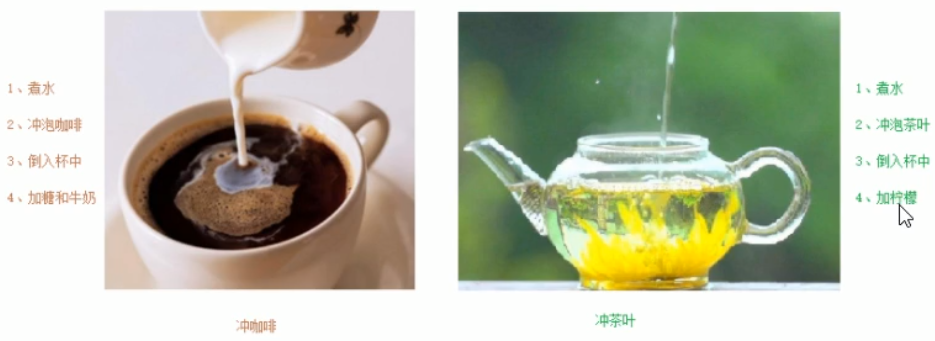
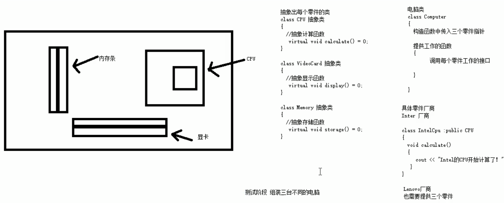

# ==三、C++学习笔记—核心编程==

本阶段，将对C++面向对象编程技术做详细学习，深入C++中的核心和精髓


#### 3.4.7.3 纯虚函数和抽象类

在多态中，通常父类中虚函数的实现是毫无意义的，主要都是调用子类重写的内容

因此可以将虚函数改为**纯虚函数**

**纯虚函数语法：**`virtual 返回值类型 函数名 （参数列表）= 0 ;`

当类中有了纯虚函数，这个类也称为==抽象类==

**抽象类特点**：

- 无法实例化对象
- **子类必须重写抽象类中的纯虚函数，否则也属于抽象类**


**示例：**

```c++
#include<iostream>
#include<string>
using namespace std;
 
//纯虚函数和抽象类
class Base 
{
public:
	//纯虚函数
	//只要有一个纯虚函数，这个类称为抽象类
	//抽象类特点：
	//1、无法实例化对象
	//2、抽象类的子类，必须要重写父类中的纯虚函数，否则也属于抽象类
	virtual void func() = 0; //虚函数的基础上=0
};

//子类重写纯虚函数
class Son : public Base
{
public:

	virtual void func() 
	{
		cout << "func函数的调用" << endl;
	}

};

void test01() 
{
	//Base b; //抽象类是无法实例化对象
	//new Base;//抽象类是无法实例化对象
	Son s; //子类必须重写父类中的纯虚函数，否则无法实例化对象
	Base * base = new Son;
	base->func();

}

int main() 
{
	test01();
	//test02();
	system("pause");
	return 0;
}
```


#### 3.4.7.4 多态案例二-制作饮品

**案例描述：**

制作饮品的大致流程为：煮水 -  冲泡 - 倒入杯中 - 加入辅料

利用多态技术实现本案例，提供抽象制作饮品基类，提供子类制作咖啡和茶叶

 

**示例：**

```c++
#include<iostream>
#include<string>
using namespace std;

//多态案例2 制作饮品—抽象类(基类/父类)
class AbstractDrinking 
{
public:
	//煮水
	virtual void Boi() = 0;//纯虚函数-抽象类
	//冲泡
	virtual void Brew() = 0;

	//倒入杯中
	virtual void  PourInCup() = 0;

	//加入佐料
	virtual void PutSomething() = 0;

	//制作饮品
	void makeDrink() 
	{
		Boi();
		Brew();
		PourInCup();
		PutSomething();
	}
};

//制作咖啡
class Coffee : public AbstractDrinking 
{
	//重写抽象类
	virtual void Boi() 
	{
		cout << "煮水" << endl;
	}

    //冲泡
	virtual void Brew() 
	{
		cout << "冲泡咖啡" << endl;
	}

	//倒入杯中
	virtual void  PourInCup() 
	{
		cout << "倒入杯中" << endl;
	}

	//加入佐料
	virtual void PutSomething() 
	{
		cout << "加入糖和牛奶" << endl;
	}

};


//制作茶叶
class Tea : public AbstractDrinking
{
	//重写抽象类
	virtual void Boi()
	{
		cout << "煮矿泉水" << endl;
	}

	//冲泡
	virtual void Brew()
	{
		cout << "泡茶叶" << endl;
	}

	//倒入杯中
	virtual void  PourInCup()
	{
		cout << "倒入保温杯" << endl;
	}

	//加入佐料
	virtual void PutSomething()
	{
		cout << "加入枸杞" << endl;
	}

};

// 制作函数
void doWork(AbstractDrinking * abs)  // AbstractDrinking * abs = new Coffee
{
	abs->makeDrink(); //接口都一样，这就叫属于多态，一个接口有多个不同的情况。
	delete abs; //堆区数据需要用完删除，释放
}
void test01() 
{
	//制作咖啡
	doWork(new Coffee);
	cout << "-------------------------" << endl;
	//制作茶叶
	doWork(new Tea);
}

int main() 
{
	test01();
	//test02();
	system("pause");
	return 0;
}
```


#### 3.4.7.5 虚析构和纯虚析构


多态使用时，如果子类中有属性开辟到堆区，那么父类指针在释放时无法调用到子类的析构代码

**解决方式：**将父类中的析构函数改为**虚析构**或者**纯虚析构**

**虚析构和纯虚析构共性：**

- 可以解决父类指针释放子类对象
- 都需要有具体的函数实现

**虚析构和纯虚析构区别：**

- 如果是纯虚析构，该类属于抽象类，无法实例化对象

虚析构语法：

`virtual ~类名(){}`

纯虚析构语法：

` virtual ~类名() = 0;`

`类名::~类名(){}`

**示例：**

```c++
#include<iostream>
#include<string>
using namespace std;

//虚析类和纯虚析构
class Animal 
{
public:
	
	Animal() 
	{
		cout << "anaimal构造函数调用" << endl;
	}

	//利用虚析构可以解决，父类指针释放子类对象时不干净的问题
	//virtual ~Animal() // 虚析构
	//{
	//	cout << "anaimal析构函数调用" << endl;
	//}

	//纯虚析构——需要声明也需要实现
	//有了纯虚析构 之后，这个类也属性抽象类，无法实例化对象
	virtual ~Animal() = 0;

	//纯虚函数-抽象类
	virtual void speak() = 0;

	//虚构函数和纯虚析构函数都是为了解决在子类中析构代码调用不到问题

};

Animal ::~Animal() 
{
	cout << "animal纯虚析构函数调用" << endl;
}

//子类实例化
class Cat : public Animal 
{
public:
	Cat(string name)
	{
		cout << "CAT构造函数调用" << endl;
		m_Name = new string(name);
	}

	virtual void speak()
	{
		cout << *m_Name<<"小猫在说话" << endl;
	}

	~Cat()
	{
		if (m_Name != NULL)
		{
			cout << "cat析构函数调用" << endl;
			delete m_Name;
			m_Name = NULL;
		}
	}

	string *m_Name;
};


void test01() 
{
	Animal * animal = new Cat("Tom");
	animal->speak();
	//父类指针在析构时候，不会调用子类中析构函数，导致子类如果有堆区属性，出现内存泄露情况
	delete animal;
}

int main() 
{
	test01();
	//test02();
	system("pause");
	return 0;
}
```

**总结：**

​	**1. 虚析构或纯虚析构都是用来解决通过父类指针释放子类对象**

​	**2. 如果子类中没有堆区数据，可以不写为虚析构或纯虚析构**

​	**3. 拥有纯虚析构函数的类也属于抽象类**

#### 3.4.7.6 多态案例三-电脑组装


**案例描述：**

电脑主要组成部件为 CPU（用于计算），显卡（用于显示），内存条（用于存储）

将每个零件封装出抽象基类，并且提供不同的厂商生产不同的零件，例如Intel厂商和Lenovo厂商

创建电脑类提供让电脑工作的函数，并且调用每个零件工作的接口

测试时组装三台不同的电脑进行工作

 

**示例：**

```c++
#include<iostream>
#include<string>
using namespace std;

//抽象CPU类
class CPU
{
public:
	//抽象的计算函数
	virtual void calculate() = 0;
};

//抽象显卡类
class VideoCard
{
public:
	//抽象的显示函数
	virtual void display() = 0;
};

//抽象内存条类
class Memory
{
public:
	//抽象的存储函数
	virtual void storage() = 0;
};

//电脑类
class Computer
{
public:
	Computer(CPU * cpu, VideoCard * vc, Memory * mem)
	{
		m_cpu = cpu;
		m_vc = vc;
		m_mem = mem;
	}

	//提供工作的函数
	void work()
	{
		//让零件工作起来，调用接口
		m_cpu->calculate();

		m_vc->display();

		m_mem->storage();
	}

	//提供析构函数 释放3个电脑零件
	//电脑是在堆区开辟的，释放掉了，但是电脑的零件没有被释放，所以需要使用析构函数
	~Computer()
	{

		//释放CPU零件
		if (m_cpu != NULL)
		{
			delete m_cpu;
			m_cpu = NULL;
		}

		//释放显卡零件
		if (m_vc != NULL)
		{
			delete m_vc;
			m_vc = NULL;
		}

		//释放内存条零件
		if (m_mem != NULL)
		{
			delete m_mem;
			m_mem = NULL;
		}
	}

private:

	CPU * m_cpu; //CPU的零件指针
	VideoCard * m_vc; //显卡零件指针
	Memory * m_mem; //内存条零件指针
};

//具体厂商
//Intel厂商
class IntelCPU :public CPU
{
public:
	virtual void calculate()
	{
		cout << "Intel的CPU开始计算了！" << endl;
	}
};

class IntelVideoCard :public VideoCard
{
public:
	virtual void display()
	{
		cout << "Intel的显卡开始显示了！" << endl;
	}
};

class IntelMemory :public Memory
{
public:
	virtual void storage()
	{
		cout << "Intel的内存条开始存储了！" << endl;
	}
};

//Lenovo厂商
class LenovoCPU :public CPU
{
public:
	virtual void calculate()
	{
		cout << "Lenovo的CPU开始计算了！" << endl;
	}
};

class LenovoVideoCard :public VideoCard
{
public:
	virtual void display()
	{
		cout << "Lenovo的显卡开始显示了！" << endl;
	}
};

class LenovoMemory :public Memory
{
public:
	virtual void storage()
	{
		cout << "Lenovo的内存条开始存储了！" << endl;
	}
};


void test01()
{
	//第一台电脑零件
	CPU * intelCpu = new IntelCPU;
	VideoCard * intelCard = new IntelVideoCard;
	Memory * intelMem = new IntelMemory;

	cout << "第一台电脑开始工作：" << endl;
	//创建第一台电脑 
	Computer * computer1 = new Computer(intelCpu, intelCard, intelMem);
	computer1->work();
	delete computer1;

	cout << "-----------------------" << endl;
	cout << "第二台电脑开始工作：" << endl;
	//第二台电脑组装
	Computer * computer2 = new Computer(new LenovoCPU, new LenovoVideoCard, new LenovoMemory);;
	computer2->work();
	delete computer2;

	cout << "-----------------------" << endl;
	cout << "第三台电脑开始工作：" << endl;
	//第三台电脑组装
	Computer * computer3 = new Computer(new LenovoCPU, new IntelVideoCard, new LenovoMemory);;
	computer3->work();
	delete computer3;

}

int main() 
{
	test01();
	//test02();
	system("pause");
	return 0;
}
```

## 3.5 文件操作

程序运行时产生的数据都属于临时数据，程序一旦运行结束都会被释放

通过**文件可以将数据持久化**

C++中对文件操作需要包含头文件 ==&lt; fstream &gt;==

---

**文件类型分为两种：**

1. **文本文件**     -  文件以文本的**ASCII码**形式存储在计算机中
2. **二进制文件** -  文件以文本的**二进制**形式存储在计算机中，用户一般不能直接读懂它们

---

**操作文件的三大类:**

1. ofstream：写操作
2. ifstream： 读操作
3. fstream ： 读写操作

### 3.5.1 文本文件

#### 3.5.1.1 写文件

   **写文件步骤如下：**

1. 包含头文件   

    \#include <fstream\>

2. 创建流对象  

    ofstream ofs;

3. 打开文件

    ofs.open("文件路径",打开方式);

4. 写数据

    ofs << "写入的数据";

5. 关闭文件

    ofs.close();

**文件打开方式：**

| 打开方式    | 解释                       |
| ----------- | -------------------------- |
| ios::in     | 为读文件而打开文件         |
| ios::out    | 为写文件而打开文件         |
| ios::ate    | 初始位置：文件尾           |
| ios::app    | 追加方式写文件             |
| ios::trunc  | 如果文件存在先删除，再创建 |
| ios::binary | 二进制方式                 |

**注意：** 文件打开方式可以配合使用，利用|操作符

**例如：**用二进制方式写文件 `ios::binary |  ios:: out`

**示例：**

```c++
#include<iostream>
#include<string>
#include<fstream> //文件流
using namespace std;

//文本文件 写文件
void test01() 
{
	//1、包含头文件 fstream
	//2、创建文件流对象
	ofstream ofs; //写文件流
	
	//3、指定打开方式
	ofs.open("test.txt", ios::out); //为写文件而打开文件

	//4、写内容
	ofs << "姓名：张三" << endl;
	ofs << "姓别：男" << endl;
	ofs << "年龄：12" << endl;
	//5、关闭文件
	ofs.close();
}

int main() 
{
	test01();
	//test02();
	system("pause");
	return 0;
}
```

总结：

- 文件操作必须包含头文件 fstream
- 读文件可以利用 ofstream  ，或者fstream类
- 打开文件时候需要指定操作文件的路径，以及打开方式
- 利用<<可以向文件中写数据
- 操作完毕，要关闭文件

#### 3.5.1.2 读文件

读文件与写文件步骤相似，但是读取方式相对于比较多

读文件步骤如下：

1. 包含头文件   

    \#include <fstream\>

2. 创建流对象  

    ifstream ifs;

3. 打开文件并判断文件是否打开成功

    ifs.open("文件路径",打开方式);

4. 读数据

    四种方式读取

5. 关闭文件

    ifs.close();

**示例：**

```c++
#include<iostream>
#include<string>
#include<fstream> //文件流
using namespace std;

//文本文件 读文件
void test01()
{
	//1、包含头文件
	//2、创建流对象
	ifstream ifs;
	//3、 打开文件，并且判断是否打开成功
	ifs.open("test.txt", ios::in);
	if (!ifs.is_open()) 
	{
		cout << "文件打开失败" << endl;
		return;
	}

	//4、 读数据
	//第一种：
	//char buf[1024] = { 0 };
	//while (ifs>>buf)
	//{
	//	cout << buf << endl;
	//}
	
	//第二种：
	//char buf[1024] = { 0 };
	//while (ifs.getline(buf,sizeof(buf)))
	//{
	//	cout << buf << endl;
	//}

	//第三种：
	string buf;
	while (getline(ifs,buf))
	{
		cout << buf << endl;
	}

	//第四种：
	char c;
	while ((c = ifs.get())!=EOF) // EOF ：end of file
	{
		cout << c;
	}

	//5、 关闭文件
	ifs.close();
}

int main() 
{
	test01();
	//test02();
	system("pause");
	return 0;
}
```


### 3.5.2 二进制文件

以二进制的方式对文件进行读写操作

打开方式要指定为 ==ios::binary==


#### 3.5.2.1 写文件

二进制方式写文件主要利用流对象调用成员函数write

**函数原型** ：`ostream& write(const char * buffer,int len);`

**参数解释：**字符指针buffer指向内存中一段存储空间。len是读写的字节数

**示例：**

```c++
#include<iostream>
#include<string>
#include<fstream> //文件流
using namespace std;

//二进制文件 写文件
class Person 
{
public:
	char m_Name[64]; //姓名
	int m_Age;//年龄
};

void test01() 
{
	//1、头文件
	//2、创建流对象
	ofstream ofs("person.txt", ios::out | ios::binary);
	//3、打开文件
	//ofs.open("person.txt",ios::out | ios::binary)
	
	//4、写文件
	Person p = { "张三", 18 };
	ofs.write((const char *)&p, sizeof(Person));
	//5、关闭
	ofs.close();

}

int main() 
{
	test01();
	system("pause");
	return 0;
}
```

总结：

- 文件输出流对象 可以通过write函数，以二进制方式写数据

#### 3.5.2.2 读文件

二进制方式读文件主要利用流对象调用成员函数read

函数原型：`istream& read(char *buffer,int len);`

参数解释：字符指针buffer指向内存中一段存储空间。len是读写的字节数

**示例：**

```c++
#include<iostream>
#include<string>
#include<fstream> //文件流
using namespace std;

class Person 
{
public:
	char m_Name[64];
	int m_Age;
};

//二进制文件 读文件
void test01() 
{
	//1、包含头文件
	//2、创建流对象
	ifstream ifs;

	//3、打开文件 判断文件是否打开成功
	ifs.open("person.txt", ios::in | ios::binary);
	if (!ifs.is_open())
	{
		cout << "文件打开失败" << endl;
	}
	//4、读文件
	Person p;
	ifs.read((char *)&p, sizeof(Person));
	cout << "姓名：" << p.m_Name << "年龄：" << p.m_Age << endl;

	//5、关闭文件流
	ifs.close();

}
 
int main() 
{
	test01();
	system("pause");
	return 0;
}
```

文件输入流对象 可以通过read函数，以二进制方式读数据


