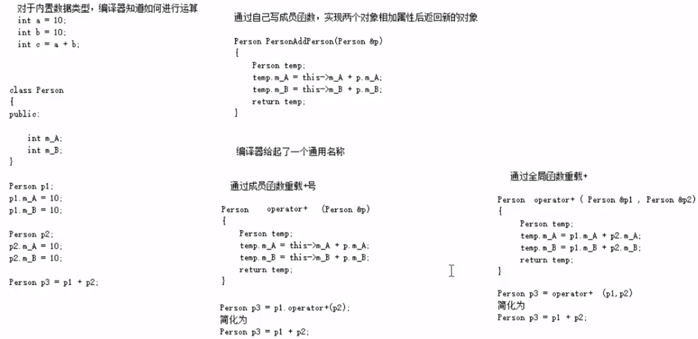

# ==三、C++学习笔记—核心编程==

本阶段，将对C++面向对象编程技术做详细学习，深入C++中的核心和精髓

### 3.4.4 友元

**生活中你的家有客厅(Public)，有你的卧室(Private)**

**客厅所有来的客人都可以进去，但是你的卧室是私有的，也就是说只有你能进去**

**但是呢，你也可以允许你的好闺蜜好基友进去。**

在程序里，有些私有属性 也想让类外特殊的一些函数或者类进行访问，就需要用到友元的技术

**友元的目的就是让一个函数或者类 访问另一个类中私有成员**

友元的关键字为  ==friend==

**友元的三种实现：**

- 全局函数做友元
- 类做友元
- 成员函数做友元

#### 3.4.4.1 全局函数做友元

```c++
#include<iostream>
#include<string>
using namespace std;
 
//建筑物类
class Building 
{
	//goodGay全局函数是 Buildiing好朋友，可以访问Building中私有成员——只要写到类上面即可
	friend void goodGay(Building *building); // 相当于全局函数的声明

public:
	Building() 
	{
		m_SittingRoom = "客厅";
		m_BedRoom = "卧室";
	}


public:

	string m_SittingRoom; //客厅

private:

	string m_BedRoom; //卧室
};

//全局函数
void goodGay(Building *building) 
{
	cout << "好基友全局函数 正在访问：" << building->m_SittingRoom << endl;
	cout << "好基友全局函数 正在访问：" << building->m_BedRoom << endl;
}

void test01() 
{
	Building building; //实例化一个对象
	goodGay(&building);

}

int main() 
{
	
	test01();
	
	system("pause");
	return 0;
}
```


#### 3.4.4.2 类做友元

一个类可以访问另一个类中的私有成员

```c++
#include<iostream>
#include<string>
using namespace std;
 
//类做有元
class Building;
class GoodGay 
{
public:

	GoodGay();
	void visit(); //参观函数，访问Building中的属性


	Building *building; 
};

class Building 
{
	// GoodGay类是本类的好朋友，可以访问本类中的私有成员
	friend class GoodGay; 
public:
	Building(); //构造函数


public:
	string m_SittingRoom;// 客厅

private:
	string m_BedRoom; //卧室
};


//类外写成员函数
Building::Building() 
{
	m_SittingRoom = "客厅";
	m_BedRoom = "卧室";
}

GoodGay::GoodGay() 
{
	//创建建筑物对象
	building = new Building;

}


void GoodGay::visit()
{
	cout << "好基友类正在访问：" << building->m_SittingRoom << endl;
	cout << "好基友类正在访问：" << building->m_BedRoom << endl;
}

//测试函数
void test01() 
{
	GoodGay gg; //实例化一个对象
	gg.visit();
}


int main() 
{
	
	test01();
	
	system("pause");
	return 0;
}
```


#### 3.4.4.3 成员函数做友元

```c++
#include<iostream>
#include<string>
using namespace std;
 
//
class Building; //先告诉编译器会写这个类，但是先别报错
class GoodGay
{
public:

	GoodGay(); // 构造函数

	Building * building;//

	void visit();  //成员函数 让visit函数可以访问Building中私有成员
	void visit2(); //让visit2函数不可以访问Building中私有成员


};

//建筑物类
class Building 
{
	//告诉编译器，GoodGay类下的visiti成员函数作为本类的好朋友，可以访问私有成员
	friend void GoodGay::visit(); //全局函数

public:
	Building(); //构造函数

public:
	string m_SittingRoom; //客厅

private:

	string m_BedRoom; //卧室

};


//类外实现成员函数——内部属性实现赋初值的操作
Building::Building()
{
	m_SittingRoom = "客厅";
	m_BedRoom = "卧室";

}

GoodGay::GoodGay() 
{
	building = new Building;  //创建了一个Building堆区，并且用指针维护这个建筑物吧

}

void GoodGay::visit() 
{
	cout << "visit函数正在访问：" << building->m_SittingRoom << endl;
	cout << "visit函数正在访问：" << building->m_BedRoom << endl;
}

void GoodGay::visit2() 
{
	cout << "visit2函数正在访问：" << building->m_SittingRoom << endl;
	//cout << "visit2函数正在访问：" << building->BedRoom << endl;

}


//测试函数
void test01() 
{
	GoodGay gg;
	gg.visit();
	gg.visit2();
}

int main() 
{
	
	test01();
	
	system("pause");
	return 0;
}
```


### 3.4.5 运算符重载

**运算符重载概念：**对已有的运算符重新进行定义，赋予其另一种功能，以适应不同的数据类型

#### 3.4.5.1 加号运算符重载

 

**作用**：实现两个自定义数据类型相加的运算

```c++
#include<iostream>
#include<string>
using namespace std;
 
//加号运算符重载
class Person
{

public:
	//1、成员函数重载+号
	//Person operator+(Person &p) 
	//{
	//	Person temp;
	//	temp.m_A = this->m_A + p.m_A;
	//	temp.m_B = this->m_B + p.m_B;
	//	return temp;
	//}

public:
	int m_A;
	int m_B;

private:

};

//2、全局函数重载+号
Person operator+(Person &p1,Person &p2)
{
	Person temp;
	temp.m_A = p1.m_A + p2.m_A;
	temp.m_B = p1.m_B + p2.m_B;
	return temp;
}

//函数重载的版本
Person operator+(Person &p1, int num)
{
	Person temp;
	temp.m_A = p1.m_A + num;
	temp.m_B = p1.m_B + num;
	return temp;

}


//测试函数
void test01() 
{
	Person p1;
	p1.m_A = 10;
	p1.m_B = 10;

	Person p2;
	p2.m_A = 10;
	p2.m_B = 10;
	//成员分数本质的调用
	//Person p3 = p1.operator+(p2);

	//全局函数重载本质调用
	//Person p3 = operator+(p1, p2);
	Person p3 =  p1+p2;
	//运算符重载 也可以发生函数重载

	Person p4 = p1 + 100; //Person +int

	cout << "p3.m_A=" << p3.m_A << endl;
	cout << "p3.m_B=" << p3.m_B << endl;

	cout << "p4.m_A=" << p4.m_A << endl;
	cout << "p4.m_B=" << p4.m_B << endl;

}

int main() 
{
	
	test01();
	
	system("pause");
	return 0;
}
```


> 总结1：对于内置的数据类型的表达式的的运算符是不可能改变的

> 总结2：不要滥用运算符重载(加法写成减法，减法写成加法)

#### 3.4.5.2 左移运算符重载

**作用：**可以输出自定义数据类型

```c++
#include<iostream>
#include<string>
using namespace std;
 
//左移运算符重载
class Person
{

	friend ostream & operator<<(ostream &cout, Person p);  //可以访问私有变量

public:
	Person(int a, int b) 
	{
		m_A = a;
		m_B = b;
	}

public:

	//利用成员函数重载，左移运算符 p.operator<<(cout) 简化版本p<<cout
	//不会利用成员函数重载<<运算符，因为无法实现cout在左侧
	/*void operator<<(Person &p) 
	{

	}*/

private:
	int m_A;
	int m_B;
 

};

//只能利用全局函数重载左移运算符
ostream & operator<<(ostream &cout,Person p) //本质 operator<<(cout p) 简化cout<<p
{
	cout << "m_A=" << p.m_A << " m_B=" << p.m_B;
	return cout;
}


void test01() 
{
	Person p(10,10);
	//p.m_A = 10;
	//p.m_B = 10;

	cout << p << endl;

}

int main() 
{
	
	test01();
	
	system("pause");
	return 0;
}
```


> 总结：重载左移运算符配合友元可以实现输出自定义数据类型


#### 3.4.5.3 递增运算符重载

作用： 通过重载递增运算符，实现自己的整型数据

```c++

```


> 总结： 前置递增返回引用，后置递增返回值

#### 3.4.5.4 赋值运算符重载


c++编译器至少给一个类添加4个函数

1. 默认构造函数(无参，函数体为空)
2. 默认析构函数(无参，函数体为空)
3. 默认拷贝构造函数，对属性进行值拷贝
4. 赋值运算符 operator=, 对属性进行值拷贝


如果类中有属性指向堆区，做赋值操作时也会出现深浅拷贝问题


**示例：**


#### 3.4.5.5 关系运算符重载


**作用：**重载关系运算符，可以让两个自定义类型对象进行对比操作


**示例：**

#### 3.4.5.6 函数调用运算符重载


- 函数调用运算符 ()  也可以重载
- 由于重载后使用的方式非常像函数的调用，因此称为仿函数
- 仿函数没有固定写法，非常灵活


**示例：**


