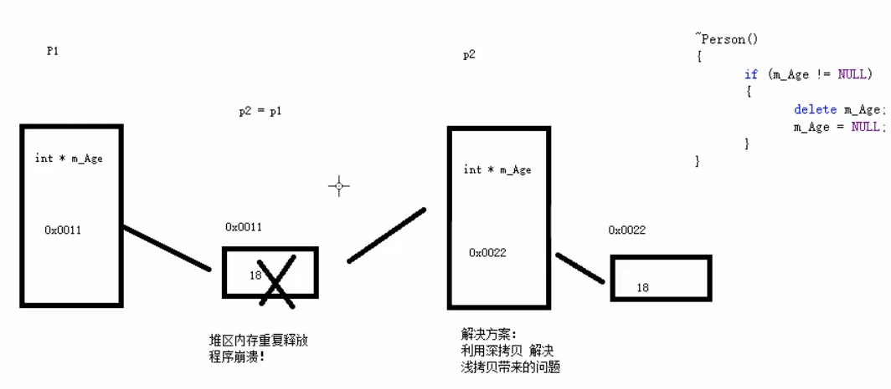

# ==三、C++学习笔记—核心编程==

本阶段，将对C++面向对象编程技术做详细学习，深入C++中的核心和精髓


#### 3.4.5.3 递增运算符重载

作用： 通过重载递增运算符，实现自己的整型数据

```c++
#include<iostream>
#include<string>
using namespace std;
 
//递增运算符重载

//自定义整型
class MyInteger 
{
	friend ostream & operator<<(ostream & cout, MyInteger myint);
public:

	MyInteger() 
	{
		m_Num = 0;
	}

	//重载前置++运算符  返回引用是为了一直对一个数据进行递增操作
	MyInteger&  operator++() 
	{
		//先进行++运算
		m_Num++;
		//再将自身做一个返回
		return *this;
	}

	//重载后置++运算符
	//void operator++(int) int代表占位参数，可以用于区分前置和后置递增
	MyInteger operator++(int) 
	{
		//先 记录当时结果
		MyInteger temp = *this;
		//后 递增
		m_Num++;
		//最后 将记录结果做返回
		return temp;
	}
	

private:

	int m_Num;

};


//重载左移运算符
ostream & operator<<(ostream & cout, MyInteger myint) 
{
	cout << myint.m_Num;
	return cout;
}


void test01() 
{
	MyInteger myint;
	cout << ++(++myint) << endl;
	cout << myint << endl;

}

void test02() 
{
	MyInteger myint;

	cout << myint++ << endl;
	cout << myint << endl;
}

int main() 
{
	
	//test01();
	test02();
	//int a = 0;
	//cout << a << endl;
	system("pause");
	return 0;
}
```

前置递减和后置递减

```c++
#include<iostream>
#include<string>
using namespace std;
 
//递减运算符重载

class MyInter 
{
	friend ostream & operator<<(ostream & cout, MyInter myint);
public:
	MyInter() 
	{
		m_Num = 5;
	}

	//重载前置--运算符  返回引用是为了一直对一个数据进行递减操作
	MyInter & operator--() 
	{
		//先--运算
		m_Num--;
		return *this;
	}
	
	//重载后置--运算符
	//void operator--(int) int代表占位参数，可以用于区分前置和后置递减
	MyInter operator--(int) 
	{
		//先 记录当前结果
		MyInter temp = *this;
		//后 递减
		m_Num--;
		//最后 将记录结构做返回
		return temp;
	}


private:
	int m_Num;
};

//重载左移运算符
ostream & operator<<(ostream & cout, MyInter myint)
{
	cout << myint.m_Num;
	return cout;
}

void test01() 
{
	MyInter myint;
	cout << myint-- << endl;
	cout <<  myint << endl;

}

void test02()
{
	MyInter myint;
	cout << --(--myint) << endl;
	cout << myint << endl;

}


int main() 
{
	
	//test01();
	test02();
	//int a = 0;
	//cout << a << endl;
	system("pause");
	return 0;
}
```


> 总结： 前置递增返回引用，后置递增返回值


#### 3.4.5.4 赋值运算符重载

c++编译器至少给一个类添加4个函数

1. 默认构造函数(无参，函数体为空)
2. 默认析构函数(无参，函数体为空)
3. 默认拷贝构造函数，对属性进行值拷贝
4. 赋值运算符 operator=, 对属性进行值拷贝

如果类中有属性指向堆区，做赋值操作时也会出现深浅拷贝问题

 

**示例：**

```c++
#include<iostream>
#include<string>
using namespace std;
 
//赋值运算符重载
class Person 
{
public:
	Person(int age) 
	{
		m_Age = new int(age); //年龄创建了一个堆区
	}

	~Person() //析构函数—配合堆区
	{
		if (m_Age != NULL)
		{
			delete m_Age;
			m_Age = NULL; //以防野指针
		}
	}
	
	//重载 赋值运算符
	Person& operator=(Person &p) 
	{
		//编译器是提供的浅拷贝
		//m_Age = p.m_Age;

		//应该先判断是否有属性在堆区，如果有先释放赶紧，然后在深拷贝
		if (m_Age!=NULL)
		{
			delete m_Age;
			m_Age = NULL;
		}

		//深拷贝
		m_Age = new int(*p.m_Age);
		//返回对象本身
		return *this;
	}

	int *m_Age;
};

void test01() 
{
	Person p1(18);	
	Person p2(20);
	Person p3(30);
	p3 = p2 = p1; //赋值操作

	cout << "p1的年龄为：" << *p1.m_Age << endl;
	cout << "p2的年龄为：" << *p2.m_Age << endl;
	cout << "p3的年龄为：" << *p3.m_Age << endl;

}

int main() 
{
	
	test01();
	//test02();
	//int a = 0;
	//cout << a << endl;
	system("pause");
	return 0;
}
```


#### 3.4.5.5 关系运算符重载

**作用：**重载关系运算符，可以让两个自定义类型对象进行对比操作

**示例：**

```c++
#include<iostream>
#include<string>
using namespace std;
 
//关系运算符重载
class Person
{


public:

	Person(string name, int age) //有参构造函数
	{
		m_Name = name;
		m_Age = age;
	}

	//重载==号
	bool operator==(Person &p) 
	{
		if (this->m_Name == p.m_Name && this->m_Age == p.m_Age)
		{
			return true;
		}
		return false;
	}

	//重载！=号
	bool operator!=(Person &p) 
	{
		if (this->m_Name == p.m_Name && this->m_Age == p.m_Age)
		{
			return false;
		}
		return true;
	}

	string m_Name;
	int m_Age;
};

void test01() 
{
	Person p1("张珊", 23);
	Person p2("张三", 23);
	if (p1 == p2)
	{
		cout << "p1和p2是相等的" << endl;
	}
	else
	{
		cout << "p1和p2是不相等的" << endl;
	}

	if (p1 != p2)
	{
		cout << "p1和p2是不相等的" << endl;
	}
	else
	{
		cout << "p1和p2是不相等的" << endl;
	}

}

int main() 
{
	
	test01();
	 
	system("pause");
	return 0;
}
```


#### 3.4.5.6 函数调用运算符重载

- 函数调用运算符 ()  也可以重载
- 由于重载后使用的方式非常像函数的调用，因此称为仿函数
- 仿函数没有固定写法，非常灵活

**示例：**

```c++
#include<iostream>
#include<string>
using namespace std;
 
//函数调用运算符重载
 
//打印输出类
class Myprint
{
public:
	
	//重载函数调用运算符
	void operator()(string test) 
	{
		cout << test << endl;
	}

};

//仿函数非常灵活，没有一个固定的写法
//加法类
class MyAdd 
{

public:
	int operator()(int num1, int num2)
	{
		return num1 + num2;
	}
};


void test02() 
{
	MyAdd myadd;
	int ret = myadd(100, 100);
	cout << "ret="<<ret << endl;

	//匿名函数对象
	cout << MyAdd()(100, 100) << endl;
}


void test01() 
{
	Myprint myPrint;
	myPrint("hello world"); //由于使用起来非常类似于函数调用，因此称为仿函数

}

int main() 
{
	test01(); 
	test02();
	system("pause");
	return 0;
}
```

### 3.4.6  继承

**继承是面向对象三大特性之一**

有些类与类之间存在特殊的关系，例如下图中：


我们发现，定义这些类时，下级别的成员除了拥有上一级的共性，还有自己的特性。

**这个时候我们就可以考虑利用继承的技术，减少重复代码**


#### 3.4.6.1 继承的基本语法

例如我们看到很多网站中，都有公共的头部，公共的底部，甚至公共的左侧列表，只有中心内容不同。

接下来我们分别利用普通写法和继承的写法来实现网页中的内容，看一下继承存在的意义以及好处

**普通实现：**

```c++
//Java页面
class Java 
{
public:
	void header()
	{
		cout << "首页、公开课、登录、注册...（公共头部）" << endl;
	}
	void footer()
	{
		cout << "帮助中心、交流合作、站内地图...(公共底部)" << endl;
	}
	void left()
	{
		cout << "Java,Python,C++...(公共分类列表)" << endl;
	}
	void content()
	{
		cout << "JAVA学科视频" << endl;
	}
};
//Python页面
class Python
{
public:
	void header()
	{
		cout << "首页、公开课、登录、注册...（公共头部）" << endl;
	}
	void footer()
	{
		cout << "帮助中心、交流合作、站内地图...(公共底部)" << endl;
	}
	void left()
	{
		cout << "Java,Python,C++...(公共分类列表)" << endl;
	}
	void content()
	{
		cout << "Python学科视频" << endl;
	}
};
//C++页面
class CPP 
{
public:
	void header()
	{
		cout << "首页、公开课、登录、注册...（公共头部）" << endl;
	}
	void footer()
	{
		cout << "帮助中心、交流合作、站内地图...(公共底部)" << endl;
	}
	void left()
	{
		cout << "Java,Python,C++...(公共分类列表)" << endl;
	}
	void content()
	{
		cout << "C++学科视频" << endl;
	}
};

void test01()
{
	//Java页面
	cout << "Java下载视频页面如下： " << endl;
	Java ja;
	ja.header();
	ja.footer();
	ja.left();
	ja.content();
	cout << "--------------------" << endl;

	//Python页面
	cout << "Python下载视频页面如下： " << endl;
	Python py;
	py.header();
	py.footer();
	py.left();
	py.content();
	cout << "--------------------" << endl;

	//C++页面
	cout << "C++下载视频页面如下： " << endl;
	CPP cp;
	cp.header();
	cp.footer();
	cp.left();
	cp.content();

}

int main() {

	test01();

	system("pause");

	return 0;
}
```

**继承实现：**

```c++
#include<iostream>
#include<string>
using namespace std;
//继承实现页面
//公共页面类

class BasePage 
{
public:
	void header()
	{
		cout << "首页，公共课，登录，注册...（公共头部）" << endl;
	}
	void footer()
	{
		cout << "帮助中心，交流合作，站内地图...（公共地步）" << endl;
	}
	void left()
	{
		cout << "java,python,c++...（公共分类列表）" << endl;
	}

};


//继承的好处：减少重复代码
//语法：class 子类：继承方式  父类
//子类: 也称为 派生类
//父类：也称为 基类
//java页面
class Java : public BasePage 
{
public:
	void content() 
	{
		cout << "java学科视频" << endl;
	}

};

//python页面
class Python : public BasePage 
{
public:
	void content()
	{
		cout << "PYTHON学科视频" << endl;
	}
};

//c++页面
class CPP : public BasePage
{
public:
	void content()
	{
		cout << "CPP学科视频" << endl;
	}
};

2
void test01() 
{
	cout << "java下载视频页面如下：" << endl;
	Java ja;
	ja.header();
	ja.footer();
	ja.left();
	ja.content();

	cout << "------------------------" << endl;
	cout << "Python下载视频页面如下：" << endl;
	Python py;
	py.header();
	py.footer();
	py.left();
	py.content();

	cout << "------------------------" << endl;
	cout << "C++下载视频页面如下：" << endl;
	CPP cpp;
	cpp.header();
	cpp.footer();
	cpp.left();
	cpp.content();

}

int main() 
{
	test01();
	system("pause");
	return 0;
}
```

**总结：**

继承的好处：==可以减少重复的代码==

class A : public B; 

A 类称为子类 或 派生类

B 类称为父类 或 基类

**派生类中的成员，包含两大部分**：

一类是从基类继承过来的，一类是自己增加的成员。

从**基类**继承过过来的表现其**共性**，而**新增的成员**体现了其**个性**。

#### 3.4.6.2 继承方式

继承的语法：`class 子类 : 继承方式  父类`

**继承方式一共有三种：**

- 公共继承
- 保护继承
- 私有继承


**示例：**

```c++
#include<iostream>
#include<string>
using namespace std;
//继承方式

//公共继承
class Base1 
{
public:
	int m_A;
protected:
	int m_B;
private:
	int m_C;

};

class Son1 : public Base1 
{
public:
	void func() 
	{
		m_A = 10; //父类中的公共权限成员  到子类中依然是公共权限
		m_B = 10; //父类中的包含权限成员  到子类中依然是保护权限
		//m_C = 10; //父类中的私有权限成员  子类访问不到
	}

};


//测试案例
void test01()
{
	Son1 s1; //子类对象
	s1.m_A = 100;
	//s1.m_B = 100; //到Son1中，m_B是保护权限，类外是访问不到的

}

//保护继承
class Base2
{
public:
	int m_A;
protected:
	int m_B;
private:
	int m_C;

};

class Son2 : protected Base2 
{
public:
	void func() 
	{
		m_A = 100;// 父类中的公共成员，到子类中变为保护权限
		m_B = 100;// 父类中的保护成员，到子类中变为保护权限
		//m_C = 100; //父类中私有成员， 子类是访问不到
	}
};

void test02() 
{
	Son2 s1;
	//s1.m_A = 1000;//在Son2中， m_A变为保护权限，因此类外访问不到
	//s1.m_B = 1000;//在Son2中， m_B变为保护权限，因此类外访问不到
}

//私有继承
class Base3
{
public:
	int m_A;
protected:
	int m_B;
private:
	int m_C;

};

class Son3 : private Base3 
{
public:
	void func() 
	{
		m_A = 100;//父类中的公共成员，到子类变成私有成员
		m_B = 100;//父类中保护成员，到子类变成私有成员
		//m_C = 100; //父类中私有成员，子类访问不到
	}
};

class GrandSon3 :public Son3 
{
public:
	void func() 
	{
		//m_A = 1000; //到了Son3中 m_A变成私有，即时是儿子，也是访问不到
		//m_B = 1000;
	}

};

void test03()
{
	Son3 s1;
	//s1.m_A = 1000;// 到Son3中，变成 私有成员类外访问不到
	//s1.m_B = 1000;// 到Son3中，变成 私有成员类外访问不到
}


int main() 
{
	
	system("pause");
	return 0;
}
```

